# Sylox Protocol: Technical Documentation

Version: v1.5 draft, October 9, 2026 · Author: David Ejere

## Changelog v1.5

Driven by an SCF delegate's observation that hourly epochs mean a user can wait up to an hour to see new data. Spec only in this revision: no contract code changes. The implementation PR follows once `feat/markets` Part A merges.

**Footprint-fix revision, within v1.5 (Section 5.9, S3-S5)**

Found and fixed while implementing the sub-epoch design above. Rule changes only:

- `EventRegistry.cover_gate` never reads `HeldHour`. It reads `Sub(asset)` for an unbuilt hour still inside that ring's own 5 hour span, and `Ring(asset)`'s own provisional roll-up for an unbuilt hour outside it; `HeldHour` is read only by the build and dispute paths. Section 5.9, S3, S5.
- A disputed sub-epoch excludes only itself from its hour's own provisional roll-up, never the hour's other, non-disputed sub-epochs. The roll-up is recomputed, with disputed sub-epochs excluded, on every post, dispute and ruling for the hour. Section 5.9, S4.
- A new `RingSlot` field, `provisional_sub_coverage: Option<u32>` (one packed byte on the ring; `0xFF` is `None`), tells a reader which posting path wrote a slot (`None`: hourly fallback, the one field value IS the posted reading; `Some(n)`: sub-epoch path, a roll-up of `n` non-disputed sub-epochs) and whether that roll-up holds real data (`Some(0)`: every posted sub-epoch disputed, no signal) without reading `peg_ratio` or `pending_until` for either purpose. Section 5.9, S4.
- A new `CoverGate` state, `UnbuiltBacklog`: if more hours in the trailing depeg window are unbuilt at once than `MAX_UNBUILT_HOURS_SCANNED_BY_COVER_GATE` (73, the window's own structural maximum) allows, the gate blocks new cover the same way any other gate state does, rather than risking its own read exceeding a real network resource limit. A sub-epoch dispute counts toward this cap, a new accepted limit (Section 11.6). Sections 5.9, S5; 9.4.
- Two new tracked network limits, `tx_memory_limit` and `tx_max_footprint_entries`, alongside the four `network_limits` already held. Section 21.3.
- An overturned sub-epoch reopens for reposting (ADR-005, extended to sub-epochs), within `max(sub_close, overturned_at) + sub_backfill_secs`: whichever is later, the original close or the ruling that overturned it. One repost per original overturn; a repost itself overturned again gets no further repost. The hour cannot build while a sub-epoch awaits a possible repost; worst case, two dispute cycles, about 12.33 days. Section 5.9, S2, S4; 11.6.

**S1-S2. A governance-set posting interval underneath the hour, not instead of it**

- `epoch_secs` (3,600s) and `RING_SLOTS` (240) stay exactly as Section 23 already freezes them: changing either live would re-encode every asset's existing packed `Ring(asset)` entry, a migration, not a `SetParam` change. Underneath each hour, a new `sub_epoch_secs` governance parameter (per asset; 300 to 3,600, must divide 3,600 evenly; default 300) splits the hour into sub-epochs. A keeper posts a `SignalSet` every `sub_epoch_secs`, disputable for `signal_dispute_secs` exactly as today. Setting `sub_epoch_secs = 3,600` reproduces today's behavior exactly: one sub-epoch per hour. Section 5.2, new Section 5.9.
- A change to `sub_epoch_secs` takes effect from the next hour boundary only, so no sub-epoch's own length is ever reinterpreted mid-flight. Section 5.9, S1.
- Sub-epochs can be backfilled for `sub_backfill_secs` (default 2 hours, a new parameter); beyond that, the keeper falls back to today's hourly backfill path (`window_secs`), which is unchanged. An hour is posted through exactly one of the two paths; mixing them is rejected (`HourAlreadyPosted`). Section 5.2, 5.9, S2.

**S4. The roll-up: hours are built from sub-epochs, never computed a different way**

- An hour that has not yet built carries a real `Pending` or `Disputed` state in `Ring(asset)`, mirroring its sub-epochs, never `Empty`: `Pending` with `pending_until = u64::MAX` (so `effective_state_of` can never auto-promote it to Final) while any sub-epoch is Pending and none is Disputed, `Disputed` while any sub-epoch is Disputed. A waiting hour's fields hold a provisional roll-up from whatever has posted so far, recomputed per sub-epoch post, so a Pending-tolerant reader (the cover gate, display) sees real numbers while it waits. Only the build itself ever writes Final. New Section 5.9, S4.
- An hour is built once every one of its sub-epochs is Final, permanently missing, or rejected (a dispute overturned), by anyone, and also inline inside `post_signals`. It needs at least `min_sub_coverage_bps` (default 7,500) of its sub-epochs Final to count as present; otherwise the built hour's own slot is written Empty, exactly like a missing hour today. A built hour is written straight to Final and is immutable from that point (I12): nothing rebuilds it. New Section 5.9, S4.
- Every `SignalSet` field gets an explicit roll-up rule (mean, median, sum, last-value, or recomputed; Section 5.9 states each one and the reasoning). `inputs_hash` becomes the hash of the sub-epoch hashes, so a built hour stays recomputable offchain from the sub-epoch data alone, the same promise Section 5.1 already makes. New Section 5.9, S4.
- Every place in `RiskOracle` and `EventRegistry` that reads hourly slot state is re-stated against the waiting and built states above (`epoch_disposition`'s own `PermanentlyMissing` rule, the F1 dispute-timeline check, `FINALITY_LOOKBACK_EPOCHS`, `effective_window`, cure tracking, `signals_final`). New Section 5.9, S4.

**S5. What moves faster**

- `EventRegistry.cover_gate`'s `RecentDepeg` check reads the posted sub-epochs (Pending or Final) only for every not-yet-built hour, falling back to the built, averaged hour exactly as today for every already-built hour in the window; this keeps the gate's own sensitivity fixed at every `sub_epoch_secs`, while still catching a depeg within one `sub_epoch_secs` of starting. Section 9.4, new Section 5.9, S5.
- `RiskOracle.latest(asset)` (Section 12.1) is unchanged: it keeps returning the newest hour's `SignalSet`, exactly as today, since `Series`' own `require_holding` valuation (Section 9.4) and every existing integration already depend on that meaning. A new read, `live(asset) -> Option<(SubEpoch, SignalSet, SlotState)>`, returns the newest sub-epoch instead, surfaced in the app as "Live" next to `latest()`/`score()`'s "Confirmed" values; never used for `require_holding` or any other payout-adjacent valuation. Section 12.1, new Section 5.9, S5.
- The score and band stay hourly, computed only from built hours. Section 6.

**S6. Staking: keeper pay per hour is unchanged**

- Keeper rewards pay per accepted sub-epoch at `keeper_reward * sub_epoch_secs / 3,600`, so the total paid per hour of real coverage does not change with the interval. `keeper_exit_delay_secs` and every other value Section 23 derives from `epoch_secs` is re-derived against the sub-epoch design and re-stated where it changes. Endpoint probes are unaffected and stay hourly. Section 18.1, 23.

**S7. One home for every time constant**

- `RING_SLOTS`, `AGGREGATE_SLOTS_7D`, `MAX_CURE_EPOCHS`, the 6-of-72 Depeg missing-epoch tolerance, the 1-to-72 `challenge_secs` bound, and `Sub(asset)`'s own fixed 60-slot size (below) all move into a new `sylox_types::time` module (mirroring `sylox_types::network_limits`'s own style), alongside new build-time (`const _: () = assert!(...)`) checks. This merges with Part B of the `feat/markets` brief. Section 23, new Section 5.9.
- `Sub(asset)` is a fixed 60 slots (6,729 bytes) at every `sub_epoch_secs` value, not resized when the interval changes. The ring's position is anchored to a fixed 300 second grid (`position = (sub_start / 300) % 60`, keyed by each sub-epoch's own start time), not to the asset's current `sub_epoch_secs`, so the ring always spans exactly 5 hours of wall-clock time regardless of interval: a slower interval uses fewer of the 60 slots per rotation, never more wall-clock span. Each slot stores its own `sub_start` timestamp as its identity (not `(hour, sub)`, since what `sub` means depends on the interval that hour used) and is checked on read, the same way `slot_for_epoch` already detects a stale slot, so an interval change needs no re-encoding and stays a pure config change. New Section 5.9, S3, S4.
- `Sub(asset)` and `SubDispute` TTL: extend on every write and on every `post_signals`, stated directly rather than deferred to a markets-specific note. Section 15.2.

**New invariants, and markets dependencies named directly**

- Three new invariants (Section 21.1): changing `sub_epoch_secs` never changes an already-built hour or hour numbering; the existing full test suite passes unchanged at `sub_epoch_secs = 3,600`, which is this revision's own regression proof; a sub-epoch that fails its dispute process never contributes to a built hour.
- `feat/markets`'s M1 (`FeedBehind`), M2 (`PriceGuard`) and M4 (TTL) are specified directly in this revision rather than only cited by name: M1 is `buy_cover` requiring the newest posted sub-epoch to be the last closed one, or the one before it within a new `feed_grace_secs` (default 120s), covering the keeper's own short posting margin so a sale is not rejected for that margin out of every `sub_epoch_secs`; M2 is an optional per-asset `PriceGuard.check(asset) -> GuardStatus { Ok, Paused, Unavailable }`, checked after `cover_gate`, rejecting a sale only (never a claim or a trigger) with `FastSignalPause`, covering the span M1's own grace window leaves open; M4 is `Series` and `MarketFactory` extending instance TTL on every state-changing call and persistent entries on write and on hot-path reads, with the exact ledger counts left to the `feat/markets` design note. Sections 5.9 S3 S5, 9.4, 15.2, 23.
- `MarketFactory` and `Series` are described here as the design `feat/markets` builds to, not as a gap in this spec: Sections 9, 12.4, 12.5, 14, 15.1 and 21.1 describe the design; `feat/markets` is the implementation.

## Changelog v1.4

Every change from v1.3, driven entirely by building `Treasury` and moving reward and slash accounting into it (PR #13), and by fixing issue #11 (keepers were never rewarded). No code changes in this revision; `Treasury`, the `Staking` refactor, and the `RiskOracle` finality-time reward call are already built and merged to match what is documented here.

**ADR-012 One home for each kind of money**

- `Staking` holds only participant funds (keeper bonds, reporter stakes including cooldown, locked dispute bonds, `Claimable` balances); `Treasury` holds only protocol funds, in the four buckets Section 12.7 already named. Enforced structurally: `Staking` has no code path left that credits `Claimable` with a protocol-destined amount; every one now reaches `Treasury` through a real `deposit` call. `Staking`'s own balance invariant tightens from `>=` to exact `==` (apart from direct donations). Sections 4.5, 7.5, 7.8, 12.3, 12.7, 13, 14, 15.1, 23, 24.2.

**Treasury (Section 12.7), built to match the interface exactly**

- `Treasury`'s full API: `deposit`, `accrue_reward`, `claim_reward`, `allocate`, `spend`, `balance`, `accrued`, exactly as Section 12.7 already specified. Governor auth on `allocate`/`spend`; `Staking` auth on `accrue_reward`. Section 12.3, 12.7.
- Every inflow and outflow emits an event under ADR-007's convention, naming its bucket: `deposited`, `reward_accrued`, `reward_claimed`, `allocated`, `spent`, all 5 already specified by Section 13, plus a new `reward_shortfall` (see below). Section 13.
- `accrue_reward` never accrues more than its bucket holds (T2): it returns the amount actually accrued, which can be less than requested, and never fails the calling flow. When it accrues less than requested, a new `reward_shortfall` event (not previously specified) makes the shortfall visible onchain, carrying `to`, `bucket`, `requested`, `accrued` and `shortfall`, rather than leaving a caller to infer it only by diffing `reward_accrued`'s own two fields. Section 13.
- A new `InvalidAmount` error (703, not previously specified) rejects a non-positive amount consistently across all 4 of `Treasury`'s mutating entry points (`deposit`, `accrue_reward`, `allocate`, `spend`), the same guard Section 12.3's own `lock_bond` already uses. Section 14.
- `Treasury`'s own storage keeps one key per bucket (`Bucket(TreasuryBucket)`) rather than the single `Buckets` instance key Section 15.1 previously showed, the same per-field-storage-cost reasoning `Staking` already uses elsewhere for similarly shaped state. Section 15.1.
- Invariant **T1** (Treasury's USDC balance is at least the sum of its bucket balances plus every accrued, unclaimed reward) is already Section 12.7's own Invariant I15; **T3** (USDC leaves `Treasury` only through a `claim_reward` or a governed `spend`) and **T4** (`allocate` moves balance between buckets without changing the total) are new, implicit in the interface as specified but not previously stated as invariants. Section 21.1.

**Staking refactor (Section 7.5, 7.8, 12.3), ADR-012's own consequence**

- `RewardPool`, `AccruedReward(addr)`, `fund_rewards` and `claim_rewards` are removed entirely, now that `Treasury` exists to be the real caller `feat/staking` (PR #7) had always left room for. `settle_probes`'s reporter-reward accrual and `Staking.reward_keeper` both call `Treasury.accrue_reward` directly; reporters and keepers claim with `Treasury.claim_reward`, not a `Staking`-local balance. Sections 4.5, 7.5, 12.3, 12.7, 15.1, 23.
- `forfeit_bond` and `slash`'s protocol-destined half (previously credited into `Claimable(treasury_address)`, a stand-in, Section 7.8) now reaches `Treasury` through a real `deposit_treasury_share` call into the `Slashed` bucket; `Staking`'s own `treasury: Address` config field, set at `initialize`, must be a real deployed `Treasury` contract for this to succeed. Winners' shares are unaffected, still credited to `Claimable` and paid by `claim`. Sections 4.5, 7.8, 12.3.
- `deposit_treasury_share`'s nested `usdc.transfer(Staking, Treasury, amount)` call needs `env.authorize_as_current_contract(...)`, since `Staking` (not a human signer) is the `from` the token's own `transfer` checks, two call hops away from `Staking`'s own code. Section 16.1.
- `Staking`'s own balance invariant (Section 21.1) tightens from `>=` to exact `==`, apart from direct donations, now that every protocol-destined amount genuinely leaves on the same call that decides it, rather than sitting in `Staking`'s own storage until some later, unspecified movement. ADR-012.

**Issue #11 fix: `RiskOracle` rewards keepers at finality time**

- `Staking.reward_keeper(keeper, epochs: u32) -> i128` (changed from `reward_keeper(keeper)`, no return value): accrues `keeper_reward * epochs` from `Treasury`'s `KeeperRewards` bucket, only if the keeper is currently active and not suspended; otherwise a no-op returning `0`, not an error, so a single grouped call covering several keepers can never fail outright over one ineligible keeper. Sections 12.3, 24.2 (closes the open question Section 24.2 previously tracked under "is `reward_keeper` meant to be called from `RiskOracle` at all, and on which transition").
- `RiskOracle`'s backward finality scan (ADR-008), on every call that advances it, groups the epochs it finds newly Final by poster and calls `Staking.reward_keeper` once per distinct poster found, with that poster's own count. An epoch's `final_announced` flag (ADR-008) already makes "newly Final on this call" a one-time fact, so a keeper is rewarded exactly once per epoch; an overturned epoch's slot state is `Overturned`, never `Final`, so it never appears in this grouping and is never rewarded, with no extra code needed for that guarantee. Section 12.1, 12.3.
- Budget test (Section 21.3): the worst case, a full backfill window (`window_secs / epoch_secs + 1` = 73 epochs at the defaults) becoming Final in one call with several keepers posting across it, measured twice: once against `Staking` and `Treasury` mocked out (a lower bound, since a mock never makes `reward_keeper`'s own further call into `Treasury.accrue_reward`) and once against the real `Staking` and `Treasury`. Both comfortably under the live network's resource limits (new `sylox_types::network_limits`, below). Section 21.3.

**Network limits, queried live rather than hardcoded from memory**

- A new, test-only `sylox_types::network_limits` module holds `tx_max_instructions`, `tx_max_write_bytes`, `tx_max_disk_read_entries`, `tx_max_write_ledger_entries` and `contract_max_size_bytes`, queried from `stellar network settings` for testnet and mainnet (identical on both, as of this writing) rather than each budget test keeping its own remembered copy. Every budget test in this revision asserts its measured call stays under 50% of each. Sections 15.3, 21.3.
- Since v1.5 (Section 5.9, S5's own footprint-fix revision): the same module also holds `tx_memory_limit` (`contract_compute_v0.tx_memory_limit`, 41,943,040 bytes / 40 MiB) and `tx_max_footprint_entries` (`contract_ledger_cost_ext_v0.tx_max_footprint_entries`, 400), both queried live the same way, added once `cover_gate`'s own unbuilt-hour scan (`MAX_UNBUILT_HOURS_SCANNED_BY_COVER_GATE`, `sylox_types::time`) surfaced each as a real, separate constraint from the four above: a single transaction's own memory cost does not grow smoothly with its workload the way instructions and write bytes do (confirmed empirically: an early, since-replaced per-hour read design stayed under 7.3 MB at 30 unbuilt hours, then exceeded the entire 40 MiB limit at 31), and footprint entries (the count of DISTINCT ledger keys one transaction's footprint touches, read or written, each counted once even if touched more than once) are an independent dimension a per-sub-epoch key lookup can exceed well before either `tx_max_disk_read_entries` or `tx_max_write_ledger_entries` alone would catch it.

**Section 24.2's keeper reward gap, removed**

- The open question "Is `Staking.reward_keeper` meant to be called from `RiskOracle` at all in v1, and if so, on which transition?" is resolved: yes, from the same scan that already advances finality and emits `signals_final`, once per distinct poster found among the epochs that scan observes newly Final. Removed from Section 24.2; the decision and its reasoning are ADR-012 (folded in) and this changelog entry.
- The companion question about a symmetric per-signal keeper bond (mirroring the disputer's `signal_dispute_bond`) is unaffected by this PR and stays open: `reward_keeper`'s own eligibility check (active, not suspended) is a read of `Staking`'s existing keeper state, not a new bond lock, and nothing in this PR changes whether a keeper's general stake, without a per-signal bond, remains the intended v1 design. Section 24.2.

**Known gap: core contracts lack `upgrade()`**

- Section 17.3 already specifies `upgrade(wasm_hash)` on every core contract, including `Treasury`; as built, none of `RiskOracle`, `Staking` or `Treasury` implements it yet (`Governor`, the governor-only auth it would check, is not built either). `Treasury` was deliberately not given one in this PR while its siblings still lack theirs, rather than making it the first and only core contract to carry it alone. Tracked as issue #12, open, to be done together with `Governor`. Section 17.3, 24.2.

## Changelog v1.3

Every change from v1.2, driven entirely by building `Staking` (PR #7) and documenting the approved deviations and review fixes it surfaced. No code changes in this revision; `Staking` and the two accompanying `RiskOracle` changes are already built and merged to match what is documented here.

**ADR-010 Signal dispute ruling deadline and default outcome**

- New parameter `signal_dispute_ruling_secs` (default 7 days), counted from `dispute_signals`, not from the posting's own `pending_until` window. If the committee has not ruled by the deadline, anyone can call `RiskOracle.resolve_signal_dispute_timeout(asset, epoch)`: the keeper's posting stands (slot Final), the disputer's bond is released in full, nobody is slashed, and a miss is recorded against the committee (`CommitteeMisses(committee)`, mirroring ADR-002's shape). Sections 5.4, 12.1, 13, 14, 15.1, 23.
- `dispute_signals` now passes the disputed epoch's `poster` through to `Staking.lock_bond` as a new `subject: Option<Address>` parameter, so a keeper's bond cannot release while a dispute naming its posting is still open (see ADR-011). Section 12.3's `lock_bond` signature changes accordingly. Sections 4.5, 7.8, 12.3.

**ADR-011 Removal is never an escape hatch**

- Removal (`remove_keeper`/`remove_reporter`) deactivates immediately but never releases funds on the same call. Funds leave only after BOTH a derived exit delay (`keeper_exit_delay_secs`, `reporter_exit_delay_secs`, long enough that every posting or probe the removed party could be held accountable for has had its full window to run) and, for a keeper, no open signal dispute naming it. Stake in cooldown stays fully slashable until actually paid out; a voluntary `unstake_request` cannot exit faster than a governor removal would have allowed for the same stake (`unstake_cooldown_secs >= keeper_exit_delay_secs`/`reporter_exit_delay_secs`). A reporter's probe is scored using the region it was registered under at submission time (a stored snapshot), never a live lookup, so removal cannot retroactively change what an already-submitted probe counts toward. Sections 7.3, 7.7, 12.3, 15.1, 23.

**Staking (Section 7, 12.3), built to match the interface exactly**

- `Staking`'s full API: keeper bonds and reporter stakes (`add_keeper`/`remove_keeper`, `add_reporter`/`remove_reporter`, `stake`/`unstake_request`/`unstake`, `withdraw_keeper_bond`), probes and aggregation (`submit_probe`, `aggregate`, `settle_probes`), and bond escrow and slashing (`lock_bond`/`release_bond`/`forfeit_bond`, `slash`, `reward_keeper`), plus `fund_rewards`/`claim_rewards` (new, a stand-in for `Treasury.accrue_reward`/`claim_reward` until `Treasury` exists). Section 12.3.
- Settlement window: `settle_probes` is callable only in `[epoch_close + probe_grace_secs, epoch_close + probe_grace_secs + settle_window_secs]`, the one span during which every probe for that epoch is guaranteed to still exist (temporary entries have independently extendable TTLs; settling on a partial set is attackable). An epoch nobody settles within its window simply never settles: no faults, no rewards, no funds ever at risk from the omission. New parameters `probe_grace_secs` (1h) and `settle_window_secs` (24h). Sections 7.3, 7.4, 12.3, 23.
- Submitter index and region snapshot (ADR-011): `aggregate`/`settle_probes` read a per-(asset, epoch) index of submitting reporters, capped at `max_submitters_per_epoch` (32), and each probe's region as registered at submission time, never the live reporter set or registration. A reporter address can only ever contribute the one region it registered under; it cannot cover two regions by submitting twice (one report per reporter per asset per epoch, Section 7.3). Sections 7.3, 7.4, 15.1, 23.
- One role per address: `add_keeper` rejects an address already registered as a reporter and `add_reporter` rejects an address already registered as a keeper (`RoleConflict`), so `slash` and every other keeper-or-reporter branch always has exactly one target. Section 12.3, 14.
- `lock_bond(key, owner, amount, subject)`: `subject: Option<Address>` is required `Some(keeper)` for a `SignalDispute` key, required `None` for an event bond kind (`InvalidBondSubject` otherwise), and `amount` must be positive (`InvalidAmount`); a zero or negative bond would otherwise increment the subject keeper's open dispute count with no real collateral locked to justify it. Sections 4.5, 7.8, 12.3, 14.
- `slash(who, amount, winner, reason)`: the amount actually deducted and paid out is `min(amount, who's remaining balance)`, never the caller's raw requested amount; a request exceeding what `who` holds is capped down rather than overpaid from other participants' funds. The `Slashed` event carries both the actual `amount` and the original `requested_amount`. This build's auth checks only `oracle`, not `oracle` or `registry`/committee (Section 24.2): `EventRegistry` is not implemented yet and has no real call site to test against. Sections 7.5, 7.8, 12.3, 13, 14.
- `unstake`/`withdraw_keeper_bond` for a keeper with an open signal dispute return a dedicated `DisputesOpen`, distinct from `Suspended` (a fault/evidence outcome, a different condition). Section 14.
- Reward and bond-settlement balances are held directly in `Staking` (`RewardPool`, `Claimable(addr)`, `AccruedReward(addr)`) rather than routed through `Treasury.accrue_reward`/`claim_reward`, since `Treasury` is not implemented yet; `fund_rewards` is callable by anyone until `Treasury` exists to call it. `reward_keeper` is implemented (a flat `keeper_reward` accrual) but, as Section 12.3 already noted, has no `RiskOracle` call site. Sections 4.5, 7.5, 7.8, 12.3, 12.7.
- New parameters, with their defaults and derivations, folded into Section 23: `probe_grace_secs` (1h), `settle_window_secs` (24h), `probe_ttl_margin_secs` (1 day), `min_distinct_regions` (2, naming the existing "2 distinct regions" rule), `fault_majority_threshold` (3, naming Section 7.5's "majority of 3 or more"), `max_submitters_per_epoch` (32), `unstake_cooldown_secs` (7d), `keeper_exit_delay_secs` (derived, `signal_dispute_secs + epoch_secs`, 3h), `reporter_exit_delay_secs` (derived, `epoch_secs + probe_grace_secs + settle_window_secs`, 26h), `reporter_reward_per_epoch` (0.1 USDC per settled asset-epoch, the `reporter_reward_pool` stand-in).
- `keeper_reward` changed from 0.50 to 0.05 USDC per accepted epoch (10x lower), so reward parameters stay within a sustainable operating cost at the target scale (10 assets, hourly epochs); no dollar figures are stated in this document. Section 23. `contracts/staking`'s own `params::KEEPER_REWARD_PER_ACCEPTED_EPOCH` constant on `main` is changed to match (`500_000`, 0.05 USDC) in this same PR: nothing is deployed to any network yet, so code and spec simply agree.
- New error codes in the `Staking` 300 range: `AlreadyRegistered` (309), `Suspended` (310), `UnstakePending` (311), `NoUnstakeRequested` (312), `ProbeWindowClosed` (313), `SettlementNotOpen` (314), `SettlementWindowExpired` (315), `AlreadySettled` (316), `UnknownCaller` (317, unreachable by construction, same reasoning as `Unauthorized`), `InvalidBondSubject` (318), `RoleConflict` (319), `DisputesOpen` (320), `InvalidAmount` (321). `EpochNotClosed` (308) documented as unreachable: `SettlementNotOpen`/`SettlementWindowExpired` supersede it. Section 14.
- New storage: `Staking`'s `Submitters(asset, epoch)` (temporary, the per-epoch submitter index), `ProbesSettled(asset, epoch)` (temporary, settlement marker), `AllReporters` (instance, duplicate-registration check only, never consulted by `aggregate`/`settle_probes`), `RewardPool` (instance), `AccruedReward(addr)` (persistent); `KeeperInfo`/`ReporterInfo` (Section 12.3's read types, not previously defined anywhere in the spec's type tables) now include `unstake_requested_at`, `removed_at` and, for a keeper, `open_dispute_count`. Section 15.1.
- Section 22.4/22.5: the keeper service calls `Staking.settle_probes` and `RiskOracle.check_stale` every epoch, alongside `finalize_endpoint` (which already calls `settle_probes` internally); an operator running their own epoch-close automation should not assume `finalize_endpoint` alone covers every asset if some assets' `finalize_endpoint` calls lag. Section 22.4.
- `Section 12.3`'s own table of which `Staking` functions `RiskOracle` actually calls, extended with `release_bond` (now also called from `resolve_signal_dispute_timeout`) and the `subject` parameter on `lock_bond`'s call from `dispute_signals`.

## Changelog v1.2

Every change from v1.1, driven entirely by building `RiskOracle` (PR #2) and documenting the approved deviations it surfaced. No code changes in this revision; `RiskOracle` is already built and merged to match what is documented here.

**ADR-007 Event topic convention**

- Every event's topics are `("sylox", <event_name>, <primary key>)`, three topics, not the v1.1 `("sylox", <contract>, <event>, <primary key>)`, four: `soroban-sdk`'s `#[contractevent]` macro cannot emit more than 2 custom prefix topics (a hard XDR schema limit). Applies to every contract, not only `RiskOracle`. Sections 13.

**ADR-008 Per-epoch independent finality**

- Finality is per epoch and fully independent: no epoch's state can block any other epoch from becoming Final. The newest Final epoch is found by scanning backward across the full backfill window on every state changing call, not by a cursor that advances one epoch at a time and stops at the first non Final epoch. Sections 5.7, 5.8, 8.2, 12.1.
- A missing, Disputed or still Pending epoch inside an aggregate window is excluded from its sum or percentile, never counted as zero, and never blocks the aggregate itself. Sections 5.8, 6.5.
- `signals_final` fires per epoch the first time it is observed Final, tracked by a one byte `final_announced` flag added to the packed ring slot (layout version 2); it can arrive out of epoch order. Sections 5.7, 5.8, 13, 13.1, 15.1.
- New reads `is_final(asset, epoch)` and `effective_window(asset, start_epoch, count)`. Sections 12.1.

**ADR-009 asset_stale as a transition event**

- `asset_stale` fires once per transition into stale, not once per newly observed epoch that happens to already be stale: the original design never fired for the realistic "keepers stopped posting" case. Sections 5.5, 13, 13.1.
- New permissionless `check_stale(asset) -> bool`, judged against the stored score's own epoch; a monitor calls it for every asset once per epoch. Sections 12.1, 22.4.
- `is_stale(asset)` and `score(asset).stale`/`check_stale(asset)` remain two different signals, judged against different epochs; documented explicitly so an integrator does not read one as a substitute for the other. Section 5.5.

**Other RiskOracle corrections, confirmed against the built contract**

- `genesis = 0` (Unix epoch): epoch numbering is a pure function of ledger time, with no stored genesis. Section 5.2.
- `epoch_secs` and the ring buffer's 240 slot size are frozen for v1, removed from the Section 23 governance parameter table: changing either needs a ring re-encoding migration, not a parameter change. Sections 5.8, 23.
- Packed ring layout confirmed and measured: 112 bytes per slot, 26,889 bytes total including its 9 byte header, 41% of `contract_data_entry_size_bytes`; write cost 1.89M CPU instructions and 28,012 write bytes (21.2% of `tx_max_write_bytes`) against a full ring. No paging fallback needed. Sections 5.8, 15.3.
- A new asset with fewer than 168 posted epochs reads as stale (not enough history for the 7 day baseline every score component needs), independent of recency based staleness. Section 5.5.
- `Reference::Asset` is rejected by `add_asset` and `update_asset` in v1 (`ReferenceNotSupported`): no USD rate is defined anywhere in this spec for an asset pegged reference. Sections 4.1, 14.
- `set_event_in_progress(asset, in_progress)`, registry authed, pushed by `EventRegistry` while any event is Proposed, Challenged or Escalated: forces the band to at least Distress as a read time floor, never written into the stored `RiskScore`, so clearing it cannot be mistaken for a new epoch of hysteresis evidence. Sections 6.3, 6.5, 8.1, 12.1, 15.1, 16.1.
- `peg_ratio_p10` for component P and the Depeg check is computed onchain from the ring's `peg_ratio` history, not trusted from the keeper's posted `SignalSet.peg_ratio_p10` field (kept for recomputation and audit only). A single epoch's wick inside the window cannot move the band through P. Sections 4.1, 5.1, 6.5.
- An overturned epoch's `Signals` entry moves to history (`Overturned(asset, epoch)`) so the epoch can be reposted, confirmed against the built contract. Sections 5.2, 15.1.
- `AggregationFailed` (110) and `ReferenceNotSupported` (111) added to the RiskOracle error range; `Unauthorized` (3) documented as unreachable in `RiskOracle`, since every auth check goes through Soroban's native `require_auth()` rather than returning it. Section 14.
- Section 12.1's RiskOracle API, Section 15.1's storage keys, and Section 12.3's note on the `Staking` interface `RiskOracle` actually calls, all updated to match the built contract exactly, including the still open gaps (`reward_keeper` declared but never called; no keeper side bond lock) carried into Section 24.2 rather than silently resolved.

## Changelog v1.1

Every change from v1.0, with the decision record behind it (`docs/decisions/`) and the sections it touched. Section numbers are unchanged; new material is in new subsections.

**ADR-001 Canonical event definitions**

- One canonical, versioned `EventDefinition` per (asset, kind), registered by governance; events keyed by (asset, kind, def\_version); `event_status` per (asset, kind), so a Declared WithdrawalHalt never blocks a later Depeg. Sections 4.3, 8 (intro, 8.1, 8.5), new 8.8, 12.2, 15.1.
- `SeriesTerms.def_versions` (one pinned version per covered kind) replaces the single definition hash. Sections 1.5, 4.4, 8.6, 9.2, 17.4, 20.3.
- `propose_tier1` takes (asset, kind) and uses the current canonical version. Sections 8.1, 8.2, 8.8, 12.2.
- After any Declared event, `MarketFactory` blocks new series on the asset until governance re-enables it by registering new versions; new `clear_event_band`. Sections 6.3, 8.5, 8.8, 9.7, 12.1, 12.4.
- New invariant I13 (live series always pin the canonical version) and the `DefinitionInUse` rule. Sections 8.8, 21.1.

**ADR-002 Ruling deadline and default outcome**

- `ruling_deadline_secs` (default 14 days) from escalation; `resolve_timeout(event_id)` with default Declared for escalated Tier 1 Depeg and IssuerFreeze and Rejected for Tier 2, Tier 3 and MintWithoutBacking; all bonds refunded on timeout; misses recorded per committee. Sections 4.3, 8 (state diagram, 8.1), new 8.9, 12.2, 13, 14, 15.1, 22.4, 22.5, 23.
- `challenge` escalates in the same call, so the deadline always runs; `escalate` and `withdraw_bond` removed. Sections 8.1, 12.2.
- Bound on Pending: the ruling deadline plus one challenge window after the acceptance period. Sections 8.9, 9.2.

**ADR-003 Coverage window and informed buying**

- Cover gate: `buy_cover` blocked if any epoch in the trailing depeg window is below threshold, the endpoint was Down or Degraded in the trailing halt window, an issuer action counted by IssuerFreeze happened in the last 7 days, or any event is in progress. Sections 4.3 (`CoverGate`), 9.4 (step 2 and diagram), 12.2, 14.
- An event covers a series if its failure window starts inside [start, expiry]; proposals accepted up to one window length after expiry, with the series Pending meanwhile (fixes the day 88 of 90 case). Sections 4.3 (`window_start`), 8.6, 9 (state diagram), 9.2, 20.3, 20.4.

**ADR-004 Contract inventory**

- `ReporterStaking` renamed `Staking`: keeper bonds, reporter stakes, signal dispute bonds, event proposal and challenge bonds, slashing on instruction from `RiskOracle` and `EventRegistry`. Sections 2, 3.1, 3.5, 5.3, 5.4, 5.6, 5.7, 7, new 7.8, 12.3, 16, 17.3, 22.1, 22.2.
- New `Treasury` contract for protocol fees, slashed funds and the keeper and reporter reward pools. Sections 2, 3.1, 3.5, 4.5, 9.4, 10.2, new 12.7, 13, 14, 15.1, 16, 17.1, 17.2, 17.3, 21.1.
- `Series` holds only collateral and premiums; `RiskOracle` and `EventRegistry` hold no funds. Sections 2, 3.1, 15.1, 21.1 (I16).
- Roles (16), storage (15.1), events (13), errors (14), API (12) and both architecture diagrams (2, 3.5) updated for seven contracts.

**ADR-005 Oracle robustness**

- Backfill: any closed epoch inside `window_secs` that is not Final can be posted; an overturned epoch reopens. Sections 5.2, 5.3, 5.7, 11.3, 14, 18.1, 22.5.
- `max_missing_epochs` (default 6 of 72): missing epochs count neither way. Sections 4.3, 8.2, 11.4, 23.
- Disputes do not reset the window; a disputed epoch stays non final. Sections 5.4, 5.7, 5.8.
- Liquidity floor compares `min_liquidity` with the median of the 7 days before the window; a live collapse is a signal, never a payout block. Sections 4.1, 6.5, 8.2, 11.4.
- `peg_ratio_p10` replaces `peg_ratio_min`. Sections 4.1, 5.1, 6.1, 6.5, 11.3, 11.4.
- Endpoint status only from the `Staking` aggregate; keeper value ignored; `finalize_endpoint` on `RiskOracle` reads `Staking.aggregate`; 7.7 diagram fixed. Sections 4.1, 5.1, 5.3, 7.4, 7.7, 12.1.
- Supply is keeper posted from ledger asset stats; no SAC cross check (SEP-41 has no `total_supply`). Sections 4.1, 5.1.
- Tier 1 checks read the ring buffer (one entry, per slot finality flag), with a write cost benchmark and a paging fallback. Sections 4.1 (`RingSlot`), new 5.8, 8.2, 15.1, 15.3.
- Reporter aggregation: the status reported by a strict majority, else Degraded. Sections 7.4, 7.7.

**ADR-006 Event definition content and v1 scope**

- `Reference::Fiat` carries an `FxRateSource` (Official or Market), fixed in the event definition and immutable on the asset; ARS official vs market rate documented. Sections 4.1, 4.3, 5.1, 17.4, 24.
- `AssetConfig.issuer_flags`; IssuerFreeze definitions only for assets whose flags allow a freeze. Sections 4.1, 8.2, 8.8, 11.6, 14, 17.1.
- WithdrawalHalt documented as the least reliable type, Tier 2 only, with its evidence model. Sections 8.3, 11.6, 20.5, 20.6.
- First build: Depeg and IssuerFreeze; Tier 2, Tier 3 and MintWithoutBacking in a later phase. Sections 1.2, 8.2, 8.3, 8.4, 22.2a.

**Other fixes**

- `require_holding` value = balance × peg\_ratio × fx\_rate, compared to cover in USDC; new `reference_rate`. Sections 9.4, 12.1, 14.
- `open_series` rejects a settlement asset equal to, or from the same issuer as, the covered asset. Sections 4.4, new 9.7, 12.4, 14.
- Series salt from a factory series counter. Sections 3.2, 9.7, 12.4, 15.1.
- `reserve_cover` checks and reserves the asset cap atomically; the 9.4 diagram no longer reads the cap first. Sections 9.4, 11.1, 12.4, 21.1.
- `transfer_position` rejects a recipient that already holds a position. Sections 9.1, 12.5, 14, 20.4.
- Adapter interfaces `PriceAdapter.spot_price` and `FxAdapter.rate`; `AssetConfig.fx_adapter`. Sections 3.3, 4.1.
- `QueuedAction` fields and `ActionState` specified to match `governance.rs`. Section 17.1, 17.2.
- New Section 21.5 Libraries (OpenZeppelin Stellar contracts check).
- New Section 1.7 Phase 0 data pull.
- Honest framing of the v1 trust root and the decentralization path: new Section 1.6, cross referenced from 5.4, 5.6, 7.6, 8.4.
- Purely technical: the calendar chart is removed, the build sequence is relabelled as build phases A, B and C, and the document carries no project planning or cost material. Sections 21.4, 22.2a.
- Currency examples use USD, EUR and ARS. Sections 4.1, 19, 24.2.

## 1. Overview and conventions

This document specifies how Sylox is built: the Soroban contracts, their data, math, interfaces and events, the offchain services that feed them, and how to integrate, deploy and operate the system. It is the engineering companion to the Sylox PRD and is written against a v1 design that has not yet been implemented, so every interface here is a draft to be validated in Phase 1.

### 1.1 Audience

| Reader | Read first |
| --- | --- |
| Contract engineers | Sections 4 to 17, 21 |
| Offchain and infra engineers | Sections 5, 7, 18, 22 |
| Wallet and lender integrators | Sections 6, 12, 13, 19, 20 |
| Auditors | Sections 1.6, 7.8, 10, 11, 12.7, 15, 16, 21 |
| Reporters and committee members | Sections 1.6, 7, 8, 20 |

### 1.2 Scope of v1

In scope: risk signals and score for issued assets on Stellar mainnet; credit event detection across three tiers; fully collateralized protection series settled in USDC; keeper and reporter staking, bonds and disputes; committee rulings with a ruling deadline; a protocol treasury; governance with timelock.

Event scope by build phase (Section 22.2a):

| Build phase | Event kinds | Tier |
| --- | --- | --- |
| First build (Phases A and B) | Depeg, IssuerFreeze, each with one canonical definition per asset (Section 8.8) | 1 |
| Later build (Phase C) | WithdrawalHalt | 2 |
| Later build (Phase C) | Insolvency | 3 |
| Later build (Phase C) | MintWithoutBacking (Tier 1 flag, committee to confirm) | 1, confirmed by 3 |

The data model and the state machine cover every kind from the start, so the later kinds need no type changes, only their checks, evidence handling and committee tooling.

Out of scope for v1: recovery based payouts, cross margining, multiple settlement assets, a pricing model, onchain token governance, cross chain reference prices.

### 1.3 A design correction to the PRD

Soroban contracts cannot read classic Stellar DEX order books, classic liquidity pool reserves or most classic account state directly. So the PRD's Tier 1 triggers ("data verified": keeper posted, publicly recomputable) are implemented here as **keeper posted, publicly recomputable** signals: a keeper computes them from public ledger data, posts the result with a hash of its inputs, and anyone can recompute and dispute within a window. Where a Soroban native source exists (for example a Soroban AMM pair's reserves, or Stellar Asset Contract balances), the contract reads it directly as a cross check. Section 5 details this.

### 1.4 Conventions

| Topic | Convention |
| --- | --- |
| Amounts | `i128`, in the token's smallest unit. USDC on Stellar uses 7 decimals |
| Prices and ratios | Fixed point `i128` with `SCALE = 10_000_000` (1e7). A peg ratio of 0.95 is `9_500_000` |
| Rates | Basis points `u32` (1 bps = 0.01%). Premium rates are annualised |
| Time | Ledger timestamps in seconds (`u64`) for windows; ledger sequence (`u32`) for TTL and ordering |
| Identifiers | `AssetId` = the Stellar Asset Contract address of the issued asset. `SeriesId`, `EventId`, `ClaimId` = `u64` counters per contract |
| Hashes | SHA-256, `BytesN<32>` |
| Rounding | Always in favour of the pool: round premiums up, payouts and withdrawals down |
| Naming | Contracts in PascalCase, functions in snake\_case, events as `("sylox", "<contract>", "<event>")` topics |

### 1.5 Terms used throughout

- **Issued asset:** a token on Stellar issued by an anchor or stablecoin issuer, referenced by its SAC address.
- **Signal:** one measured input about an issued asset (peg deviation, liquidity, redemption flow, issuer actions, supply change, endpoint health).
- **Epoch:** one hour of signal history for one asset; never reinterpreted or resized live (Section 5.2).
- **Sub-epoch:** one `sub_epoch_secs` posting interval inside an hour. Several sub-epochs roll up into their hour's own epoch slot once settled (Section 5.9).
- **Credit event:** a declared failure of an issuer under a fixed definition.
- **Series:** one protection market for one asset and one term, pinning one event definition version for each event kind it covers.
- **Cover:** the USDC amount a buyer is paid if the event is declared.
- **Collateral:** USDC sellers lock to back cover.

A full glossary is in Section 24.

### 1.6 Trust model in v1

In v1 the trust root for payouts is a set of permissioned, bonded keepers plus a 4 of 7 committee. Every step is permissionless to trigger and every signal is recomputable, but keepers and reporters are permissioned and the committee resolves disputes.

Concretely: keepers (Section 5.6) and reporters (Section 7.6) are added by governance and bonded in `Staking`; anyone can recompute a posting from its inputs bundle and dispute it with a bond (Section 5.4); the committee decides signal disputes and escalated events, under a ruling deadline with a fixed default outcome (Section 8.9). Nothing in this design hides that trust: it is bounded by bonds, public recomputation and deadlines, not removed.

Decentralization path, in later versions:

1. Open keeper and reporter registration, with higher stakes in place of governance approval (Sections 5.6, 7.6).
2. Onchain verifiable signal disputes, replacing committee recomputation where the inputs can be proven onchain (Section 5.4).
3. An onchain recusal list for committee conflicts (Section 8.4).

### 1.7 Phase 0 data pull

Before any contract work, pull mainnet data to decide which assets launch and whether the asset wide cover cap (Section 11.1) is meaningful for them. This is a concrete task with a written output, not a diagram:

1. List every mainnet issued asset referencing USD, EUR, ARS and other fiat currencies, with issuer account and home domain.
2. For each asset: circulating supply from ledger asset stats; 90 days of classic DEX and AMM trade history against USDC and XLM; order book and pool depth within 2% of peg sampled hourly (the `liquidity_2pct` signal, Section 5.1).
3. For each issuer: `AUTH_REVOCABLE` and `CLAWBACK_ENABLED` flags (decides whether an IssuerFreeze definition is possible, Section 8.2) and any clawback or authorization revocation in the period.
4. For each fiat reference: which FX feeds on Stellar publish it, at what frequency, and whether they publish an official rate, a market rate, or both (Section 4.1, ARS example).
5. Output: a table of candidate launch assets with median `liquidity_2pct`, the cover cap it implies at `liquidity_cover_ratio`, and a recommendation. An asset whose implied cap is too small to matter is a feed only asset at launch.

## 2. System architecture

Data moves left to right: reporters and keepers feed the oracle, the oracle feeds the event registry, and the registry's status decides how each series settles. Money sits in exactly three places: `Series` holds buyer and seller money (collateral and premiums only), `Staking` holds bonds and stakes, and `Treasury` holds protocol fees, slashed funds and the reward pools. `RiskOracle` and `EventRegistry` hold no funds.

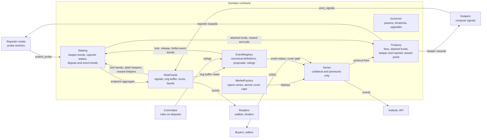

The Governor governs every contract through timelocked actions; its arrows are omitted for readability. The indexer reads events from all contracts; the arrow shows it reading the series, the busiest source. Section 3.5 shows the same contracts as a build and runtime dependency graph.

`Treasury` is built (`feat/treasury`, PR #13): the `ST -->|slashed funds, reward accruals| TR` and `TR -->|keeper and reporter rewards| KP, RN` arrows above are the real, current call shape, not a forward reference. `Staking` holds and pays only participant funds; every protocol-destined amount reaches `Treasury` through a real `deposit`/`accrue_reward` call (ADR-012, Section 4.5, 7.5, 7.8).

## 3. Contract inventory and deployment topology

Sylox v1 is seven Soroban contracts plus the Stellar Asset Contracts (SACs) of the assets it references. Three are core (oracle, registry, market factory), one is instantiated per series, and three are supporting (staking, treasury and governance).

### 3.1 Contracts

| Contract | Instances | Responsibility | Holds funds? |
| --- | --- | --- | --- |
| `RiskOracle` | 1 per network | Stores per asset signals per epoch and the ring buffer, computes the score, exposes bands, staleness and reference rates; keeps signal dispute records | No |
| `EventRegistry` | 1 per network | Canonical versioned event definitions, Tier 1 proposals, Tier 2 claims, challenges, Tier 3 rulings, ruling deadlines, per (asset, kind) event status, the cover gate; keeps proposal and challenge records | No |
| `Staking` | 1 per network | Keeper and reporter registration and stake, probe reports and aggregation, bond escrow for signal disputes, event proposals and challenges, slashing on instruction from `RiskOracle` and `EventRegistry` | Holds keeper bonds, reporter stakes, signal dispute bonds, event proposal and challenge bonds (USDC) |
| `Treasury` | 1 per network | Receives protocol fees and slashed funds, keeps the keeper and reporter reward pools, pays accrued rewards, spends only by governance | Holds protocol fees, slashed funds, keeper and reporter reward pools (USDC) |
| `MarketFactory` | 1 per network | Opens series, tracks the series index and counter, enforces global caps atomically, deploys `Series` contracts | No |
| `Series` | 1 per series | Collateral pool, quotes, cover tokens, share tokens, premiums, claims, withdrawals | Holds collateral and premiums only (USDC) |
| `Governor` | 1 per network | Multisig owned parameter store, timelock queue, upgrade execution, pause switches | No |

### 3.2 Why one contract per series

- **Isolation:** a bug or accounting error in one series cannot touch another series' collateral.
- **Bounded state:** each series has a fixed lifetime, so its storage can expire cleanly after final settlement.
- **Simple invariants:** one pool, one asset, one event definition, one term.

The factory deploys `Series` from a single uploaded Wasm hash using `env.deployer()`, with a salt derived from a monotonically increasing series counter maintained by `MarketFactory` (`SeriesCounter`, Section 15.1). A counter can never collide, whereas a salt built from series terms would collide for two series with the same asset, definitions and start time.

### 3.3 External dependencies

| Dependency | Used for | Access |
| --- | --- | --- |
| USDC SAC | Collateral, premiums, bonds, fees, rewards, payouts | `token::Client` transfer and balance |
| Issued asset SACs | Reference asset identity; optional balance reads for insurable interest checks | `token::Client` balance |
| Soroban AMM pairs (where they exist for the asset) | Onchain spot price cross check | `PriceAdapter`, one adapter per AMM |
| Reference FX oracle | Fiat reference rate for non USD assets | `FxAdapter` wrapping the chosen oracle's interface |
| Soroban Optimistic Oracle (optional) | Tier 2 dispute escalation, if adopted after review | Adapter contract |

Every external read goes through an **adapter** with a fixed interface, so a dependency can be swapped by governance without changing core contracts. The two adapter interfaces the core contracts call:

```rust
/// One per Soroban AMM (contracts/adapters/amm-*). Listed per asset in
/// AssetConfig.amm_adapters.
pub trait PriceAdapter {
    /// price: USDC per one unit of `asset`, SCALE 1e7.
    /// liquidity: pool depth within 2% of that price, USDC units.
    /// timestamp: ledger timestamp of the reserves the price was read from.
    fn spot_price(env: Env, asset: Address) -> (i128, i128, u64); // (price, liquidity, timestamp)
}

/// Wraps an external FX feed (contracts/adapters/fx-*). Set per asset in
/// AssetConfig.fx_adapter when the reference is Fiat.
pub trait FxAdapter {
    /// rate: USD per one unit of the ISO 4217 currency `code`, SCALE 1e7,
    /// on the requested basis (FxRateSource::Official or ::Market, Section 4.1).
    /// timestamp: time of the source observation.
    /// Fails if the wrapped feed does not publish that basis for `code`.
    fn rate(env: Env, code: Symbol, rate_source: FxRateSource) -> (i128, u64); // (rate, timestamp)
}
```

Callers treat a price or rate whose `timestamp` is older than `stale_after_epochs × epoch_secs` as unavailable and fail closed: a stale AMM price is skipped in the cross check (Section 5.3), and a stale FX rate fails `RiskOracle.reference_rate` (Section 12.1).

### 3.4 Networks

| Network | Purpose | Data source |
| --- | --- | --- |
| Local (quickstart) | Unit and integration tests | Mocked adapters |
| Testnet | MVP, trials, dispute drills | Mainnet data mirrored by the keeper, posted to testnet contracts |
| Mainnet | Production | Mainnet data |

Testnet uses real mainnet signals so the feed is meaningful before launch; testnet USDC is used for collateral and payouts.

### 3.5 Repository and module map

The repository is a single Cargo workspace (Section 22.1) plus independent offchain services. Every contract crate depends on one shared types crate so encodings never drift; nothing depends on a contract crate except its own tests and the offchain services that call it over RPC.

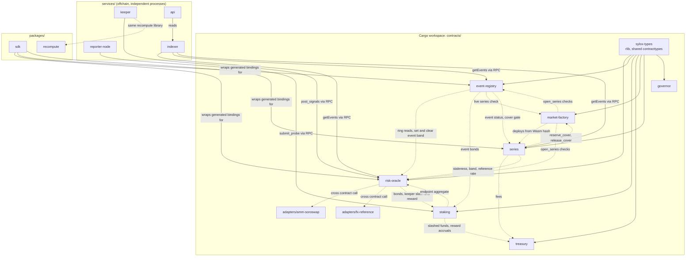

Solid arrows are compile time (Cargo) dependencies; dashed arrows are runtime cross contract calls or RPC calls, not Cargo dependencies, and point from the caller to the callee. No service is trusted for payouts (Section 18): everything a service posts is checked or disputable onchain, which is why the diagram has no arrow from a service into `Series`. Runtime calls between `RiskOracle` and `Staking`, and between `EventRegistry` and `MarketFactory`, go in both directions, so their addresses are computed before deployment and passed to each `initialize` (Section 22.2).

## 4. Core data model

All shared types live in a `sylox-types` crate imported by every contract, so encodings never drift between contracts. Types are `#[contracttype]` unless noted.

### 4.1 Assets and signals

```rust
#[contracttype]
pub struct AssetConfig {
    pub asset: Address,            // SAC address of the issued asset
    pub issuer: Address,           // classic issuer account (G...)
    pub reference: Reference,      // what the asset should be worth; fixed at add_asset
    pub home_domain: String,       // for SEP-1 / SEP-24 probing
    pub amm_adapters: Vec<Address>,// optional PriceAdapters (Section 3.3)
    pub fx_adapter: Option<Address>,// FxAdapter (Section 3.3); required for Fiat references
    pub min_liquidity: i128,       // USDC units; compared with the 7 day median before a depeg window
    pub issuer_flags: IssuerFlags, // decides whether IssuerFreeze is definable
    pub enabled: bool,
}

#[contracttype]
pub struct IssuerFlags {
    pub auth_revocable: bool,      // AUTH_REVOCABLE
    pub clawback_enabled: bool,    // CLAWBACK_ENABLED
}

#[contracttype]
pub enum Reference {
    Usd,                           // 1 unit = 1 USD
    Fiat(Symbol, FxRateSource),    // ISO 4217 code and rate basis, priced via FxAdapter
    Asset(Address),                // pegged to another onchain asset; rejected by RiskOracle's add_asset/update_asset in v1 (ReferenceNotSupported, Section 14): no USD rate is defined anywhere in this spec for an asset pegged reference
}

#[contracttype]
pub enum FxRateSource { Official, Market }

#[contracttype]
pub struct SignalSet {
    pub epoch: u64,
    pub posted_at: u64,            // ledger timestamp
    pub peg_ratio: i128,           // TWAP price / reference, SCALE 1e7
    pub peg_ratio_p10: i128,       // keeper posted, for recomputation/audit only: RiskOracle computes its own peg_ratio_p10 onchain from the ring's peg_ratio history for component P and the Depeg check (Section 6.5)
    pub liquidity_2pct: i128,      // depth within 2% of peg, USDC units
    pub redemption_net: i128,      // net burned minus issued this epoch, asset units
    pub supply: i128,              // total circulating supply from ledger asset stats, asset units
    pub supply_change_bps: i32,    // vs previous epoch
    pub issuer_actions: IssuerActions,
    pub endpoint: EndpointStatus,  // overwritten from Staking.aggregate; keeper value ignored
    pub inputs_hash: BytesN<32>,   // hash of raw inputs, for recomputation
    pub poster: Address,
}

#[contracttype]
pub struct IssuerActions {
    pub clawbacks: u32,
    pub clawback_amount: i128,
    pub auth_revocations: u32,
    pub flag_changes: u32,
}

#[contracttype]
pub enum EndpointStatus { Unknown, Up, Degraded, Down }
```

Field notes:

- **`reference` and `FxRateSource`.** Some currencies have two live exchange rates. Argentina is the standard example: for long periods the official ARS rate and the market (parallel) rate have differed by tens of percent, and at times the market rate has been more than double the official one. An ARS token redeemable at the official rate looks deeply depegged if it is measured against the market rate, and a token that trades at the market rate looks deeply depegged against the official one. So `Reference::Fiat` names its basis, and that basis is part of every event definition for the asset (Section 4.3). `update_asset` rejects any change to `reference`, so a basis can never change under a live definition.
- **`issuer_flags`.** Recorded from the issuer account when the asset is added and kept current by governance (a change shows up in `issuer_actions.flag_changes`). Revoking authorization needs `AUTH_REVOCABLE`; clawback needs `CLAWBACK_ENABLED`. If neither is set an issuer freeze is impossible, so `register_definition` rejects an IssuerFreeze definition for that asset (Section 8.2).
- **`min_liquidity`.** Compared with the median `liquidity_2pct` of the 7 days before a Depeg window starts, never with live liquidity (Sections 8.2, 11.4).
- **`peg_ratio_p10`.** Replaces the old lowest window value: one wick at a bad price moves a minimum but not a 10th percentile, so a single trade cannot force a band change through component P (Section 6.1).
- **`supply`.** Keeper posted from ledger asset stats. SEP-41 tokens expose no `total_supply` function, so supply cannot be cross checked against the SAC onchain; it is checked by recomputation like every other keeper value.
- **`endpoint`.** Comes only from the `Staking` aggregate of reporter probes (Section 7.4). `RiskOracle` overwrites the field in `post_signals` and `finalize_endpoint`; whatever a keeper puts there is ignored, so keepers post `Unknown`.

Since v1.5 (Section 5.9), a sub-epoch posts the same `SignalSet` shape, addressed by `(hour, sub)` instead of a single `epoch`:

```rust
#[contracttype]
pub struct SubEpoch {
    pub hour: u64,                 // the hourly epoch this sub-epoch rolls up into
    pub sub: u32,                  // 0..(3_600 / sub_epoch_secs), position within the hour
}
```

`SubEpoch { hour, sub }` is a key, not a new copy of `SignalSet`'s fields: `post_signals` for a sub-epoch takes this pair in place of `epoch` and otherwise posts the identical `SignalSet` shape above, with `sub_epoch_secs` substituted for `epoch_secs` in every "epoch `n` covers `[n * epoch_secs, ...)`" rule (Section 5.2, 5.9). Converting a sub-epoch's own absolute position to `(hour, sub)` and back is `hour = ts / 3_600`, `sub = (ts % 3_600) / sub_epoch_secs`; this stays a pure function of ledger time and the asset's current `sub_epoch_secs`, the same genesis-free property `epoch` already has (Section 5.2), with the one exception S1 states: a change to `sub_epoch_secs` takes effect only from the next hour boundary, so `sub`'s own meaning never shifts mid-hour.

The per asset ring buffer that Tier 1 checks read is described in Section 5.8; its slot type is:

```rust
#[contracttype]
pub enum SlotState { Empty, Pending, Disputed, Final }

#[contracttype]
pub struct RingSlot {
    pub epoch: u64,
    pub state: SlotState,          // per slot finality flag
    pub pending_until: u64,        // a Pending slot reads as Final after this
    pub peg_ratio: i128,
    pub liquidity_2pct: i128,
    pub redemption_net: i128,
    pub supply: i128,
    pub supply_change_bps: i32,
    pub clawback_amount: i128,
    pub auth_revocations: u32,
    pub endpoint: EndpointStatus,
}
```

### 4.2 Scores

```rust
#[contracttype]
pub struct RiskScore {
    pub epoch: u64,
    pub score: u32,                // 0..=100
    pub band: Band,
    pub formula_version: u32,
    pub stale: bool,
}

#[contracttype]
pub enum Band { Normal, Watch, Warning, Distress, Event }
```

### 4.3 Credit events

```rust
#[contracttype]
pub struct EventDefinition {
    pub asset: Address,
    pub kind: EventKind,           // one canonical definition per (asset, kind)
    pub version: u32,              // def_version, assigned by register_definition: previous + 1, from 1
    pub reference: Reference,      // copy of AssetConfig.reference, fixes the FX rate source
    pub depeg_threshold: i128,     // Depeg: e.g. 9_500_000 = 0.95
    pub depeg_window_secs: u64,    // Depeg: e.g. 259_200 = 72h
    pub max_missing_epochs: u32,   // Depeg: e.g. 6 of 72
    pub cure_threshold: i128,      // Depeg: e.g. 9_800_000, only during challenge
    pub freeze_pct_bps: u32,       // IssuerFreeze: X in the PRD
    pub mint_spike_bps: u32,       // MintWithoutBacking: Y in the PRD
    pub halt_window_secs: u64,     // WithdrawalHalt: e.g. 259_200 = 72h
    pub challenge_secs: u64,       // all kinds: e.g. 86_400
    pub ruling_deadline_secs: u64, // all kinds: e.g. 1_209_600 = 14 days from escalation
}
// stored by (asset, kind, version); Canonical(asset, kind) names the current version.
// Parameters that do not apply to `kind` must be zero.

#[contracttype]
pub enum EventKind { Depeg, IssuerFreeze, MintWithoutBacking, WithdrawalHalt, Insolvency }

#[contracttype]
pub enum EventState { None, Proposed, Challenged, Escalated, Declared, Rejected, Cured }

#[contracttype]
pub struct EventRecord {
    pub id: u64,
    pub asset: Address,
    pub kind: EventKind,
    pub def_version: u32,          // events are keyed by (asset, kind, def_version)
    pub tier: u32,                 // 1, 2 or 3
    pub state: EventState,
    pub window_start: u64,         // start of the failure window (Section 8.6)
    pub proposed_at: u64,
    pub escalated_at: Option<u64>, // ruling deadline = escalated_at + ruling_deadline_secs
    pub declared_at: Option<u64>,
    pub evidence_hash: BytesN<32>,
    pub proposer: Address,
    pub bond: i128,                // proposer bond held by Staking; 0 for Tier 1 and Tier 3
}

#[contracttype]
pub enum AssetEventStatus {        // per (asset, kind), for the canonical version
    None,
    InProgress(u64),               // event_id
    Declared(u64, u32, u64, u64),  // event_id, def_version, window_start, declared_at
}

#[contracttype]
pub enum CoverGate {               // EventRegistry.cover_gate(asset), Section 9.4 step 2
    Clear, EventInProgress, RecentDepeg, RecentEndpointOutage, RecentIssuerAction,
    UnbuiltBacklog,                // since v1.5, Section 5.9 S5
}
```

The `reference` copy is what "fixed in the event definition" means for the FX rate source: a buyer reading one definition sees exactly which rate the peg is measured against, and because `AssetConfig.reference` cannot change after `add_asset`, the copy and the oracle's live configuration always agree. `register_definition` rejects a definition whose `reference` differs from the asset's.

### 4.4 Series

```rust
#[contracttype]
pub struct SeriesTerms {
    pub asset: Address,
    pub def_versions: Map<EventKind, u32>, // covered kinds, one pinned def_version each
    pub settlement: Address,       // USDC SAC; never `asset`, never the same issuer as `asset`
    pub start: u64,
    pub expiry: u64,               // start + 30 or 90 days
    pub claim_window_secs: u64,    // e.g. 30 days
    pub cap: i128,                 // max total cover
    pub max_cover_per_buyer: i128,
    pub require_holding: bool,     // insurable interest check
    pub fee_bps: u32,              // protocol fee on premiums
}

#[contracttype]
pub enum SeriesState { Open, Closed, Triggered, Settling, Expired, Finalized }

#[contracttype]
pub struct Quote {
    pub seller: Address,
    pub rate_bps: u32,             // annualised premium rate
    pub available: i128,           // cover this seller still offers
}
```

`def_versions` replaces the single definition hash of v1.0. Its keys are the event kinds the series covers; each value must equal the canonical version for `(asset, kind)` when the series opens (Section 9.7), and stays fixed for the life of the series (invariant I11).

### 4.5 Staking and Treasury

```rust
#[contracttype]
pub enum BondKey {                 // one bond in Staking escrow
    SignalDispute(Address, u64),   // (asset, epoch), locked by RiskOracle
    EventProposal(u64),            // event_id, Tier 2 proposer bond, locked by EventRegistry
    EventChallenge(u64),           // event_id, challenger bond, locked by EventRegistry
}

#[contracttype]
pub enum TreasuryBucket { Fees, Slashed, KeeperRewards, ReporterRewards }
```

`RiskOracle` and `EventRegistry` keep the dispute, proposal and challenge records; the USDC behind each record sits in `Staking` under its `BondKey` (Section 7.8). `Treasury` accounts its USDC in the four buckets (Section 12.7).

A `BondKey::SignalDispute` bond also carries a `subject`: the keeper whose posting is disputed, passed from `RiskOracle.dispute_signals` into `Staking.lock_bond` (ADR-010, ADR-011). `Staking` uses this to count, per keeper, how many signal disputes naming it are still open, so removal cannot release a keeper's bond while one of its postings is still under dispute (Section 12.3). An event bond kind (`EventProposal`, `EventChallenge`) carries no subject: `EventRegistry` has no equivalent "which address does this concern" question a bond lock needs to answer.

## 5. Anchor Risk Oracle

The `RiskOracle` contract stores one `SignalSet` per asset per epoch, posted by bonded keepers, and derives the score and band onchain from those signals. Any posting can be disputed within a window by anyone who recomputes it from public data and gets a different result. `RiskOracle` holds no funds: keeper bonds and dispute bonds sit in `Staking` (Section 7.8).

### 5.1 Where each signal comes from

| Signal | Computed from | How it is verified |
| --- | --- | --- |
| `peg_ratio`, `peg_ratio_p10` | Trades on the classic DEX and classic AMM pools for the asset against USDC and XLM, over the window, volume weighted; divided by the reference rate on the asset's `FxRateSource` basis (Section 4.1). `peg_ratio_p10` is the 10th percentile of the volume weighted price series in the window, kept on `SignalSet` for recomputation and audit; `RiskOracle` itself computes its own `peg_ratio_p10` for component P from the ring's `peg_ratio` history onchain, not from this field (Section 6.5) | Recompute from Horizon or RPC trade history; onchain cross check against `PriceAdapter`s where present |
| `liquidity_2pct` | Classic order book offers and pool reserves within 2% of peg, valued in USDC | Recompute from a ledger snapshot at the epoch's closing ledger |
| `redemption_net` | Payments to and from the issuer account and burns, from ledger operations and SAC events | Recompute from ledger history |
| `supply` | Keeper posted from ledger asset stats at the epoch's closing ledger | Recompute from ledger history. SEP-41 tokens expose no `total_supply` function, so this cannot be cross checked onchain |
| `issuer_actions` | Clawback, set trustline flags and set options operations by the issuer | Recompute from issuer account operations |
| `endpoint` | Not keeper posted. `RiskOracle` writes the `Staking` aggregate of reporter probes for this epoch (Section 7.4) and ignores any keeper value | Reporter signatures and evidence bundles stored in `Staking` |

### 5.2 Epochs

- Epoch length: `epoch_secs`, frozen at 3,600 for v1 (Section 23). Epoch `n` covers `[n * epoch_secs, (n + 1) * epoch_secs)`, measured from the Unix epoch (`genesis = 0`): epoch numbering is a pure function of ledger time, the same for every asset, with no stored genesis to initialize or keep synchronized across contracts.
- One accepted `SignalSet` per asset per epoch. Later postings for the same epoch are rejected unless the first is overturned by a dispute, which reopens the epoch for reposting.
- Windowed signals (peg TWAP, `peg_ratio_p10`) look back `window_secs` (default 72 hours) ending at the epoch close.
- **Backfill:** a keeper may post any epoch that closed inside the current `window_secs` and is not yet Final. A keeper outage therefore leaves no gap if keepers catch up within the window, and an overturned epoch is reposted rather than becoming a gap.
- **Since v1.5, why the update interval is a sub-epoch underneath the hour, not a shorter `epoch_secs` (Section 5.9).** Shortening `epoch_secs` directly, rather than adding sub-epochs, fails on all three of the ring's own fixed costs. The ring is one storage entry: `storage.rs`'s own packed layout is 112 bytes per slot, 26,889 bytes total for the current 240 slot, hourly ring (9 byte header plus 26,880 bytes of slot data), comfortably under Soroban's 65,536 byte `contract_data_entry_size_bytes` limit (Section 5.8); the same 240 slots at 5 minute epochs would span only 20 hours, so holding the current 10 days of history would need 2,880 slots, about 322,560 bytes, 4.9 times over the limit. The long reads would get proportionally heavier: `DEPEG_WINDOW_SLOTS` (72, the 72 hour Depeg window) and `AGGREGATE_SLOTS_7D` (168, the 7 day score baseline) would become 864 and 2,016 slots read in one call at 5 minute epochs, 12 times their current cost, for every `propose_tier1` and every score recompute. And epoch numbering (`check_epoch_window`'s own `now / epoch_secs`, `genesis = 0`, `contracts/risk-oracle/src/lib.rs`) is a pure function of the CURRENT value of `epoch_secs`: changing it live reinterprets the time range of every epoch number already stored in every asset's ring, which is a migration, not a parameter change. Sub-epochs, rolled up into the hour that already fits all three budgets, avoid all three without touching `epoch_secs` or `RING_SLOTS` at all.

### 5.3 Posting flow

1. Keeper computes the `SignalSet` offchain and stores the raw inputs bundle (trades, offers, operations) at a content addressed location (IPFS or object storage).
2. Keeper calls `post_signals(asset, signal_set)`. The contract checks: keeper is bonded and active in `Staking`; the epoch closed inside the current `window_secs` and has no Pending, Disputed or Final posting; values are within sanity bounds (Section 11); `inputs_hash` is present. The keeper's `endpoint` value is discarded: if the epoch has closed and `Staking` has an aggregate for it, that aggregate is stored, otherwise `Unknown` until `finalize_endpoint` (Section 7.4).
3. If `PriceAdapter`s exist for the asset, the contract reads each `spot_price`, converts it to a peg ratio with `reference_rate(asset)`, and rejects a posting whose `peg_ratio` deviates more than `amm_tolerance_bps` from it, unless that adapter's liquidity is below `min_liquidity` or its timestamp is stale.
4. The posting enters `Pending` for `signal_dispute_secs` (default 2 hours), then becomes `Final`. The ring buffer slot for the epoch is written in the same call (Section 5.8). Scores use `Pending` values immediately for display, but credit event checks only use `Final` values.

### 5.4 Disputing a posting

- Anyone calls `dispute_signals(asset, epoch, alt_hash)` with a hash of their own inputs bundle. `RiskOracle` records the dispute and has `Staking` lock a bond of `signal_dispute_bond` USDC from the disputer under `BondKey::SignalDispute(asset, epoch)`, naming the epoch's poster as the bond's `subject` (Section 4.5, ADR-011) so the keeper's own bond cannot be released by a removal while this dispute is open.
- A dispute does not reset any window. The disputed epoch stays non final (Pending in the sense of Section 5.7, `Disputed` in its ring slot) until resolved; if overturned it reopens for reposting (Section 5.2).
- The dispute is decided by the committee multisig in v1 (a recomputation is deterministic, so the committee runs the open source recomputation tool on both bundles). Moving this to onchain verifiable recomputation is on the decentralization path (Section 1.6).
- Loser forfeits: 50% to the winner, 50% to the `Treasury`. If the keeper wins, `RiskOracle` instructs `Staking` to forfeit the disputer's bond to the keeper. If the disputer wins, `RiskOracle` instructs `Staking` to release the disputer's bond and slash the keeper by `keeper_slash` with the disputer as winner; `Staking` suspends a keeper after `keeper_max_faults`. `resolve_signal_dispute`'s own `reason` argument is accepted but not persisted by `RiskOracle` and not forwarded to `Staking.slash` (which always receives a zero filled reason from this call site); a committee ruling's actual reason lives only in whatever offchain record the committee publishes, not onchain.
- **Ruling deadline (ADR-010).** If the committee has not ruled within `signal_dispute_ruling_secs` (default 7 days) of the dispute, anyone can call `resolve_signal_dispute_timeout(asset, epoch)`: the default outcome favors the data, the same reasoning Section 8.9 gives for an escalated Tier 1 event. The keeper's posting stands (its slot becomes Final), the disputer's bond is released in full, and nobody is slashed; the committee's silence is read as no evidence the posting was wrong, not as a loss for either side. A miss is recorded against the committee address (`committee_misses`, Section 12.1), grounds for rotating the committee through governance.

### 5.5 Staleness

- An asset is **stale** if the risk score has not been computed from a Final epoch within `stale_after_epochs` (default 3) epochs of the current one. A brand new asset with fewer than 168 posted epochs (the 7 day baseline every score component needs, Section 6.5) also reads as stale, even while actively posting: there is not yet enough history to compute a trustworthy score at all, which is a different condition from "the data has gone old" but uses the same `stale` field, since nothing else in this spec distinguishes them.
- Two different reads can disagree about whether an asset is stale, by design: `is_stale(asset)` judges against the newest *posted* epoch; `score(asset).stale` and `check_stale(asset)` both judge against the *stored score's own epoch* (ADR-009). An asset whose finality has stalled behind a gap (ADR-008) can keep posting fresh epochs while its score stays frozen on an old one; `is_stale` alone would miss this, `score().stale` and `check_stale` catch it. Prefer `check_stale`/`score().stale` wherever "is this asset's risk data current" is the actual question.
- While stale: `RiskScore.stale = true`; `MarketFactory` blocks new series and `Series` blocks new cover on that asset; existing cover is unaffected.
- Staleness never triggers a credit event by itself.
- `asset_stale` is emitted once per transition into stale, not once per epoch spent stale (ADR-009); `check_stale(asset)` is the permissionless call that actually detects and announces the transition, called once per epoch for every asset by the monitor (Section 22.4).

### 5.6 Keepers

- v1: up to 5 permissioned keepers, each added by governance and bonded in `Staking` (`keeper_bond`, default 5,000 USDC). Together with the committee they are the v1 trust root for payouts (Section 1.6).
- Any keeper may post for any asset; the first valid posting for an epoch wins. `Staking.reward_keeper` exists and accrues `keeper_reward` from `Staking`'s own local reward balance (a stand-in for the `Treasury` keeper reward pool until `Treasury` exists), but as built `RiskOracle` never actually calls it when a posting becomes Final: no `RiskOracle` call site invokes `reward_keeper` yet (Section 12.3, 24.2), a known, open gap, not a design decision.
- Reference keeper implementation is open source (Section 18), so third parties can run one. Open keeper registration with higher stakes is a later version item (Section 1.6).

### 5.7 Signal lifecycle

Every epoch's `SignalSet` moves through the same states, independent of every other epoch: no epoch's state can block another epoch from becoming Final (ADR-008). `Final` is a precondition for a Tier 1 credit event check (Section 8.2); a signal that is still `Pending` or `Disputed` cannot count toward one. A dispute never resets a window: the disputed epoch simply stays non final until resolved, and does not prevent any later epoch on the same asset from reaching Final.

The newest Final epoch is found by scanning backward from the newest posted epoch, across the full backfill window, on every state changing call (ADR-008); a missing, Disputed, or still Pending epoch anywhere in that range is skipped, never a reason to stop. `signals_final` fires for an epoch the first time it is observed Final, tracked by a per-slot `final_announced` flag (Section 5.8); because a single scan can discover several epochs Final at once, and a backfilled epoch can become Final later than a newer epoch posted on time, `signals_final` events can arrive out of epoch order (Section 13.1).

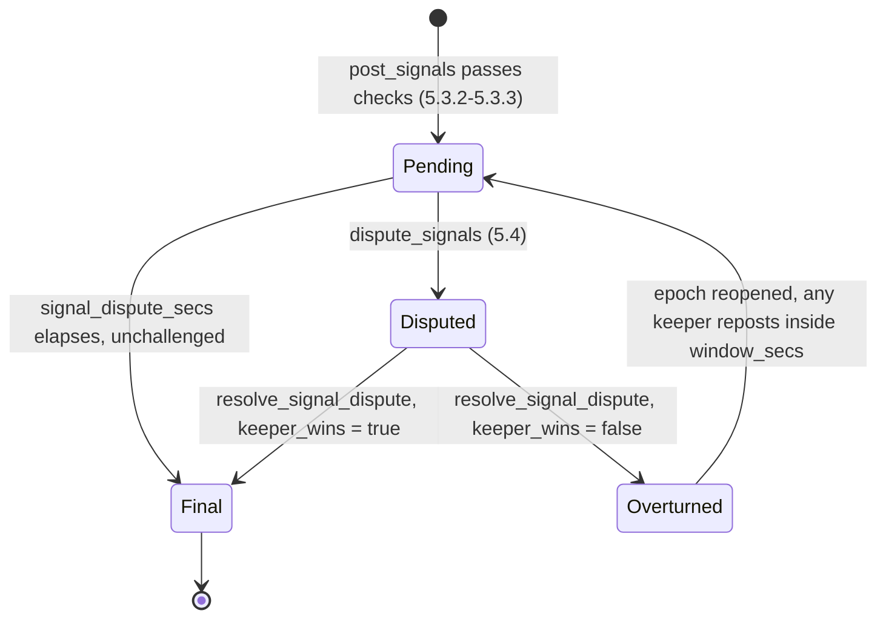

The posting and dispute flow as a call sequence, matching Sections 5.3 and 5.4 step for step:

```mermaid
sequenceDiagram
  participant Keeper
  participant Store as Object storage (inputs bundle)
  participant Oracle as RiskOracle
  participant AMM as AMM adapter
  participant Staking
  participant Disputer
  participant Committee

  Keeper->>Store: upload inputs bundle
  Store-->>Keeper: content hash
  Keeper->>Oracle: post_signals(asset, signal_set { inputs_hash })
  Oracle->>Staking: is_active_keeper(keeper)
  Oracle->>Oracle: check epoch inside window_secs and not posted, sanity bounds (11.3)
  Oracle->>Staking: aggregate(asset, epoch), keeper endpoint value ignored
  Oracle->>AMM: spot_price(asset) [if adapter configured]
  AMM-->>Oracle: (price, liquidity, timestamp)
  Oracle->>Oracle: reject if peg ratio gap above amm_tolerance_bps and liquidity >= min_liquidity
  Oracle->>Oracle: write Signals(asset, epoch) and ring slot, state = Pending
  Oracle-->>Keeper: signals_posted event

  alt no dispute within signal_dispute_secs
    Oracle->>Oracle: effectively Final once signal_dispute_secs elapses; observed and announced by the backward scan on the next state changing call for this asset (ADR-008)
    Note over Oracle,Staking: Staking.reward_keeper exists but, as built, nothing calls it here yet (known gap, Section 24.2)
    Oracle-->>Keeper: signals_final event (once, when first observed Final)
  else disputed
    Disputer->>Oracle: dispute_signals(asset, epoch, alt_hash)
    Oracle->>Staking: lock_bond(SignalDispute(asset, epoch), disputer, signal_dispute_bond, subject = Some(keeper))
    Oracle-->>Disputer: signals_disputed event, state = Disputed
    alt committee rules before signal_dispute_ruling_secs
      Committee->>Committee: run sylox-recompute on both bundles
      Committee->>Oracle: resolve_signal_dispute(asset, epoch, keeper_wins, reason)
      alt keeper_wins
        Oracle->>Oracle: state = Final
        Oracle->>Staking: forfeit_bond(SignalDispute, winner = keeper), 50% keeper, 50% Treasury
        Oracle-->>Keeper: signals_resolved event
      else disputer_wins
        Oracle->>Oracle: state = Overturned, epoch reopened for reposting
        Oracle->>Staking: release_bond(SignalDispute), disputer refunded
        Oracle->>Staking: slash(keeper, keeper_slash, winner = disputer), 50% disputer, 50% Treasury
        Oracle-->>Disputer: signals_resolved event
      end
    else nobody rules within signal_dispute_ruling_secs (ADR-010)
      Anyone->>Oracle: resolve_signal_dispute_timeout(asset, epoch)
      Oracle->>Oracle: state = Final, a miss recorded against the committee
      Oracle->>Staking: release_bond(SignalDispute), disputer refunded in full, keeper not slashed
      Oracle-->>Disputer: signal_dispute_timed_out event
    end
  end
```

Note on the sequence above: the forfeiture rule in Section 5.4 is symmetric by role, not fixed to one side. Whoever loses the dispute forfeits, split 50% to the winner and 50% to the `Treasury`. The `alt` branches show each direction explicitly so the asymmetry is visible at a glance: a losing keeper is slashed by `keeper_slash` and risks suspension, while a losing disputer only forfeits the dispute bond. In both branches the USDC moves inside `Staking`; `RiskOracle` only sends instructions.

### 5.8 Ring buffer

Tier 1 checks (Section 8.2), the cover gate (Section 9.4) and the 24 hour and 7 day score aggregates (Section 6.5) all read one entry per asset: `Ring(asset)`, a ring buffer of `RingSlot`s (Section 4.1), one slot per epoch. They never read the 72 or more separate `Signals(asset, epoch)` entries a window spans.

- **Size:** 240 slots, frozen for v1 alongside `epoch_secs` (Section 23), which is 10 days: the longest v1 depeg window (72 hours) plus the 7 day liquidity baseline before it (Section 8.2). The 24 hour and 7 day aggregates use the newest 168 slots.
- **Per slot finality flag:** `post_signals` writes the slot as `Pending` with `pending_until = posted_at + signal_dispute_secs`; a reader treats a `Pending` slot past `pending_until` as Final without a write. `dispute_signals` sets `Disputed`; a resolution sets `Final`, or `Empty` when overturned so the epoch can be reposted. A slot whose stored `epoch` is not the epoch expected at that position is treated as `Empty`. The newest Final epoch is found by scanning backward across the full backfill window on every state changing call (ADR-008), never by a cursor that depends on any other epoch's state.
- **Missing epochs:** an `Empty` slot, or one still `Pending` or `Disputed` when a check runs, is missing. Missing epochs count neither for nor against a Depeg (Section 8.2) nor against the score's own aggregates (Section 6.5): a missing epoch's contribution to a sum is 0 and uncounted, and a missing epoch is excluded from `peg_ratio_p10`'s percentile input entirely, not treated as present with some default value.
- **`final_announced` flag:** one byte per slot (layout version 2) marking whether `signals_final` has already been emitted for that epoch, so the backward scan never re-announces the same epoch. Set `true` only when a scan or a resolution first observes the epoch Final; reset to unannounced on a repost after an overturn. Not part of the `RingSlot` shape `ring(asset)` returns; it is bookkeeping for event emission, not signal data.
- **Encoding:** slots are stored packed as fixed width fields, no field names: 112 bytes per slot (106 used, padded for fixed offsets), plus a 9 byte header (layout version, slot count, slot width) validated on every read, 26,889 bytes for a full 240 slot ring. Measured against a naive `Vec<RingSlot>` using the SDK's own `#[contracttype]` derive (which encodes a struct as an XDR map of named fields): about 440 bytes per slot, 105,732 bytes for 240 slots, 61% over `contract_data_entry_size_bytes` (65,536). The packed encoding is required to fit at all; it is not achievable by storing the existing `RingSlot` type directly, only by hand (de)serializing it. The `ring(asset)` read still returns `Vec<RingSlot>` to callers; only the persisted representation is packed.
- **Write cost:** one ring write per accepted posting, plus the `Signals(asset, epoch)` entry kept for 30 days of direct history (Section 15.2). Measured against a full 240 slot ring: 1,891,655 CPU instructions (0.47% of `tx_max_instructions`), 28,012 bytes written (21.21% of `tx_max_write_bytes`, the binding constraint, though still well under it). The packed single entry design fits with headroom; no paging fallback is needed.

### 5.9 Sub-epochs and the hourly roll-up (v1.5)

Everything above this section is unchanged: the hour, the 240 slot ring, the 72 hour Depeg window, the 7 day score baseline, cure tracking, staleness, all of `EventRegistry`, all read and write exactly as already specified, from built hours. This section adds a second, faster posting layer underneath the hour, and the one rule that turns it back into an hour: the roll-up.

**S1. `sub_epoch_secs`, a governance setting per asset**

- Allowed values: 300, 600, 900, 1,200, 1,800, 3,600 seconds (5 to 60 minutes), each dividing 3,600 evenly. Default 300. Below 300 is a build constant, not a governance floor: going lower needs a new build, deliberately, so `Sub(asset)`'s own ring stays small (S3) and a single keeper is capped at 288 posts per asset per day at the default (Section 23).
- A change takes effect from the next hour boundary only: store `(sub_epoch_secs, effective_from_hour)` and expose a read of the pending value, so no sub-epoch already posted, or postable before that boundary, is ever reinterpreted under a different length.
- `sub_epoch_secs = 3,600` means exactly one sub-epoch per hour, numbered `sub = 0`: today's behavior, unchanged, reachable at any time by setting the parameter back.

**S2. Posting and disputes**

- Sub-epoch `sub` of hour `hour` covers `[hour * 3,600 + sub * sub_epoch_secs, hour * 3,600 + (sub + 1) * sub_epoch_secs)`. `sub` runs `0..(3,600 / sub_epoch_secs)`.
- A keeper posts the same `SignalSet` shape as today (Section 4.1), keyed by `(hour, sub)` instead of a single `epoch`: this is the natural way to address "which interval of which hour" at the API boundary, and the contract converts it internally to that sub-epoch's own start time, `sub_start = hour * 3,600 + sub * sub_epoch_secs`, which is what `Sub(asset)`'s own ring actually stores as each slot's identity (S3). Each post is Pending for `signal_dispute_secs` (2 hours, unchanged), disputable exactly as Section 5.4 already specifies, and ruled on by the same committee and timeout path (Section 5.4, ADR-010).
- **Backfill.** A sub-epoch can be backfilled for `sub_backfill_secs` only (new parameter, default 2 hours). Past that, the keeper backfills the whole hour through today's hourly path (`window_secs`, Section 5.2), which stays in place unchanged as the fallback. This is what keeps `Sub(asset)`'s own ring small (S3): it only ever needs to hold recent sub-epochs, never a full `window_secs` of them.
- **One writer per hour.** An hour is posted through exactly one of the two paths, never both: the hourly fallback path is accepted only for an hour with no sub-epoch posted yet, and once an hour has a sub-epoch posted, every later post for that hour (whether another sub-epoch or an hourly fallback) must go through the sub-epoch path. `HourAlreadyPosted` (new error, Section 14) rejects a fallback hourly post against an hour that already has at least one sub-epoch, and the reverse case: a sub-epoch post against an hour that was already posted through the fallback path. This keeps "which path wrote this hour" unambiguous without needing to merge data from both paths for the same hour.
- **Known trade-off at an outage's edge.** The hour in which a keeper outage BEGINS already has some sub-epochs posted before the outage started, so it can never use the hourly fallback (the rule above); if fewer than `min_sub_coverage_bps`'s worth posted before the outage, that hour builds Empty once its backfill window closes, staying missing, where a pre-v1.5 keeper could still have recovered it with a single hourly backfill post within `window_secs`. Every hour entirely INSIDE the outage has no sub-epoch posts at all, so it keeps the hourly fallback exactly as a missing hour does today. This costs at most one additional missing hour per outage, at either edge, which is inside Depeg's own `max_missing_epochs` tolerance (6 of 72) and the score's own missing-epoch handling (Section 6.5); it is not fixed further in this revision.
- **Reposting an overturned sub-epoch (ADR-005, extended to sub-epochs).** An overturned sub-epoch (a dispute the disputer won) reopens for reposting, mirroring ADR-005's own "an overturned epoch reopens for reposting" rule for the hourly path, with one difference a sub-epoch has that an hourly epoch does not: a sub-epoch's own `sub_backfill_secs` window (2 hours) can be, and usually is, far shorter than the ruling that overturns it (`signal_dispute_ruling_secs`, up to 6 days), so a repost window anchored only to the sub-epoch's own original close would almost always have already passed by the time the overturn happens. A repost is instead accepted until `max(sub_close, overturned_at) + sub_backfill_secs`, anchored to whichever of the two is later: the sub-epoch's own original close (the ordinary case, nothing overturned) or the ruling that overturned it (reliably reachable regardless of how long the ruling took). Where the repost lands depends on whether `Sub(asset)`'s own ring position for that `sub_start` still belongs to it (S3): if nothing newer has rotated in, the repost writes directly into the ring, same as any fresh post; if the ring has rotated past it (a slow ruling, S3), the repost writes into the hour's own `HeldHour` entry instead, never overwriting a different, newer sub-epoch's slot. Either way, the hour's own provisional roll-up and `provisional_sub_coverage` (S4) are recomputed using the same exclusion rule every other roll-up uses. **One repost per original overturn.** If the repost itself is later overturned too, that sub-epoch is permanently excluded, with no second repost: the longest an hour can wait on one sub-epoch is two full dispute cycles (post, dispute, overturn, repost, dispute, overturn again), never more. Until a repost's own window closes (or a repost arrives and is itself decided), the hour must not build: a sub-epoch awaiting a possible repost counts the same as one still inside its own backfill window, blocking the build exactly as `MissingWithinBackfill` already does, so the overturned value's own absence is never mistaken for final, decided data before the repost opportunity has actually run out. **Worst-case wait:** one cycle is at most `signal_dispute_secs + signal_dispute_ruling_secs + sub_backfill_secs` (7,200 + 518,400 + 7,200 = 532,800 seconds, about 6.17 days); two cycles, the absolute ceiling on how long one hour can stay unbuilt because of a single contested sub-epoch, is about 12.33 days (1,065,600 seconds).

**S3. Storage: `Sub(asset)`, a second packed ring**

- One packed ring per asset, same encoding as `Ring(asset)` (Section 5.8: fixed width fields, no field names, `SLOT_BYTES` per slot plus a 9 byte header), sized to outlive the worst case a sub-epoch dispute needs: `sub_backfill_secs + signal_dispute_secs + 3,600` seconds of sub-epochs, the one extra hour covering the time a scan or a resolution takes to actually run at the deadline instant (the same reasoning `risk-oracle/src/lib.rs`'s own `SIGNAL_DISPUTE_RULING_SECS` const assertion already uses for `Ring(asset)`, Section 23).
- **Fixed at 60 slots, never resized, always spanning a fixed 5 hour grid.** `(sub_backfill_secs + signal_dispute_secs + 3,600) / 300 = (7,200 + 7,200 + 3,600) / 300 = 60` slots, `60 * 112 + 9 = 6,729` bytes, about 10.3% of the 65,536 byte `contract_data_entry_size_bytes` limit. The ring's position function is anchored to the fixed 300 second (5 minute) grid, not to the asset's current `sub_epoch_secs`: `position = (sub_start / 300) % 60`, where `sub_start = hour * 3,600 + sub * sub_epoch_secs` is the sub-epoch's own START time, not the time it was posted (so a backfilled post lands on the slot its own interval owns, never on whatever slot "now" happens to occupy). Every allowed `sub_epoch_secs` value is a multiple of 300, so every sub-epoch's `sub_start` always falls exactly on this grid. Because of this fixed anchoring, `Sub(asset)` always spans exactly 5 hours of wall-clock time (the 2 hours of `sub_backfill_secs`, 2 hours of `signal_dispute_secs`, and 1 hour of margin the sizing formula above adds up), at every `sub_epoch_secs` value: a slower interval uses fewer of the 60 slots per rotation (6 of them at 1,800s, 1 of them at 3,600s), never more wall-clock span. Each slot stores its own `sub_start` timestamp as its identity, not `(hour, sub)`: what `sub` means depends on which `sub_epoch_secs` governed that hour, so after an interval change `(hour, sub)` alone cannot be read back reliably, while a timestamp is unambiguous regardless of any later interval change. A read checks the slot's stored `sub_start` against the `sub_start` being asked about, the same stored-identity check `slot_for_epoch` (`event-registry/src/lib.rs`) already uses for `Ring(asset)`'s own stale-slot detection: a mismatch is treated as missing, not misread as the wrong sub-epoch's data. This means a `sub_epoch_secs` change (S1) needs no re-encoding of `Sub(asset)` at all: it is a pure config change, exactly as S1 states. Since a disputed sub-epoch is copied out to `SubDispute` the moment it is disputed (below), the fixed 5 hour ring span never cuts a ruling short: a ruling that takes up to `signal_dispute_ruling_secs` (6 days) lives entirely outside the ring once disputed.
- **Disputes.** A disputed sub-epoch is copied out to its own `SubDispute(asset, hour, sub)` persistent entry the moment `dispute_signals` is called against it (mirroring `Overturned(asset, epoch)`'s own existing move-out-of-the-ring pattern, Section 15.1), so a ruling that takes up to `signal_dispute_ruling_secs` (6 days) can still read this ONE sub-epoch's own state correctly however far `Sub(asset)`'s ring has rotated underneath it. `SubDispute` alone is not enough to keep the HOUR itself correct, though: the hour's build also needs every OTHER sub-epoch's own data, and the ring's fixed 5 hour span is far shorter than the 6 day ruling deadline, so by the time a slow ruling arrives, the ring has typically rotated past the hour's entire footprint, not just the disputed slot. The moment ANY sub-epoch in an hour is disputed, every one of that hour's OTHER currently-readable (Pending or Final) sub-epochs, plus the disputed one's own pre-dispute data, is copied out to one `HeldHour(asset, hour)` entry (a `Map<sub, ...>` of the same roll-up fields `Sub(asset)`'s own slots carry, at most 12 entries, well under 1.3 KB); any sub-epoch of that hour posted afterward is written into the same entry as it posts. If the ruling upholds the keeper, the sub-epoch's value comes back from this held copy; if it overturns, that sub-epoch's own held entry is removed and excluded from the roll-up exactly as an ordinary overturned sub-epoch is. The hour itself stays `Disputed` in `Ring(asset)` for exactly as long as any of its sub-epochs has an open `SubDispute` (S4), never `Empty`, so a slow sub-epoch dispute cannot desync the ring from cure tracking the way an `Empty`-while-waiting hour would; `HeldHour` is cleared once the hour builds.
  **`HeldHour` is read by the build and dispute paths only, never by the gate.** `build_hour` and the hour's own `Disputed`-tracking (S4) read `HeldHour` once it exists for an hour, falling back to `Sub(asset)`'s ring directly only for the overwhelming majority of hours that never have any dispute at all; either source's own stored `state` is trusted directly, never a separate `SubDispute` lookup (`dispute_sub_signals`, `resolve_sub_signal_dispute` and `resolve_sub_dispute_timeout` all write `state` to whichever of `HeldHour`/`Sub(asset)` is the current source of truth for that sub-epoch, in the same call that changes it, so a later reader never needs to cross-check `SubDispute` to know a sub-epoch's current disposition; `SubDispute` itself is read only by those three dispute-resolution calls, for the dispute's own `disputer`/`alt_hash`/`opened_at` fields). `EventRegistry.cover_gate` is deliberately NOT one of those readers (S5): an earlier revision had the gate read `HeldHour` for an hour whose sub-epochs had rotated out of `Sub(asset)`'s own ring, but that made the gate's own footprint (the count of distinct ledger keys one call touches) grow by one key for every unbuilt hour scanned, since even a miss (an hour that was never held) still costs one footprint entry. Removing `HeldHour` from the gate path keeps that footprint flat regardless of how many hours are unbuilt (S5); the gate relies entirely on `Sub(asset)` (inside its own 5 hour span) and `Ring(asset)`'s own provisional roll-up (outside it, S4) instead, and never needs to know whether an hour has ever been held at all.
- **TTL.** Extended on every write, and on every `post_signals` for the asset, the same target lifetime as `Ring(asset)` (Section 15.2).

**S4. The roll-up**

*The hour slot's own state while it waits.* An hour that has not yet built is never `Empty` in `Ring(asset)`: it carries a real state, mirroring whatever is happening underneath it, so every existing reader of hourly slot state keeps seeing a true picture without any reader-side change.

- **Pending**, with `pending_until = u64::MAX`, for as long as the hour has at least one posted, non-disputed sub-epoch and none is Disputed. `pending_until` is pinned to `u64::MAX`, never derived from any sub-epoch's own `pending_until`, specifically so `effective_state_of` (`event-registry/src/lib.rs`) can never promote this slot to Final on its own: `now >= slot.pending_until` cannot hold while `pending_until` is the maximum representable value. The ONLY thing that ever writes `Final` for this hour is the build itself (below). This closes a gap a sub-epoch's own `pending_until` would otherwise leave open: if a sub-epoch is never posted at all (not disputed, simply missing, still inside its own `sub_backfill_secs`), there is no sub-epoch `pending_until` to extend the hour's own wait past the last sub-epoch that WAS posted, so a `pending_until` derived from posted sub-epochs alone would let the hour auto-promote to Final before every sub-epoch in it has actually been decided.
- **Disputed**, for as long as any sub-epoch in the hour is Disputed. Unlike an hour-level dispute through the hourly fallback path (where the one posted reading IS the contested value, Section 5.4), a sub-epoch-path hour's `Disputed` state excludes only the disputed sub-epoch(s) from its own provisional roll-up, never the hour's OTHER, non-disputed sub-epochs: the roll-up is recomputed, excluding disputed sub-epochs by the same rule `sub_peg_ratios` uses, on every post, dispute and ruling for the hour, reading from `HeldHour` once the hour's own sub-epochs have rotated out of `Sub(asset)`'s ring (so a ruling arriving after that rotation still has the other sub-epochs' real data to roll up from, not a stale or empty read). A `Disputed` slot is never subject to `effective_state_of`'s `Pending`-promotion rule in the first place, the same as before this fix.
- **Empty**, only once the hour has no sub-epochs posted at all yet (nothing to be Pending or Disputed about).
- **Provisional fields and `provisional_sub_coverage`.** While `Pending` or `Disputed` (not yet built), the hour's own `SignalSet` fields hold a provisional roll-up: the same S4 combining rule below, applied to whatever non-disputed sub-epochs have actually posted so far, recomputed on every sub-epoch post, dispute and ruling for the hour. A reader that only needs Pending-or-better data (the cover gate's own read, S5; app display) sees real, live numbers, never a zeroed placeholder, EVEN while the slot is `Disputed`. A reader that requires effective finality (Tier 1 checks, cure tracking, the score) still waits for the build, since `effective_state_of` never promotes this slot regardless of what its fields hold.

  A new field on `RingSlot`, `provisional_sub_coverage: Option<u32>` (packed as one byte on the ring, `0xFF` encoding `None`; a decoded value above 12, the most sub-epochs an hour can ever hold, is a storage-corruption error, not a value this contract ever writes), tells a reader two things the `state`/`peg_ratio` fields alone cannot:
  - **Which posting path produced this slot.** `None` means the hourly fallback path (`write_ring_slot`, Section 5.2): `peg_ratio` and the rest are the one real, possibly contested posted reading itself, with no roll-up or coverage concept. `Some(n)` means the sub-epoch path (`refresh_waiting_hour`/`try_build_hour`): the hour's fields are always a roll-up, not a single posted reading.
  - **Whether that roll-up holds real data.** `Some(0)` means every currently posted sub-epoch is disputed: zero non-disputed coverage, so the roll-up's own fields (computed from an empty list) read as an all-zero placeholder that must be treated as NO SIGNAL, never as a real reading of exactly zero. `Some(n > 0)` means `n` non-disputed sub-epochs' real values are rolled up into the slot's fields, trustworthy regardless of `state` (including while `Disputed`, since the roll-up already excludes the disputed sub-epoch(s)).

  `provisional_sub_coverage` is cleared to `None` the moment the hour builds (either outcome, `Final` or below-coverage `Empty`): a built hour's own fields are never a "provisional" anything again.

*When an hour is built.* Hour `hour` is built once every one of its sub-epochs is Final, permanently missing (past `sub_backfill_secs` and never posted), or settled-and-excluded (an overturned sub-epoch whose own repost window, S2, has closed with no repost, or whose one allowed repost was itself overturned with no further repost possible). Anyone can trigger the build; `post_signals` also triggers it inline, the same way it already triggers the hourly finality scan today (ADR-008). A sub-epoch still AWAITING a possible repost (overturned, its own repost window still open) blocks the build exactly as one still inside its own ordinary backfill window does: the longest an hour can wait on one sub-epoch stuck in this cycle is two full dispute rounds (post, dispute, overturn, repost, dispute, overturn again, S2), bounded, never open-ended.

*When an hour counts as present.* At least `min_sub_coverage_bps` (new parameter, default 7,500, so 9 of 12 sub-epochs at the 5 minute default) of its sub-epochs must be Final. Below that threshold, the built hour's own slot is written `Empty`, exactly like a missing hour today (Section 5.8): a sparse hour is a missing hour, never a present one computed from less data. This is a different `Empty` from the waiting state above: it is written once, at build time, and does not change again.

*Combining each field,* once a built hour clears the coverage threshold:

| `SignalSet` field | Rule | Why |
| --- | --- | --- |
| `peg_ratio` | Mean of the Final sub-epochs' `peg_ratio` | Each sub-epoch's `peg_ratio` is already a TWAP (Section 5.1); the mean of several TWAPs over contiguous, equal-length sub-windows is the TWAP over their union. With missing sub-epochs, this mean is the TWAP over the hour's covered sub-epochs only, not the full hour; `min_sub_coverage_bps` bounds how much of the hour can go uncovered before the hour is Empty instead |
| `liquidity_2pct` | Median of the Final sub-epochs | Matches the existing median-based liquidity baseline (Section 8.2), resistant to one sub-epoch's liquidity wick the same way `peg_ratio_p10` resists a price wick (Section 6.1) |
| `supply` | Last Final sub-epoch's value | `supply` is a point-in-time read (Section 4.1), not an accumulation; the hour's own closing supply is the last one observed inside it |
| `redemption_net`, `issuer_actions.*` (counts and amounts) | Sum across the Final sub-epochs | These are already per-interval flow and count fields (Section 4.1); summing sub-intervals reproduces the hourly total exactly, the same as summing hours already does for the 7 day aggregates (Section 6.5) |
| `supply_change_bps` | Recomputed against the previous built hour's `supply`, not summed or averaged from the sub-epochs' own per-sub-epoch change | A per-sub-epoch supply-change figure compounds incorrectly if summed or averaged across sub-epochs; recomputing from the two hourly `supply` values (this hour's and the previous built hour's) is the only way to keep this field meaning the same thing (hour-over-hour change) it already means today |
| `endpoint` | Unchanged: the hourly `Staking` aggregate, written the same way `post_signals`/`finalize_endpoint` already write it today | Probes stay hourly (S6); there is no sub-epoch endpoint value to roll up |
| `inputs_hash` | Hash of the Final sub-epochs' own `inputs_hash` values, in `sub` order | Keeps the built hour recomputable offchain from exactly the sub-epoch data that built it, the same promise Section 5.1 already makes for a single epoch's own `inputs_hash` |

*Finality of the built hour.* The built hour is written straight to `Final`: every sub-epoch inside it already went through the full Pending/dispute lifecycle on its own, so a built hour never itself enters `Pending` or `Disputed` as a NEW dispute target; the hour-level `Pending`/`Disputed` state above describes the hour WAITING for that lifecycle to finish underneath it, not a second lifecycle at the hour level. Once built, the slot is as immutable as any other Final epoch (I12); nothing rebuilds a built hour. Every place in this spec that reads hourly slot state:

| Assumption | Where | Behavior with a waiting or built hour |
| --- | --- | --- |
| `epoch_disposition` (`event-registry/src/lib.rs`): an `Empty` slot becomes `PermanentlyMissing` once `now > epoch_close + WINDOW_SECS`, where `epoch_close` is the target hour's own natural close time | Tier 1 checks, cure tracking (below) read a slot's disposition through this function | A waiting hour's slot is `Pending` (with `pending_until = u64::MAX`, above) or `Disputed`, never `Empty`, so this function's own `is_empty` branch does not apply to it; it falls through to `effective_state_of`, which reports `NotReady` for both states (the `Pending` branch's own promotion condition can never hold). `PermanentlyMissing` is reachable only once the hour is actually, finally Empty, after a build writes it so at the coverage threshold (above). The clock `epoch_disposition` measures is still the hour's own fixed `epoch_close`, same as for an hourly epoch today, not the time of the build-Empty write; this is consistent regardless, because a built-Empty hour never changes again, so whichever disposition `epoch_disposition` computes for it from that point on is itself final |
| F1's dispute-timeline const assertion (`WINDOW_SECS + SIGNAL_DISPUTE_SECS + SIGNAL_DISPUTE_RULING_SECS + EPOCH_SECS <= RING_SLOTS * EPOCH_SECS`, `risk-oracle/src/lib.rs`) | Guards `Ring(asset)` against a still-open dispute being overwritten by ring wraparound | Covers a waiting hour's own `Disputed` state the same way it already covers an hour-level dispute: the hour's slot stays `Disputed` in `Ring(asset)` for up to `signal_dispute_ruling_secs`, the exact span this check already bounds against ring wraparound |
| `FINALITY_LOOKBACK_EPOCHS` (the backward finality scan's own lookback window, ADR-008) | Finds the newest Final hour by scanning backward across the full backfill window | Unaffected: it scans hourly ring positions exactly as today; a waiting hour reads `Pending`/`Disputed`, the same as any other non-Final slot the scan already skips, and a built hour appears Final the moment the roll-up writes it |
| `effective_window` (`RiskOracle`'s per-epoch effective-state read, Section 12.1) | Reports whether a slot is effectively Final for `EventRegistry`'s Tier 1 checks (ADR-008) | Unaffected: it reports a waiting hour as not effectively Final (`Pending` before `pending_until`, or `Disputed`) and a built hour as Final from the moment it is written, the same two outcomes it already reports for an hour-level `Pending`/`Final` distinction today |
| Cure tracking (`CureProgress`'s per-epoch bitmap, Section 8.2, `event-registry/src/storage.rs`) | Records which cure-window hours recovered, via `epoch_disposition` | A waiting hour's `epoch_disposition` is `NotReady`, which `record_cure_progress` already treats as "not yet decided" (it does not record a bit), the same as it already does for a Pending or Disputed hour today; only once the hour is genuinely `PermanentlyMissing` (actually Empty, past `WINDOW_SECS` from that write) or `Final` (built) does a bit get recorded, so the bitmap can never record a disposition that later changes |
| `signals_final` (emitted once per epoch the first time it is observed Final, Section 13) | Announces hourly finality to indexers | Fires once per built hour, the same "first time observed Final" rule (the `final_announced` flag, Section 5.8) already guarantees; a built hour simply reaches that observation through the roll-up instead of through `pending_until` elapsing unchallenged |

A sub-epoch dispute resolving after its hour would otherwise have gone stale cannot desync the ring from cure tracking, because the hour's own slot stays `Disputed`, never `Empty`, for as long as the dispute is open: `epoch_disposition`'s `PermanentlyMissing` branch is reachable only from an `Empty` slot, and a waiting hour is never `Empty` until it is genuinely, finally decided one way or the other. This is the mechanism, not an assumption: the fix is the hour-level `Pending`/`Disputed` state itself, not a separate proof that a bad case cannot arise.

An hour-level `Disputed` state (above) has no hour-level `Dispute(asset, epoch)` record of its own (Section 15.1): the dispute record lives on the sub-epoch, in `SubDispute(asset, hour, sub)` (S3), not duplicated at the hour level. Hour-level dispute resolution and timeout paths (`resolve_signal_dispute`, `resolve_signal_dispute_timeout`, Section 5.4) must not assume a `Disputed` hour slot has a matching `Dispute(asset, epoch)` entry to read; they operate on the sub-epoch's own `SubDispute` record, exactly as the hourly path already operates on `Dispute(asset, epoch)` for an hour-level dispute today.

*Recomputable offchain.* A built hour's own `SignalSet` is a pure function of its Final sub-epochs' `SignalSet`s (the table above) and nothing else, so anyone can recompute it from the published sub-epoch data alone, the same guarantee Section 5.1 already states for a single epoch's own inputs bundle.

**S5. What gets faster**

- `EventRegistry.cover_gate`'s `RecentDepeg` check (Section 9.4), exactly ONE source per hour in the trailing `depeg_window_secs`, and NEVER `HeldHour` (S3):
  - A BUILT hour reads from `Ring(asset)` alone, at its own built, averaged `peg_ratio`, exactly as today: this keeps the gate's own sensitivity fixed regardless of `sub_epoch_secs` (a wick that lasted one sub-epoch and was absorbed into an hour's own average cannot be read back out once that hour builds), and keeps Section 9.4's own payout-window guarantee intact: a built hour that passed the gate can never be part of a Depeg window a purchase made afterward is exposed to, because a Depeg still requires every present HOUR in its window to fail.
  - An UNBUILT hour still inside `Sub(asset)`'s own 5 hour span (S3) is read at sub-epoch granularity, through ONE batched cross-contract call covering every such hour in the window (never one call per hour), so a depeg is visible within one `sub_epoch_secs` of starting. This call touches exactly one ledger key (`Sub(asset)`) regardless of how many hours or sub-epochs it covers, so the gate's own footprint does not grow with how many hours are scanned.
  - An UNBUILT hour whose sub-epochs have rotated OUT of that 5 hour span is read from `Ring(asset)`'s own provisional roll-up instead (S4), using `provisional_sub_coverage` to decide whether that roll-up holds real data: `Some(0)` (every posted sub-epoch disputed) reads as no signal, same as a missing hour; `Some(n > 0)` reads the roll-up's real values regardless of `state` (even `Disputed`, since the roll-up already excludes the disputed sub-epoch(s), S4); `None` (hourly fallback path) applies today's unchanged rule, excluding the slot entirely while `Disputed` (its own fields ARE the contested value, not a roll-up that already excludes anything).
  - **`UnbuiltBacklog`** (new `CoverGate` state). If more hours in the window are unbuilt at once than `MAX_UNBUILT_HOURS_SCANNED_BY_COVER_GATE` (`sylox_types::time`, 73, the structural maximum the window can ever produce) allows, `cover_gate` returns `UnbuiltBacklog` without making the batched sub-epoch read at all: blocking new cover is the safe failure, the same direction as every other gate state, rather than guessing or risking the read itself exceeding the network's own transaction memory limit. `73` is set at the exact structural ceiling (`RING_SLOTS - AGGREGATE_SLOTS_7D + 1`, Section 6's own window-size arithmetic), not a lower, extra-cautious number, because the measured cost even at that ceiling leaves comfortable margin on every real network limit (Section 15.3). **A sub-epoch dispute counts toward this cap**: a disputed hour is still unbuilt (S4), so enough simultaneous disputes can themselves push an asset into `UnbuiltBacklog` (Section 11.6's own accepted limit).
- **M1, `FeedBehind`.** `buy_cover` rejects unless the asset's newest posted sub-epoch is the last one that closed, or the one before it within `feed_grace_secs` (default 120 seconds) of the last close. The grace window is needed because the keeper posts a short margin after each sub-epoch closes (Section 18.1): without it, a sale would be rejected for that margin out of every `sub_epoch_secs`, a much larger fraction of the time at 5 minutes than it was at an hour. The most a depeg can stay hidden behind this grace window is one sub-epoch plus `feed_grace_secs`; M2 (`PriceGuard`, below) covers exactly that span as its own, independent check.
- **M2, `PriceGuard`.** An optional per-asset client, `PriceGuard.check(asset) -> GuardStatus { Ok, Paused, Unavailable }`, called after `cover_gate` in `buy_cover`'s own check sequence (Section 9.4). `Paused` or `Unavailable` rejects the sale with `FastSignalPause` (new error, Section 14). It only ever affects sales: a trigger, a claim, or an existing position is never gated by `PriceGuard`.
- `RiskOracle.latest(asset)` (Section 12.1) is unchanged by this revision: it keeps returning the newest HOUR's `SignalSet`, exactly as today, because `Series`'s own `require_holding` valuation (Section 9.4) and every existing integration already depend on that exact meaning, and changing it would silently move a payout-adjacent check onto Pending, challengeable sub-epoch data. A new read, `live(asset) -> Option<(SubEpoch, SignalSet, SlotState)>` (Section 12.1), returns the newest sub-epoch's `SignalSet` and its state instead, surfaced in the app as "Live" next to `latest()`/`score()`'s "Confirmed" values. `live()` is never used for `require_holding` or any other payout-adjacent valuation.
- The score and band stay hourly, computed only from built hours (Section 6): nothing about component P, L, R, I or S changes its own inputs, only how often the hour underneath them can become available.

**S6. Staking**

- Keeper rewards pay per accepted sub-epoch at `keeper_reward * sub_epoch_secs / 3,600` (Section 23), so the total paid out per hour of real coverage is unchanged regardless of `sub_epoch_secs`.
- `keeper_exit_delay_secs` (`signal_dispute_secs + epoch_secs` today, Section 23) is unaffected: it already derives from `signal_dispute_secs` and `epoch_secs`, neither of which this revision changes, and a sub-epoch dispute's own bond and timeline follow Section 5.4 exactly as an hourly one does today.
- Endpoint probes stay hourly: reporters probe once per hour exactly as today (Section 7), with no sub-epoch probing layer.

**S7. One home for time constants**

`RING_SLOTS`, `AGGREGATE_SLOTS_7D`, `MAX_CURE_EPOCHS`, the 6-of-72 Depeg missing-epoch tolerance (`max_missing_epochs`'s default), the 1-to-72 `challenge_secs` bound, and `Sub(asset)`'s own fixed slot count (60, S3) move into a new `sylox_types::time` module in the implementation PR, mirroring `sylox_types::network_limits`'s existing style (one constant per line, a doc comment naming its source, Section 21.3's own testing note). New build-time checks (`const _: () = assert!(...)`, the same pattern `risk-oracle/src/lib.rs` already uses for the dispute-timeline check above):

- `Ring(asset)` still fits `contract_data_entry_size_bytes` (unchanged from today; this revision does not touch `RING_SLOTS` or `SLOT_BYTES`).
- `Sub(asset)` fits `contract_data_entry_size_bytes` at the 5 minute floor (S3's own 6,729 byte figure).
- The cure window still fits `CureProgress`'s own `u128` bitmap (`MAX_CURE_EPOCHS`, unchanged).
- The existing dispute-timeline check (F1, above) still holds.

**S8. New invariants (Section 21.1)**

- Changing `sub_epoch_secs` never changes an hour that is already built, and never changes hour numbering.
- With `sub_epoch_secs = 3,600`, every existing test passes unchanged: the current suite is this revision's own regression proof.
- A sub-epoch that fails its dispute process (resolved Overturned) never contributes to a built hour.

## 6. Risk score

The score is a weighted sum of six component scores, each 0 to 100, computed onchain from the latest `SignalSet`. Formula version 1 is below; weights and targets are governance parameters, versioned so history stays comparable.

Since v1.5 (Section 5.9): the score and band stay hourly, computed only from built hours, regardless of `sub_epoch_secs`. A sub-epoch's own posting is never, by itself, an input to this section's formula.

### 6.1 Components

Let `clamp(x) = min(max(x, 0), 1)`. All divisions are fixed point with `SCALE = 1e7`.

| Component | Symbol | Formula | Default parameters |
| --- | --- | --- | --- |
| Peg deviation | P | 100 × clamp(\|1 − peg\_ratio\_p10\| / d\_max) | d\_max = 0.10 |
| Endpoint health | E | Up 0, Unknown 30, Degraded 50, Down 100 |  |
| Redemption pressure | R | 100 × clamp(redemption\_net\_24h / (supply × r\_max)) | r\_max = 0.10 |
| Issuer actions | I | 100 × clamp(clawback\_amount\_7d / (supply × c\_max) + auth\_revocations\_7d / k\_max) | c\_max = 0.01, k\_max = 20 |
| Liquidity | L | 100 × clamp(1 − liquidity\_2pct / L\_target) | L\_target per asset; v1 uses `AssetConfig.min_liquidity` as `L_target` (no separate `l_target` field exists yet; open item, Section 24.2) |
| Supply shock | S | 100 × clamp(\|supply\_change\_24h\_bps\| / s\_max\_bps) | s\_max\_bps = 2,000 |

### 6.2 Combined score

```math
\text{score} = \operatorname{round}\left(w_P P + w_E E + w_R R + w_I I + w_L L + w_S S\right)
```

Default weights (sum to 1): w\_P 0.35, w\_E 0.20, w\_R 0.15, w\_I 0.15, w\_L 0.10, w\_S 0.05. Stored as basis points that must sum to 10,000; `set_formula` rejects any other sum.

### 6.3 Bands and overrides

| Band | Score range | Override rules |
| --- | --- | --- |
| Normal | 0 to 24 |  |
| Watch | 25 to 49 |  |
| Warning | 50 to 74 | Forced to at least Warning if P = 100 or E = 100 |
| Distress | 75 to 100 | Forced to at least Distress while `EventRegistry` has called `set_event_in_progress(asset, true)` and not yet cleared it with `set_event_in_progress(asset, false)` |
| Event | n/a | Set when a credit event is Declared; sticky until governance re-enables the asset by registering a new canonical version for every Declared kind (Section 8.8) |

### 6.4 Hysteresis

To stop bands flapping, an upward move (towards Distress) applies immediately, but a downward move requires the new band's range for `band_down_epochs` consecutive epochs (default 3). A `BandChanged` event is emitted on every change.

### 6.5 Implementation notes

- 24 hour and 7 day aggregates (`redemption_net_24h`, `clawback_amount_7d`, `auth_revocations_7d`) are computed onchain from the newest 168 slots of the asset's ring buffer (Section 5.8), not trusted from the keeper. This is the same ring Tier 1 checks read.
- Component P uses `peg_ratio_p10`, computed onchain as the 10th percentile of `peg_ratio` across the newest `depeg_window_secs` slots of the ring, with missing epochs excluded from the percentile input, never the keeper posted `SignalSet.peg_ratio_p10` field (that field is kept for recomputation and audit only). A single epoch's wick inside the window therefore cannot move component P, the same guarantee as a window minimum would have broken; a sustained depeg across the window still moves it. A live liquidity collapse raises component L; it never blocks a payout (Section 8.2).
- The `set_event_in_progress` override (Section 6.3) is pushed by `EventRegistry`, registry authed; `RiskOracle` never calls into `EventRegistry` to check this itself. It is applied as a read time floor on every `score()`/`band()` call, not written into the stored `RiskScore`: the hysteresis streak that governs downward band moves (Section 6.4) is computed only from genuinely new epochs, never from this flag changing, so clearing the override cannot be mistaken for a new epoch of evidence and cannot corrupt the streak's own count.
- All math in `i128`; intermediate products are bounded by sanity checks on inputs (Section 11) where sanity checks apply; fields with no such bound (`clawback_amount`, `redemption_net`) can still overflow the 24 hour or 7 day sum across many epochs, which is reachable and intended, not a theoretical case. Use checked arithmetic throughout and return `MathOverflow`.
- The score is advisory data. Only credit events (Section 8), never the score, release payouts.

## 7. Reporter network and endpoint probing

Endpoint health is the one signal that cannot be read from the ledger, so it comes from a set of staked reporters who each probe every anchor independently and sign what they saw. `Staking` stores the reports and computes the majority result per epoch; `RiskOracle` takes the endpoint status only from that aggregate, never from a keeper. `Staking` is also the escrow for every bond in the protocol (Section 7.8).

### 7.1 What a probe checks

For each asset's `home_domain`, a reporter runs this sequence every `probe_secs` (default 900):

1. Fetch `https://<home_domain>/.well-known/stellar.toml` (SEP-1). Record HTTP status and whether `TRANSFER_SERVER_SEP0024` or `TRANSFER_SERVER` is present.
2. Call the transfer server's `GET /info`. Record status and whether the asset's `withdraw.enabled` (and `deposit.enabled`) is true.
3. Optionally, for anchors that opt in, run an authenticated SEP-10 flow with a reporter test account and start (but not complete) an interactive withdrawal, recording whether the flow opens.
4. Record latency for each step.

### 7.2 Result mapping

| Observation | Status |
| --- | --- |
| stellar.toml and /info return 200, withdraw enabled | Up |
| Reachable but latency above `degraded_ms` (default 5,000) or withdraw enabled only for some methods | Degraded |
| /info unreachable, non 200, or withdraw disabled for the asset | Down |
| Reporter could not run the probe (its own network failure) | No report |

### 7.3 Signed reports

```rust
#[contracttype]
pub struct ProbeReport {
    pub asset: Address,
    pub epoch: u64,
    pub status: EndpointStatus,
    pub region: Symbol,            // e.g. "eu", "us", "af"; accepted on the wire but IGNORED by Staking (ADR-011), see below
    pub evidence_hash: BytesN<32>, // raw HTTP transcripts bundle
}
```

Reporters submit `submit_probe(reporter, report)` with `reporter.require_auth()`. One report per reporter per asset per epoch, accepted only for the current epoch or the just-closed epoch within `probe_grace_secs` (new parameter, default 1h, Section 23) of its close.

`report.region` is accepted on the wire but ignored: `Staking` uses the reporter's own REGISTERED region (fixed at `add_reporter`, immutable afterward) for aggregation, never the field on the individual report. A reporter address can therefore never cover two regions by submitting twice; a single address contributes exactly the one region it registered under, no matter what it puts in `report.region` (ADR-011).

`Staking` keeps a per (asset, epoch) index of every reporter who submitted a probe for it, capped at `max_submitters_per_epoch` (new parameter, default 32, well above the 5 to 9 reporter target so no legitimate network could ever hit it). `aggregate`/`settle_probes` iterate this index, together with the region each probe was snapshotted under at submission (not a live lookup of the reporter's current registration), so a reporter removed after submitting still counts toward that epoch's result exactly as it would have before removal (ADR-011).

### 7.4 Aggregation

- At least `min_reporters` (default 3) reports from at least `min_distinct_regions` (new parameter, default 2) distinct regions are needed for a status other than Unknown.
- Status = the status reported by a strict majority; if no strict majority, Degraded. "Strict majority" means more than half of the reports received for that asset and epoch.
- `Staking.aggregate(asset, epoch)` computes this; it is a read with no side effects.
- The endpoint status comes only from this aggregate. `RiskOracle` writes it into the epoch's `SignalSet.endpoint` and ring slot during `post_signals` if the aggregate exists by then, or when anyone calls `RiskOracle.finalize_endpoint(asset, epoch)` after the epoch closes. `finalize_endpoint` lives on `RiskOracle`, reads `Staking.aggregate`, and then calls `Staking.settle_probes(asset, epoch)` so rewards and faults are booked exactly once. A keeper can never set the endpoint status.

### 7.5 Incentives and slashing

- Stake: `reporter_stake` (default 1,000 USDC), held in `Staking`.
- **Settlement window.** `settle_probes(asset, epoch)` is callable exactly once per (asset, epoch), only during `[epoch_close + probe_grace_secs, epoch_close + probe_grace_secs + settle_window_secs]` (new parameter, default 24h): the one span during which every probe for that epoch is guaranteed to still exist. Probes are separate temporary entries with independently extendable TTLs; settling on a set that cannot be guaranteed complete would let an address that extends only its own probe's TTL manufacture a majority by letting everyone else's probe expire first. **An epoch nobody settles within its window simply never settles**: no faults are recorded, no rewards are reserved, the reward pool is untouched. This is intended behavior, not an error state: stakes stay exactly where they were and nothing was transferred speculatively, so a missed settlement window costs nothing beyond the rewards that epoch would otherwise have paid out.
- Reward: an equal share of `reporter_reward_per_epoch` (0.1 USDC per settled asset-epoch) among reporters who agreed with the majority, for every epoch actually settled within its window. `Staking.settle_probes` accrues each matching reporter's share via `Treasury.accrue_reward(reporter, ReporterRewards, share)` (ADR-012); reporters claim with `Treasury.claim_reward`. `Treasury.accrue_reward` itself caps an accrual at what the `ReporterRewards` bucket holds and emits `reward_shortfall` if it could not cover the full request (Section 12.7); nothing is owed beyond that.
- Fault: a report that disagrees with the majority in an epoch where the majority had at least `fault_majority_threshold` (new parameter, naming the existing "3 or more" rule, default 3) reporters counts one fault. More than `reporter_max_faults` (default 10) faults in 30 days triggers a slash of `reporter_slash_bps` (default 1,000 = 10%) and suspension. The slashed amount goes to the `Treasury` (`Slashed`).
- Provably false evidence (an evidence bundle that contradicts the signed status) is slashed fully after a committee ruling.

### 7.6 Sybil resistance

v1 reporters are permissioned by governance (target 5 to 9, from different organizations and regions). Open registration with higher stakes is a later version item on the decentralization path (Section 1.6).

### 7.7 Reporter lifecycle and probe aggregation

A reporter's own state (separate from any one probe) moves between four states based on stake and fault history (Sections 7.5, 12.3):

```mermaid
stateDiagram-v2
  [*] --> Registered: add_reporter (governor)
  Registered --> Staked: stake >= reporter_stake
  Staked --> Staked: submit_probe each epoch
  Staked --> Suspended: faults > reporter_max_faults in 30d, or false evidence ruling
  Staked --> Unstaking: unstake_request (cooldown starts)
  Unstaking --> [*]: unstake, after cooldown >= reporter_exit_delay_secs
  Suspended --> Staked: governor re-adds, re-stake
  Staked --> Removed: remove_reporter (governor); deactivated immediately, no new probes
  Removed --> [*]: unstake, after reporter_exit_delay_secs (ADR-011); stake stays slashable until then
```

Removal (`Staked -> Removed`) is not an instant exit: it deactivates the reporter immediately but does not release its stake. The stake leaves only after `reporter_exit_delay_secs` has passed (ADR-011), long enough that every epoch the reporter could have probed can still run through its own settlement window and fault or slash it if warranted; a reporter's own voluntary `unstake_request` is held to the same floor (`unstake_cooldown_secs >= reporter_exit_delay_secs`), so neither path can be used to exit faster than the accountability window allows.

Each epoch, every active reporter probes independently and the contract resolves one aggregate status from however many reports arrive:

```mermaid
sequenceDiagram
  participant R1 as Reporter (eu)
  participant R2 as Reporter (us)
  participant R3 as Reporter (af)
  participant Anchor as Anchor's stellar.toml / transfer server
  participant Staking
  participant Oracle as RiskOracle
  participant Treasury

  par independent probes, every probe_secs
    R1->>Anchor: GET stellar.toml, GET /info (7.1)
    Anchor-->>R1: status, latency
    R1->>Staking: submit_probe(asset, epoch, status, region ignored, evidence_hash)
    Note over Staking: Staking uses R1's REGISTERED region ("eu"), snapshotted now, never the field above
  and
    R2->>Anchor: GET stellar.toml, GET /info
    Anchor-->>R2: status, latency
    R2->>Staking: submit_probe(asset, epoch, status, region ignored, evidence_hash)
  and
    R3->>Anchor: GET stellar.toml, GET /info
    Anchor-->>R3: status, latency
    R3->>Staking: submit_probe(asset, epoch, status, region ignored, evidence_hash)
  end

  Note over Staking: after epoch closes, needs >= min_reporters from >= min_distinct_regions
  alt strict majority on one status
    Staking->>Staking: aggregate = the status reported by the strict majority
  else no strict majority
    Staking->>Staking: aggregate = Degraded (7.4)
  end

  Note over Oracle: endpoint status comes only from Staking.aggregate, a keeper value is always ignored
  alt keeper posts after the epoch closed
    Keeper->>Oracle: post_signals(asset, signal_set)
    Oracle->>Staking: aggregate(asset, epoch)
  else anyone finalizes, for example when the keeper posted before probes were in
    Anyone->>Oracle: finalize_endpoint(asset, epoch)
    Oracle->>Staking: aggregate(asset, epoch)
  end
  Staking-->>Oracle: EndpointStatus
  Oracle->>Oracle: write SignalSet.endpoint and ring slot

  Note over Staking: only inside [epoch_close + probe_grace_secs, + settle_window_secs] (7.5); outside it, settle_probes rejects and the epoch never settles
  Oracle->>Staking: settle_probes(asset, epoch), once per asset epoch
  Staking->>Treasury: accrue_reward(reporter, ReporterRewards, share) for each reporter matching the aggregate, reporter_reward_per_epoch split equally (7.5, ADR-012)
  Staking->>Staking: reporters disagreeing with a fault_majority_threshold+ majority accrue one fault
```

### 7.8 Bond escrow and slashing

`Staking` holds every bond and stake in the protocol; `RiskOracle` and `EventRegistry` keep the records that decide who wins, and send `Staking` instructions. Neither of them ever holds USDC.

| Bond or stake | `BondKey` or record | Locked by | Settled by |
| --- | --- | --- | --- |
| Keeper bond | `Keeper(addr)` stake | Keeper, via `stake` | `slash` from `RiskOracle` on a lost signal dispute |
| Reporter stake | `Reporter(addr)` stake | Reporter, via `stake` | Fault slashes inside `Staking` (7.5); false evidence slash after a committee ruling |
| Signal dispute bond | `SignalDispute(asset, epoch)`, `subject` = the disputed posting's keeper | `RiskOracle.dispute_signals` | `release_bond` or `forfeit_bond` from `resolve_signal_dispute`, or `release_bond` from `resolve_signal_dispute_timeout` (ADR-010) |
| Tier 2 proposer bond | `EventProposal(event_id)`, no subject | `EventRegistry.propose_tier2` | `release_bond` or `forfeit_bond` from `finalize`, `rule` or `resolve_timeout` |
| Challenger bond | `EventChallenge(event_id)`, no subject | `EventRegistry.challenge` | `release_bond` or `forfeit_bond` from `rule` or `resolve_timeout` |

Settlement rules:

- `lock_bond(key, owner, amount, subject)` requires `amount > 0` and a `subject` matching the key's kind: `Some(keeper)` for `SignalDispute`, `None` for an event bond kind; a mismatch or a non-positive amount is rejected, never silently accepted (Section 12.3, 14).
- `release_bond(key)` credits the full bond back to its owner, and, for a `SignalDispute` bond, decrements the named keeper's open dispute count by one (ADR-011).
- `forfeit_bond(key, winner)` credits 50% to the winner and sends 50% to the `Treasury` (`Slashed`), and decrements the open dispute count the same way `release_bond` does. With no bonded counterparty (a challenge against a Tier 1 or Tier 3 proposal), `winner` is `None` and 100% goes to the `Treasury`.
- `slash(who, amount, winner, reason)` takes from a keeper or reporter stake with the same 50/50 split, capped at `min(amount, who's remaining balance)`: a request exceeding what `who` actually holds is paid out at what was actually deducted, never at the full requested amount, so the difference is never drawn from other participants' funds. Suspends the keeper or reporter once its fault limit is reached.
- Refunds and winnings are credited to a claimable balance and paid by `claim(who)`, never pushed, so a recipient whose USDC trustline is missing or frozen cannot block a resolution.
- On a ruling deadline timeout (Section 8.9, ADR-010) every bond on the event or dispute is released; nobody is slashed.

## 8. Credit Event Registry

`EventRegistry` is the only contract that can move an event into the Declared state, and Declared is the only state that releases payouts. It holds one canonical, versioned definition per (asset, kind) (Section 8.8), keys every event by (asset, kind, def_version), and keeps event status per (asset, kind), so a Declared WithdrawalHalt never blocks a later Depeg on the same asset. Each event moves through a fixed state machine; every transition is permissionless to trigger, but bonded and time locked. `EventRegistry` holds no funds: proposal and challenge bonds sit in `Staking` (Section 7.8).

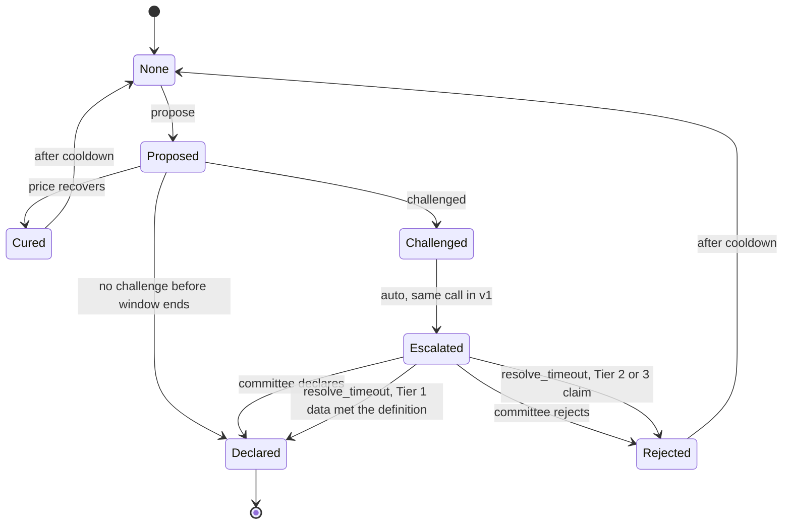

### 8.1 State transitions

| From | To | Trigger | Who |
| --- | --- | --- | --- |
| None | Proposed | `propose_tier1` passes checks, or `propose_tier2` with bond, or `propose_tier3` by committee, always against the canonical definition for (asset, kind) | Anyone (T1, T2), committee (T3) |
| Proposed | Challenged | `challenge` with bond inside `challenge_secs` | Anyone |
| Proposed | Declared | `finalize` after `challenge_secs` with no challenge | Anyone |
| Proposed | Cured | Depeg only: `finalize` sees `peg_ratio` above `cure_threshold` for the whole challenge window | Anyone |
| Challenged | Escalated | Automatic inside the same `challenge` call (v1 always escalates to the committee); sets `escalated_at`, which starts the ruling deadline | Anyone (the challenger) |
| Escalated | Declared or Rejected | `rule(event_id, outcome, reason_hash)` before the ruling deadline | Committee multisig |
| Escalated | Declared or Rejected | `resolve_timeout(event_id)` after the ruling deadline: Declared for escalated Tier 1 Depeg and IssuerFreeze, Rejected for everything else (Section 8.9) | Anyone |
| Cured, Rejected | None | Automatic; the (asset, kind) can be proposed again after `cooldown_secs` |  |
| Declared | (terminal) | No reversal for this (asset, kind, def_version) |  |

Escalation happens in the same call as the challenge so that no event can sit in Challenged with no clock running: if escalation were a separate call, a challenger could stall a Tier 1 event indefinitely by never escalating.

While any event of any kind is Proposed, Challenged or Escalated for an asset, `EventRegistry` calls `RiskOracle.set_event_in_progress(asset, true)` (Section 6.3, 12.1), forcing the band to at least Distress; it clears the flag with `set_event_in_progress(asset, false)` on every transition out of those three states (to Declared, Cured, Rejected, or None). `RiskOracle` never calls into `EventRegistry` to check this itself; the flag is purely pushed.

### 8.2 Tier 1 checks (keeper data, recomputable)

`propose_tier1(caller, asset, kind)` takes only (asset, kind) and always uses the current canonical definition for that pair (Section 8.8); the caller cannot pick a version. It reads the asset's ring buffer from `RiskOracle` in one call (`ring(asset)`, Section 5.8), never the 72 or more separate `Signals` entries a window spans, and checks only slots `RiskOracle.effective_window` reports effectively Final (ADR-008): a slot whose stored state is still `Pending` but whose `pending_until` has already passed counts as Final here too, the same as everywhere else in `RiskOracle`, so `EventRegistry` never derives finality by re-deriving it from `ring()`'s raw state field itself.

- **Depeg:** the window is the `depeg_window_secs` ending at the close of the latest Final epoch. It passes if every present (Final) slot in the window has `peg_ratio < depeg_threshold`, and the number of missing slots (no Final posting, Section 5.8) is at most `max_missing_epochs` (default 6 of 72). Missing epochs count neither for nor against. Liquidity floor: the median `liquidity_2pct` of the Final slots in the 7 days before the window started must be at least `min_liquidity`; liquidity inside the window is never checked. A live liquidity collapse is its own signal (component L, Section 6.1) and an input for the committee if the event is challenged, never a reason to block a payout. `window_start` = the start of the window's first epoch.
- **IssuerFreeze:** only definable for an asset whose `AssetConfig.issuer_flags` has `auth_revocable` or `clawback_enabled` set; `register_definition` rejects it otherwise (Section 8.8). Over the 7 days ending at the latest Final epoch, `clawback_amount / supply >= freeze_pct_bps` or `auth_revocations` above the threshold, and no governance flag marks the issuer's action as a declared compliance action. `window_start` = the start of the epoch holding the first counted clawback or revocation in those 7 days.
- **MintWithoutBacking** (later build phase, Section 1.2): `supply_change_bps >= mint_spike_bps` within 24 hours and `redemption_net` shows no matching inflow. Proposed as Tier 1 but always escalated to the committee before Declared, so for the ruling deadline it is treated as a claim (Section 8.9). `window_start` = the start of the 24 hour window.

No bond is required for Tier 1 proposals, because the data is already final and bonded at the oracle layer. Any challenge to a Tier 1 proposal still posts `challenge_bond`.

### 8.3 Tier 2: reporter claims

WithdrawalHalt is the least reliable event type: an anchor's endpoints can fail for reasons that are not a halt, and a real halt can sit behind endpoints that still answer. It is therefore Tier 2 only, never Tier 1, and comes in a later build phase (Section 1.2).

- `propose_tier2(proposer, asset, kind, evidence_hash)` for **WithdrawalHalt**, with `claim_bond` (default 2,000 USDC) locked in `Staking` under `BondKey::EventProposal(event_id)`.
- Evidence: reporter probes (the `Staking` aggregate and the reporters' evidence bundles); user submitted SEP-24 transactions stuck in a pending status beyond a threshold, with their transaction ids and status history; and anchor cooperation where available (the anchor confirming or denying the halt). The bundle is referenced by `evidence_hash`.
- Auto support: if the oracle's aggregated endpoint status has been Down for every epoch in `halt_window_secs`, the proposal is marked `supported` and no challenge bond multiplier applies.
- Challengers post `challenge_bond = claim_bond × challenge_multiplier` (default 1), locked under `BondKey::EventChallenge(event_id)`.
- Bond outcomes: winner gets their bond back plus 50% of the loser's; 50% goes to the `Treasury` (Section 7.8). On a ruling deadline timeout all bonds are refunded.
- `window_start` = `proposed_at − halt_window_secs`: the claim asserts that the whole halt window failed.

### 8.4 Tier 3: committee

- Committee: an M of N multisig address (default 4 of 7) registered in `Governor`. Together with the keepers it is the v1 trust root for payouts (Section 1.6).
- Handles **Insolvency** directly through `propose_tier3` (later build phase), and all escalated disputes through `rule`, before each event's ruling deadline (Section 8.9).
- Every ruling stores `reason_hash` pointing to a published written reason.
- Committee members must declare conflicts; a member with a conflict must not sign (enforced socially in v1, by an onchain recusal list later, Section 1.6).
- Insolvency has no measurement window: its `window_start` is `proposed_at`.

### 8.5 Effects of Declared

On Declared, the registry:

1. Sets `event_status(asset, kind) = Declared(event_id, def_version, window_start, declared_at)`. Other kinds on the same asset are unaffected.
2. Calls `RiskOracle.set_event_band(asset)`.
3. Settles the event's bonds in `Staking` (Section 7.8).
4. Emits `event_declared`.

From then on `MarketFactory` refuses new series on the asset (`EventRegistry.has_declared(asset)`, Section 9.7) until governance re-enables it by registering a new canonical version for every Declared kind on the asset (Section 8.8).

Series contracts do not get pushed a message; they **pull** status via `event_status(asset, kind)` for each kind they cover when someone calls `trigger` or `sync` (Section 9), which keeps the registry independent of how many series exist.

### 8.6 Which series an event covers

An event covers a series if all of these hold:

1. The series' `asset` matches.
2. The event's `kind` is a key of the series' `def_versions`, and the event's `def_version` equals the version pinned for that kind.
3. The event's failure window starts inside the term: `series.start <= window_start <= series.expiry`.
4. The event was proposed no later than one window length after expiry: `proposed_at <= series.expiry + window_len(kind)`.

During that post expiry acceptance period the series stays Pending (Section 9.2), so sellers cannot withdraw collateral that a late but valid proposal might need.

| Kind | `window_start` | `window_len(kind)` |
| --- | --- | --- |
| Depeg | Start of the first epoch of the evaluated window | `depeg_window_secs` |
| IssuerFreeze | Start of the epoch of the first counted clawback or revocation | 7 days |
| MintWithoutBacking | Start of the 24 hour window | 24 hours |
| WithdrawalHalt | `proposed_at − halt_window_secs` | `halt_window_secs` |
| Insolvency | `proposed_at` | 0 (must be proposed by expiry) |

Why the failure window start and not the proposal time: a 90 day series whose asset starts to depeg on day 88 cannot be proposed before expiry, because a 72 hour window needs 72 hours of failing epochs and only 48 remain. Keying coverage on `proposed_at` would let that series expire unpaid even though the failure began while the cover was live. With this rule the window starts on day 88, inside the term; the proposal becomes possible on day 91 and is accepted until day 93 (expiry plus 72 hours); the series waits in Pending and pays. Conversely, a depeg that starts after expiry is never covered, however long the acceptance period runs, because its window starts outside the term.

Combined with the cover gate (Section 9.4 step 2), which blocks buying while any posted epoch in the trailing depeg window is below threshold, this also guarantees that any depeg window that triggers a payout started after the purchase: a Depeg needs every present epoch of its window to fail, and the buyer could only buy when every posted epoch of the trailing window passed. The one precise caveat is epochs not yet posted at the moment of purchase (the open epoch plus any keeper backlog, which the staleness rule in Section 5.5 caps below `stale_after_epochs`); a window can start that many epochs before the purchase only if those epochs later post as failing.

### 8.7 End to end: Tier 1 depeg to a buyer's payout

This traces one concrete path through the state machine in Section 8's diagram: an uncontested Tier 1 proposal declared after its challenge window, then a series pulling that status to pay out a buyer. A challenged event (escalation to the committee, ruling or ruling deadline timeout, Section 8.9) and Tier 3 (direct committee ruling) replace the middle section only; the pull based settlement at the end is identical for every tier.

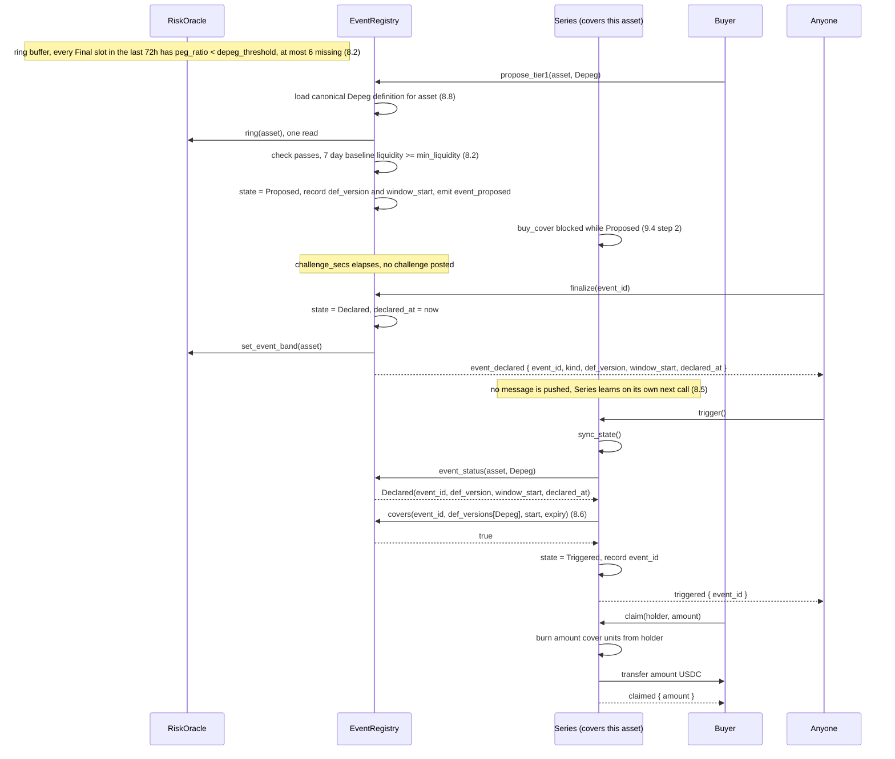

### 8.8 Canonical definitions and versions

There is exactly one canonical `EventDefinition` per (asset, kind), registered by governance through the `RegisterDefinition` action (7 day timelock). Definitions are never edited; a change registers a new version.

- **Registration:** `register_definition(def)` stores the definition under `(asset, kind, version)` with `version` = the current canonical version plus one (1 for the first), and points `Canonical(asset, kind)` at it. It rejects the definition if:
  - the asset is not registered in `RiskOracle`, or `def.reference` differs from `AssetConfig.reference`;
  - a parameter that does not apply to `kind` is non zero, or the Depeg window plus the 7 day baseline does not fit in the ring buffer (Section 5.8);
  - `kind` is IssuerFreeze and the asset's `issuer_flags` has neither `auth_revocable` nor `clawback_enabled` (`FreezeImpossible`);
  - an event for (asset, kind) is in progress;
  - any live series on the asset still pins the current version for `kind` (`DefinitionInUse`). The registry checks this by reading `MarketFactory.series_for(asset)` (at most `max_series_per_asset` entries) and each series' `terms()`.
- **Invariant I13:** every live series pins the current canonical version of each kind it covers. It follows from the last rejection rule plus `open_series` accepting only current versions (Section 9.7). Because of it, `event_status(asset, kind)` is unambiguous: the status a series reads is always the status of the version it pinned. To change a definition, governance stops opening series that pin the old version, lets the live ones expire or trigger (and calls `sync` on them), then executes the queued `RegisterDefinition`.
- **Proposals:** `propose_tier1`, `propose_tier2` and `propose_tier3` take (asset, kind) and always use the current canonical version. Nobody can choose a more favourable version.
- **Status:** `event_status(asset, kind)` reports the status of (asset, kind) under its canonical version. A new version starts at `None`.
- **Re-enabling after Declared:** after any Declared event on an asset, `MarketFactory` blocks new series on that asset. Governance re-enables it by registering a new canonical version (possibly with identical parameters) for every Declared kind on the asset. When the last Declared kind on the asset gets a new version, the registry calls `RiskOracle.clear_event_band(asset)`, the band returns to its score, and `open_series` works again. The old Declared event stays on record under its old version.

### 8.9 Ruling deadline and default outcome

The committee must rule within `ruling_deadline_secs` (default 14 days) of escalation, which in v1 is the moment of the challenge. If it has not, anyone can call `resolve_timeout(event_id)`:

| Event | Default on timeout | Why |
| --- | --- | --- |
| Escalated Tier 1: Depeg, IssuerFreeze | Declared | The data already met the definition; the challenger carries the burden of proof |
| Tier 2: WithdrawalHalt | Rejected | Based on claims |
| Tier 3: Insolvency | Rejected | Based on claims |
| MintWithoutBacking | Rejected | The Tier 1 data is only a flag; the definition requires committee confirmation, so it is treated as a claim |

On timeout every bond on the event is refunded through `Staking.release_bond`; nobody is slashed for the committee's silence. The registry records the miss against the committee address that was registered at escalation (`CommitteeMisses(committee)`), emits `ruling_timed_out`, and missed deadlines are grounds for rotating the committee through governance (`SetCommittee`). A declared outcome on timeout has the same effects as any other Declared (Section 8.5).

Bound on Pending: once a series' post expiry acceptance period (Section 8.6) has ended, the latest possible proposal can be challenged for at most one challenge window and then ruled on or timed out within the ruling deadline. So no series can sit in Pending beyond the ruling deadline plus one challenge window after its acceptance period; with the default Depeg definition that is at most 3 + 1 + 14 = 18 days after expiry. `resolve_timeout` is permissionless, so the bound does not depend on the committee acting.

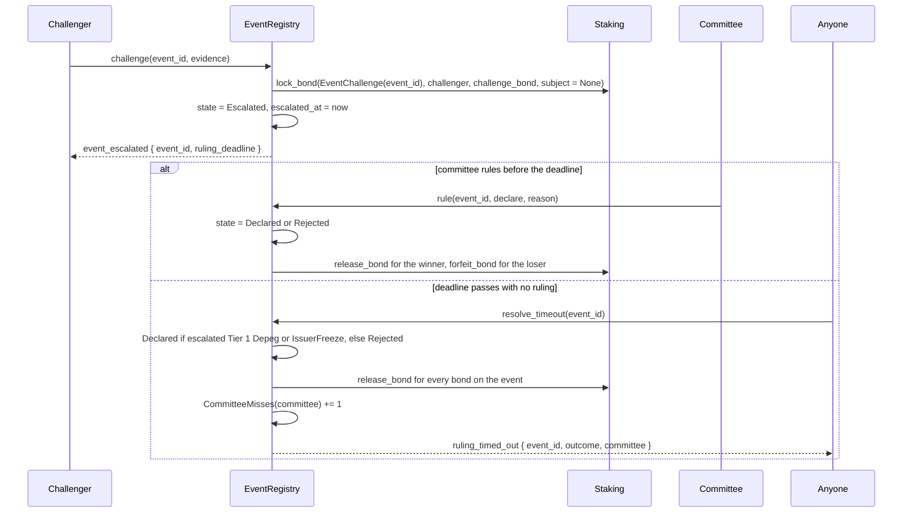

## 9. Protection Markets

Each `Series` contract is a self contained market: sellers deposit USDC and post quotes, buyers fill those quotes to receive fungible cover units (1 unit pays 1 USDC on a covered event), and every unit of cover is backed by one unit of the seller's locked collateral at all times.

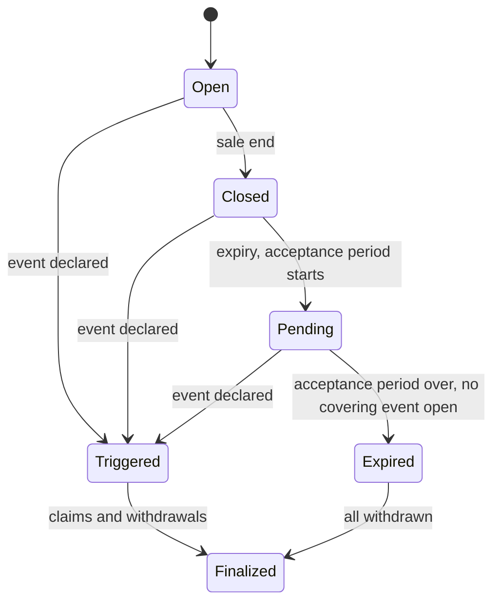

### 9.1 Positions

- **Seller position** (non fungible, keyed by seller address): `collateral`, `cover_written`, `premium_earned`, `quote`. Invariant: `cover_written <= collateral`. Transferable with `transfer_position(from, to)`, which moves the whole position. In v1 it rejects with `RecipientHasPosition` if `to` already holds a position in the series, because merging two positions (and their quotes) is not defined; the recipient must withdraw or transfer its own position first.
- **Cover units** (fungible within the series): the `Series` contract implements the SEP-41 token interface for cover units, so wallets can show and transfer them. Symbol `CVR-<asset code>-<expiry yyyymmdd>`, 7 decimals to match USDC.

### 9.2 Series states

| State | Meaning | Allowed actions |
| --- | --- | --- |
| Open | Before `sale_end` | Deposit, quote, buy, withdraw unencumbered collateral |
| Closed | `sale_end` to `expiry`; no new cover | Withdraw unencumbered collateral |
| Triggered | A covered event is Declared | Claims; sellers withdraw `collateral − cover_written` plus premiums |
| Pending | After `expiry`, while the acceptance period runs (one window length per covered kind, the longest one counts, Section 8.6) or while an event that could cover the series is still Proposed, Challenged or Escalated | Nothing until it resolves; bounded by Section 8.9 |
| Expired | After `expiry`, no covering event | Sellers withdraw everything; cover units are worthless |
| Finalized | All seller balances withdrawn | Read only; storage may lapse |

`sale_end = expiry − sale_cutoff_secs` (default 3 days). Transitions are lazy: any state changing call first runs `sync_state()`, which reads the clock and `EventRegistry.event_status(asset, kind)` for each kind in `def_versions`. When a series reaches Expired or Triggered, `sync_state()` calls `MarketFactory.release_cover`, which also removes the series from the factory's live list.

### 9.3 Quotes and the order book

- `quote(seller, rate_bps, available)` sets or replaces the seller's single quote. `available <= collateral − cover_written`.
- Quotes are kept in a vector sorted by `rate_bps`, capped at `max_quotes` (default 64) per series. A new quote above the cap must beat the worst rate, which is evicted.
- `cancel_quote(seller)` sets `available = 0`.

### 9.4 Buying cover

`buy_cover(buyer, amount, max_rate_bps) -> (filled, premium_paid)`:

1. `buyer.require_auth()`; `sync_state()`; series must be Open.
2. Reject if any of these holds (this blocks informed buying, ADR-003):
   - the asset is stale (`AssetStale`), or its band is Distress or Event (`AssetDistressed`);
   - `EventRegistry.cover_gate(asset)` is not `Clear`:
     - `EventInProgress`: any event of any kind is Proposed, Challenged or Escalated for the asset (`AssetDistressed`);
     - `RecentDepeg`: any posted epoch (Pending or Final) in the trailing `depeg_window_secs` has `peg_ratio < depeg_threshold` (`RecentFailureSignals`);
     - `RecentEndpointOutage`: the endpoint status was Down or Degraded in any epoch of the trailing `halt_window_secs` (`RecentFailureSignals`);
     - `RecentIssuerAction`: any clawback or authorization revocation, the actions IssuerFreeze counts, occurred in the last 7 days (`RecentFailureSignals`);
     - `UnbuiltBacklog` (since v1.5, Section 5.9, S5): more hours in the trailing `depeg_window_secs` are unbuilt at once than `cover_gate` can safely scan (`RecentFailureSignals`).

   The gate reads the ring buffer once (Section 5.8). Thresholds and windows come from the asset's canonical definitions, which for the kinds a live series covers are exactly the versions it pins (invariant I13); where the asset has no definition of a kind, the Section 23 default for that parameter applies. Because a Depeg requires every present epoch in its window to fail, this guarantees that any depeg window that triggers a payout started after the purchase (Section 8.6 states the exact caveat).

   Since v1.5 (Section 5.9, S5): `RecentDepeg` reads exactly ONE source per hour, NEVER `HeldHour`. A BUILT hour is checked through `Ring(asset)` exactly as today, at its own built, averaged `peg_ratio`. An UNBUILT hour still inside `Sub(asset)`'s own 5 hour span is checked at sub-epoch granularity, through one batched cross-contract call covering every such hour in the window. An UNBUILT hour whose sub-epochs have rotated out of that span is checked through `Ring(asset)`'s own provisional roll-up instead, using `provisional_sub_coverage` (S4) to tell a real roll-up from zero coverage. This way a depeg blocks new cover within one `sub_epoch_secs` of starting, without changing the gate's own sensitivity to how long a single wick stays visible: a wick a built hour's own roll-up (S4) already absorbed into its average can never, by itself, be read back out once that hour builds, since the gate stops reading sub-epochs for a built hour at all. If more hours are unbuilt at once than `MAX_UNBUILT_HOURS_SCANNED_BY_COVER_GATE` allows, `cover_gate` instead returns `UnbuiltBacklog`, blocking the sale the same as any other gate state (Section 11.6 states the accepted limit this creates). `RecentEndpointOutage` and `RecentIssuerAction` are unaffected: endpoint probes stay hourly (Section 5.9, S6), and issuer actions are read from the hourly ring exactly as today.
3. Since v1.5: reject (`FeedBehind`, Section 5.9, S5; `feat/markets` M1) unless the asset's newest posted sub-epoch is the last one that closed, OR is the one before that and fewer than `feed_grace_secs` (new parameter, default 120 seconds) have passed since the last sub-epoch closed. The grace window accounts for the keeper's own short posting margin after each close (Section 18.1): without it, every sale would be rejected for a few seconds out of every `sub_epoch_secs` simply because the newest post has not landed yet, which at a 5 minute interval is a meaningfully larger fraction of the time than it was at an hour.
4. Since v1.5: if the asset has a `PriceGuard` configured, call `PriceGuard.check(asset)`; reject with `FastSignalPause` unless it returns `Ok` (Section 5.9, S5; `feat/markets` M2). An asset with no `PriceGuard` configured skips this step. `PriceGuard` only ever gates a sale: it is never consulted by `trigger`, `claim`, or any read of an existing position.
5. Check the series' own caps: series total cover plus `amount` is at most `cap`; buyer's cover plus `amount` is at most `max_cover_per_buyer`. The series never reads the asset wide cap.
6. If `require_holding`: the USD value of the buyer's issued asset balance must be at least the buyer's resulting cover in USDC:

   ```math
   \text{balance} \times \text{peg\_ratio} \times \text{fx\_rate} \ge \text{resulting cover}
   ```

   `balance` is read from the asset's SAC, `peg_ratio` is the latest posted value, and `fx_rate` is the reference to USD rate from `RiskOracle.reference_rate(asset)`: `SCALE` for a `Usd` reference, `FxAdapter.rate(code, rate_source)` for a `Fiat` reference. A stale rate fails closed. All factors are fixed point with `SCALE`, rounded down. `open_series` rejects `require_holding` for an asset with an `Asset` reference in v1 (Section 9.7), so that case never reaches this step.
7. Walk quotes from cheapest; skip any with `rate_bps > max_rate_bps`; fill until `amount` or quotes run out. For each fill, compute the premium (Section 10), add `fill` to the seller's `cover_written` and the premium net of fee to `premium_earned`.
8. Call `MarketFactory.reserve_cover(series, filled)`. The factory checks `open_cover(asset) + filled <= cover_cap(asset)` and reserves in the same call, or fails with `CoverCapExceeded` and the whole purchase reverts. There is no separate read of the cap, so there is no window between checking and reserving.
9. Transfer total premium from buyer to the series (USDC); pay the fee part into the `Treasury` with `Treasury.deposit(series, Fees, fee)`; mint `filled` cover units to the buyer.
10. Emit `cover_bought`. Partial fills are allowed; the caller sees `filled < amount`.

Call sequence for the steps above, using the two seller example from Section 10.5 (Seller A quotes 400 bps, Seller B quotes 300 bps; buyer walks the book cheapest first):

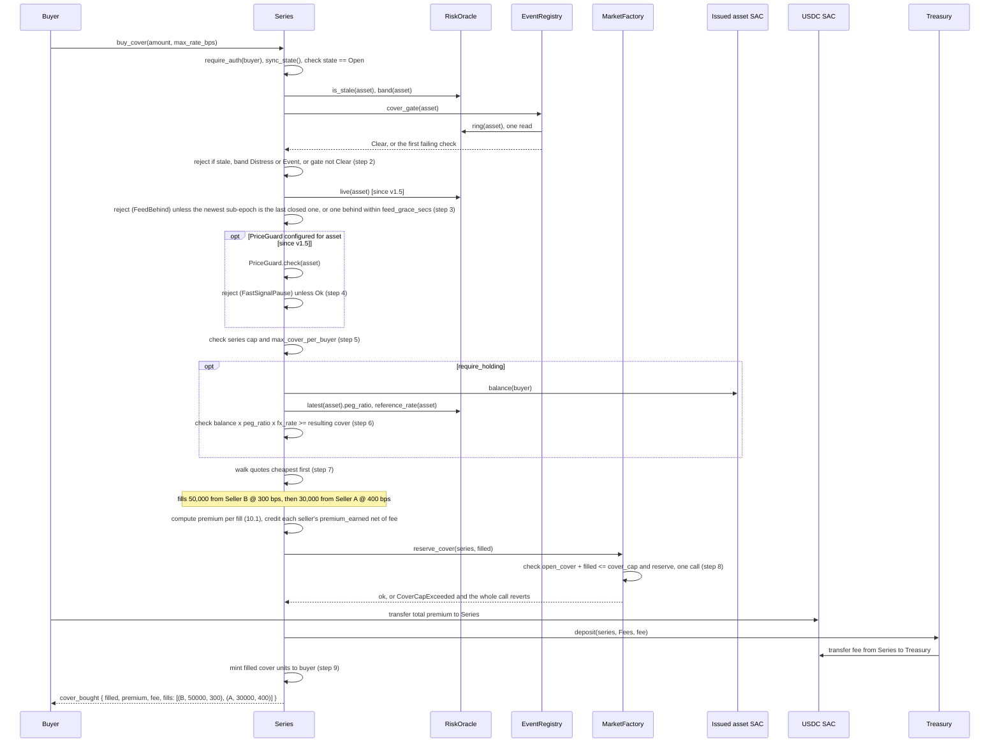

### 9.5 Triggering and claiming

- `trigger()`: anyone; succeeds if, for some kind the series covers, the registry reports a Declared event covering this series (Section 8.6). Moves to Triggered and records `event_id`. If several covered kinds are Declared, the first in `EventKind` order is recorded; the payout is the same.
- `claim(holder, amount)`: burns `amount` cover units from `holder` (with `holder.require_auth()`) and transfers `amount` USDC to `holder`.
- `claim_for(holder)`: anyone may push a holder's full balance to them after `claim_window_secs`, so funds are never stuck because a holder is inactive.
- Payouts come from the pooled collateral. Because each seller's `cover_written` is at most their collateral, total collateral always covers total cover units (Section 21 invariant I1).

### 9.6 Seller withdrawals

| State | Seller may withdraw |
| --- | --- |
| Open, Closed | `collateral − cover_written`, minus the amount still offered in their quote (they must cancel or shrink it first) |
| Triggered | `collateral − cover_written + premium_earned` |
| Expired | `collateral + premium_earned` |
| Pending | Nothing |

Premiums are not withdrawable before Triggered or Expired, so a seller cannot take premiums and run before the outcome is known.

### 9.7 Opening a series

`MarketFactory.open_series(terms)` (governor only in v1) validates the terms, then deploys the series. It rejects, in this order:

| Check | Error |
| --- | --- |
| Asset unknown, disabled or stale in `RiskOracle` | `InvalidTerms` |
| Any event on the asset is Declared under its canonical version (`EventRegistry.has_declared(asset)`); new series stay blocked until governance re-enables the asset (Section 8.8) | `AssetBlocked` |
| `def_versions` is empty, or any pinned version is not the current canonical version for (asset, kind) | `DefinitionNotCurrent` |
| `settlement == asset` | `InvalidSettlement` |
| The settlement asset has the same issuer as the covered asset. The factory reads the settlement SAC's `name()`, which is `CODE:ISSUER` for a classic asset, and compares the issuer with `AssetConfig.issuer` | `InvalidSettlement` |
| `require_holding` is set and the asset's reference is `Asset(_)` | `InvalidTerms` |
| Dates, cap, claim window or fee invalid | `InvalidTerms` |
| The asset already has `max_series_per_asset` live series | `TooManySeries` |

The two settlement rules stop a series from paying out in the very asset whose failure it covers, or in an asset that fails together with it because the same issuer stands behind both.

On success the factory increments `SeriesCounter`, derives the deployment salt from it (Section 3.2), deploys the `Series` Wasm with constructor arguments `(terms, factory, oracle, registry, treasury)`, adds the series to `Deployed` and `SeriesList(asset)`, and emits `series_opened`.

## 10. Settlement and accounting math

All money math is integer `i128` in USDC base units (7 decimals). Premiums round up and payouts round down, so rounding dust always stays with the pool.

### 10.1 Premium for one fill

For a fill of `c` cover units from a quote at `r` basis points, with `t` seconds remaining until expiry:

```math
\text{premium} = \left\lceil \frac{c \times r \times t}{10{,}000 \times 31{,}536{,}000} \right\rceil
```

31,536,000 is seconds in a 365 day year. Pricing on time remaining (not full term) means late buyers pay less. The ceiling uses `(numerator + denominator − 1) / denominator`.

### 10.2 Fee split

```math
\text{fee} = \left\lceil \frac{\text{premium} \times f}{10{,}000} \right\rceil, \qquad \text{seller credit} = \text{premium} - \text{fee}
```

`f` = `fee_bps` from the series terms (default 750 = 7.5%). The fee is paid into the `Treasury` contract's `Fees` bucket at purchase (Section 9.4 step 7).

### 10.3 Series balance identity

At any moment, the USDC held by a series must equal:

```math
B = \sum_i \text{collateral}_i + \sum_i \text{premium\_earned}_i - \text{paid\_out} - \text{withdrawn}
```

where `collateral_i` is reduced as sellers withdraw. Implement by tracking `total_collateral`, `total_premium`, `total_paid` and `total_withdrawn`, and assert `token.balance(series) >= expected` in tests after every operation (a donation can only make the left side larger).

### 10.4 Payout

In Triggered, a holder of `u` cover units receives exactly `u` USDC. Seller `i`'s loss is exactly `cover_written_i`. There is no pro rata haircut in v1, because full collateralization guarantees:

```math
\sum_i \text{cover\_written}_i = \text{total cover units} \le \sum_i \text{collateral}_i
```

### 10.5 Worked example

| Step | Values |
| --- | --- |
| Seller A deposits | 100,000 USDC, quotes 400 bps for 100,000 |
| Seller B deposits | 50,000 USDC, quotes 300 bps for 50,000 |
| Buyer buys 80,000 cover, 90 days left (7,776,000 s), max 500 bps | Fills 50,000 from B at 300 bps, 30,000 from A at 400 bps |
| Premium from B fill | ceil(50,000 × 300 × 7,776,000 / 315,360,000,000) = 369.87 USDC |
| Premium from A fill | ceil(30,000 × 400 × 7,776,000 / 315,360,000,000) = 295.90 USDC |
| Total premium; fee at 7.5% | 665.77 USDC; fee ≈ 49.94 (computed per fill, rounded up) |
| No event, expiry | A withdraws 100,000 + about 273.7; B withdraws 50,000 + about 342.1 |
| Event declared | Buyer claims 80,000. A withdraws 70,000 + premium; B withdraws 0 + premium |

Figures are rounded for display; contracts work in base units.

## 11. Risk limits and manipulation defences

The limits below are enforced in contracts, not just recommended. Their shared goal: pushing an asset's market to fake a credit event must cost more than the cover it would pay out.

### 11.1 Asset wide cover cap

Open cover on an asset, summed over all live series, is capped by its measured liquidity:

```math
\text{open\_cover}(a) \le \min\left(\text{hard\_cap}(a),\; k \times \overline{\text{liquidity\_2pct}}(a)\right)
```

`k` = `liquidity_cover_ratio` (default 0.25). The liquidity term is the median of the last 168 hourly values, so a short burst of fake liquidity cannot raise the cap. `MarketFactory` keeps `open_cover(a)`. Each `Series` calls `factory.reserve_cover(series, amount)` before minting; the factory checks the cap and reserves atomically in that one call, or fails with `CoverCapExceeded`. A series never reads the cap and then reserves. `release_cover` runs at Expired or Triggered.

### 11.2 Why this makes manipulation unprofitable

To hold the price below 0.95 for 72 hours, an attacker must keep absorbing the buying that arbitrage and holders bring, which costs at least the depth near peg, repeatedly. With cover capped at a quarter of that depth, the attacker's maximum payout is small relative to the capital at risk. The ratio is a governance parameter to tune with real data from the feed.

### 11.3 Sanity bounds on posted signals

`post_signals` rejects values outside these bounds (the posting is invalid, not disputed):

| Field | Bound |
| --- | --- |
| `peg_ratio`, `peg_ratio_p10` | 0 to 2 × SCALE each, and `peg_ratio_p10 <= peg_ratio`. This ordering bound is enforced in the built contract despite the general statement elsewhere in this section that a 10th percentile can sit above a volume weighted mean; it is kept as an explicit review decision, not resolved either way, since `peg_ratio_p10` is audit only (Section 6.5) and does not feed the score. Whether this bound should be relaxed to match the general statement, or the general statement narrowed to describe `RiskOracle`'s own onchain `peg_ratio_p10` computation (which has no such ordering constraint against any single epoch's `peg_ratio`), is open (Section 24.2) |
| `liquidity_2pct`, `supply` | 0 to `i128::MAX / SCALE` |
| `supply_change_bps` | Matches `supply` vs previous epoch within 1 bps |
| Epoch | Closed inside the current `window_secs`, and not already posted (Pending, Disputed or Final) |
| `endpoint` | Not checked: always replaced by the `Staking` aggregate |
| AMM cross check | Within `amm_tolerance_bps` (default 300) of each adapter with enough liquidity and a fresh timestamp |

### 11.4 Event side defences

- Depeg requires every present (Final) epoch in the window to fail. Up to `max_missing_epochs` missing epochs are ignored, counting neither for nor against; with more missing than that, no Depeg can be proposed for that window.
- Liquidity floor: the median `liquidity_2pct` over the 7 days before the window started must be at least `min_liquidity`, so a market that was already empty cannot trigger. Liquidity inside the window is never compared: a live collapse is captured by component L and is a committee input, never a reason to block a payout.
- Component P and the band use `peg_ratio_p10`, so one wick cannot force a band change.
- Challenge window and cure threshold (Section 8).
- Informed buying block: no new cover while an event is in progress or while any trailing failure signal is present (Section 9.4 step 2), and coverage keyed to the failure window start (Section 8.6).
- Ruling deadline with fixed default outcomes (Section 8.9).

### 11.5 Buyer and seller limits

| Limit | Default | Enforced in |
| --- | --- | --- |
| Max cover per buyer per series | 10% of series cap | `Series.buy_cover` |
| Max series per asset at once | 4 | `MarketFactory.open_series` |
| Minimum collateral deposit | 100 USDC | `Series.deposit` |
| Related seller block list | Issuer and declared affiliates | `Series.deposit`, list in `Governor` |
| Max quotes per series | 64 | `Series.quote` |

### 11.6 Known limits of these defences

- A buyer can split across many addresses to bypass per buyer caps; the asset wide cap still holds.
- `require_holding` can be gamed by borrowing the asset briefly; treat it as a legal signal, not a security control.
- An issuer that genuinely fails slowly may never trip a depeg; WithdrawalHalt and Insolvency events cover that case, and both arrive in a later build phase (Section 1.2).
- WithdrawalHalt is the least reliable event type: endpoint probes can misread a halt in either direction, which is why it is Tier 2 only and relies on stuck SEP-24 transactions and anchor cooperation as well as probes (Section 8.3).
- An issuer whose flags allow neither revocation nor clawback cannot be covered for IssuerFreeze at all (Section 8.8); if it later sets one of those flags, governance must update `issuer_flags` before such a definition can be registered.
- Since v1.5: a keeper can post one fake low sub-epoch to trip `RecentDepeg` (Section 9.4, S5), which reads Pending sub-epochs, and pause cover sales on the asset until the posting is disputed and overturned. It cannot move money: `RecentDepeg` only ever blocks a sale, never triggers a payout, and a real Depeg still needs every present epoch in the actual Depeg window to fail (Section 8.2). The same accepted limit M2 (`PriceGuard`) already carries for a sale-only pause.
- Since v1.5's footprint-fix revision: `UnbuiltBacklog` (Section 5.9, S5) can be reached on purpose, not just by an asset's own build backlog. A sub-epoch dispute keeps its hour unbuilt for up to `signal_dispute_ruling_secs` (6 days) if the committee never rules on it; disputing one sub-epoch in each of 74 hours (one more than `MAX_UNBUILT_HOURS_SCANNED_BY_COVER_GATE`, 73) pushes the asset into `UnbuiltBacklog`, pausing cover sales the same way the single-sub-epoch attack above does. It fails closed: `UnbuiltBacklog` only ever blocks a sale, the same as every other gate state, so no funds are at risk. It is not free: each of the 74 disputes locks `signal_dispute_bond` (1,000 USDC) from the disputer, and the committee can rule against any of them at any time (`resolve_sub_signal_dispute`, `keeper_wins: true`), forfeiting that one bond to the keeper; the one way to hold all 74 open at no net cost is for the committee to rule on none of them, in which case every dispute self-resolves (`resolve_sub_dispute_timeout`, permissionless, callable by anyone) in the keeper's favor, bond refunded in full, at `signal_dispute_ruling_secs` after it opened. An hour an attacker successfully overturns stays unbuilt a while LONGER still: an overturned sub-epoch awaiting its own repost window (S2) counts toward `UnbuiltBacklog` the same as any other unbuilt hour, so an attacker who gets a dispute overturned, rather than just ignored, extends that one hour's hold from one dispute cycle (`signal_dispute_secs + signal_dispute_ruling_secs`, up to 6 days) toward the full two-cycle ceiling (about 12.33 days, S2) before it finally settles — but doing so costs the disputer's own bond each time the committee actually rules against the sub-epoch's eventual repost too, not just the once. So the pause this attack can force lasts at most 6 days per wave if the committee stays silent, longer (up to the two-cycle ceiling per hour) if the attacker also wins rulings and keeps disputing the repost, and either way can be renewed by opening a fresh wave of disputes once the first resolves; cost scales with how many of the 74 disputes (and any of their own reposts) the committee actually rules against, 1,000 USDC each. The same accepted limit M2 (`PriceGuard`) carries for the sale-only pause this produces, exactly as it does for the single-sub-epoch version above.

## 12. Contract API reference

Every public function per contract, with who may call it. "Auth" names the address whose `require_auth()` is checked. Read only functions need no auth and cost no state writes. Every core contract (all except `Series`) also exposes `upgrade(wasm_hash)`, governor only (Section 17.3). Subsections 12.1 to 12.6 keep their v1.0 numbering; `Treasury` is added as 12.7.

### 12.1 RiskOracle

```rust
fn initialize(env, governor: Address, registry: Address, staking: Address);
fn add_asset(env, cfg: AssetConfig);                       // auth: governor; rejects cfg.reference = Asset (v1, no USD rate is defined for an asset pegged reference)
fn update_asset(env, asset: Address, cfg: AssetConfig);    // auth: governor; rejects a change to cfg.reference; rejects cfg.reference = Asset
fn disable_asset(env, asset: Address);                     // auth: governor
fn post_signals(env, keeper: Address, asset: Address, s: SignalSet); // auth: keeper; any closed, non Final epoch inside window_secs; s.endpoint ignored; checks staleness (check_stale) on the way out
fn dispute_signals(env, disputer: Address, asset: Address, epoch: u64, alt_hash: BytesN<32>); // auth: disputer; bond locked in Staking; checks staleness on the way out
fn resolve_signal_dispute(env, asset: Address, epoch: u64, keeper_wins: bool, reason: BytesN<32>); // auth: committee; instructs Staking; checks staleness on the way out
fn resolve_signal_dispute_timeout(env, asset: Address, epoch: u64); // anyone, after signal_dispute_ruling_secs from the dispute if the committee has not ruled (ADR-010); keeper's posting stands, disputer's bond released in full, nobody slashed, a miss recorded against the committee
fn finalize_endpoint(env, asset: Address, epoch: u64);     // anyone, after the epoch closes; reads Staking.aggregate, then Staking.settle_probes; checks staleness on the way out
fn set_event_band(env, asset: Address);                    // auth: registry contract
fn clear_event_band(env, asset: Address);                  // auth: registry contract (re-enable, Section 8.8)
fn set_event_in_progress(env, asset: Address, in_progress: bool); // auth: registry contract; Section 6.3's forced-Distress override, push model (Section 6.5)
fn set_formula(env, version: u32, weights: Vec<u32>, params: Map<Symbol, i128>); // auth: governor

// reads
fn signals(env, asset: Address, epoch: u64) -> Option<SignalSet>;
fn overturned_signals(env, asset: Address, epoch: u64) -> Option<SignalSet>; // the SignalSet an overturned epoch's posting had before it was moved out of signals(); audit only
fn latest(env, asset: Address) -> Option<SignalSet>;      // unchanged by v1.5: the newest HOUR's SignalSet; Series' require_holding valuation (Section 9.4) and every existing integration keep reading this exact meaning
fn live(env, asset: Address) -> Option<(SubEpoch, SignalSet, SlotState)>; // new in v1.5 (5.9, S5): the newest sub-epoch's SignalSet and its state; shown in the app as "Live," next to latest()/score()'s hourly "Confirmed" values. Never used for require_holding or any other payout-adjacent valuation
fn ring(env, asset: Address) -> Vec<RingSlot>;             // oldest first, one storage read (Section 5.8)
fn is_final(env, asset: Address, epoch: u64) -> bool;      // effective finality (ADR-008): Final by stored state, or Pending with now >= pending_until
fn effective_window(env, asset: Address, start_epoch: u64, count: u32) -> Vec<Option<SlotState>>; // per-epoch effective state over a range, for EventRegistry's Tier 1 checks (8.2)
fn score(env, asset: Address) -> RiskScore;
fn band(env, asset: Address) -> Band;
fn check_stale(env, asset: Address) -> bool;               // permissionless; emits asset_stale on the transition into stale (ADR-009); see also is_stale below
fn is_stale(env, asset: Address) -> bool;                  // judged against the newest POSTED epoch, not the stored score's epoch; see Section 5.5, ADR-009 for how this differs from check_stale
fn median_liquidity(env, asset: Address) -> i128;          // last 168 slots, for the cover cap (11.1)
fn reference_rate(env, asset: Address) -> i128;            // reference to USD, SCALE 1e7: Usd = SCALE, Fiat via FxAdapter; fails if stale, or the reference is Asset (rejected at add_asset/update_asset in v1, so unreachable in practice)
fn asset_config(env, asset: Address) -> Option<AssetConfig>;
fn assets(env) -> Vec<Address>;
```

`resolve_signal_dispute_timeout` (ADR-010) records a miss against the committee in its own `CommitteeMisses(committee)` storage (Section 15.1), mirroring `EventRegistry.committee_misses`'s role (Section 12.2) for the analogous event ruling timeout. As built, `RiskOracle` has no public read exposing this counter; it is written but not yet readable from outside the contract. Flagged in Section 24.2 as a gap to close, most likely by adding a `committee_misses(committee) -> u32` read matching `EventRegistry`'s own.

### 12.2 EventRegistry

```rust
fn initialize(env, governor: Address, oracle: Address, staking: Address, factory: Address);
fn register_definition(env, def: EventDefinition) -> u32;  // auth: governor; returns the new canonical version (8.8)
fn propose_tier1(env, caller: Address, asset: Address, kind: EventKind) -> u64; // anyone; canonical version, ring checks (8.2)
fn propose_tier2(env, proposer: Address, asset: Address, kind: EventKind, evidence: BytesN<32>) -> u64; // auth: proposer; claim_bond locked in Staking
fn propose_tier3(env, asset: Address, kind: EventKind, evidence: BytesN<32>) -> u64; // auth: committee
fn challenge(env, challenger: Address, event_id: u64, evidence: BytesN<32>); // auth: challenger; challenge_bond locked in Staking; escalates in the same call
fn finalize(env, event_id: u64);                           // anyone, after challenge window; Declared or Cured
fn rule(env, event_id: u64, declare: bool, reason: BytesN<32>); // auth: committee; before the ruling deadline
fn resolve_timeout(env, event_id: u64);                    // anyone, after the ruling deadline; default outcome, all bonds refunded (8.9)

// reads
fn definition(env, asset: Address, kind: EventKind, version: u32) -> Option<EventDefinition>;
fn current_version(env, asset: Address, kind: EventKind) -> u32; // 0 if none registered
fn event(env, event_id: u64) -> Option<EventRecord>;
fn event_status(env, asset: Address, kind: EventKind) -> AssetEventStatus; // per (asset, kind), canonical version
fn in_progress(env, asset: Address) -> bool;               // any kind
fn has_declared(env, asset: Address) -> bool;              // any kind, canonical versions
fn cover_gate(env, asset: Address) -> CoverGate;           // Section 9.4 step 2
fn covers(env, event_id: u64, def_version: u32, start: u64, expiry: u64) -> bool; // Section 8.6
fn ruling_deadline(env, event_id: u64) -> Option<u64>;     // escalated_at + ruling_deadline_secs
fn committee_misses(env, committee: Address) -> u32;
```

v1.0's `escalate` is folded into `challenge` (Section 8.1) and `withdraw_bond` is gone: bonds are settled inside `Staking` when an event resolves and paid out by `Staking.claim` (Section 7.8).

### 12.3 Staking

```rust
fn initialize(env, governor: Address, oracle: Address, registry: Address, treasury: Address, usdc: Address);

// membership
fn add_keeper(env, keeper: Address);                       // auth: governor; rejects an address already registered as a reporter (RoleConflict)
fn remove_keeper(env, keeper: Address);                    // auth: governor; deactivates immediately, does not release the bond (ADR-011)
fn add_reporter(env, reporter: Address, region: Symbol);   // auth: governor; region fixed from here on; rejects an address already registered as a keeper (RoleConflict)
fn remove_reporter(env, reporter: Address);                // auth: governor; deactivates immediately, does not release the stake (ADR-011)

// keeper bonds and reporter stakes
fn stake(env, who: Address, amount: i128);                 // auth: who (a registered keeper or reporter)
fn unstake_request(env, who: Address, amount: i128);       // auth: who, starts cooldown (unstake_cooldown_secs, >= the removal exit delay, ADR-011)
fn unstake(env, who: Address) -> i128;                      // auth: who, after cooldown; for a keeper, also requires no open signal dispute (DisputesOpen otherwise)
fn withdraw_keeper_bond(env, keeper: Address) -> i128;      // anyone, the removal exit path (ADR-011): after keeper_exit_delay_secs from remove_keeper AND no open signal dispute naming this keeper

// probes
fn submit_probe(env, reporter: Address, r: ProbeReport);   // auth: reporter; current epoch or the just-closed epoch within probe_grace_secs; r.region ignored, the reporter's registered region is used (ADR-011)
fn settle_probes(env, asset: Address, epoch: u64);         // anyone, once per asset epoch, only inside its settlement window (7.5); books faults, accrues matching reporters' rewards via Treasury.accrue_reward (ADR-012); never settles outside the window

// bond escrow (Section 7.8, ADR-010, ADR-011, ADR-012)
fn lock_bond(env, key: BondKey, owner: Address, amount: i128, subject: Option<Address>); // auth: RiskOracle for SignalDispute, EventRegistry for EventProposal and EventChallenge; pulls USDC from owner; subject = Some(keeper) for SignalDispute, None for an event kind (InvalidBondSubject otherwise); amount must be positive (InvalidAmount otherwise)
fn release_bond(env, key: BondKey);                        // auth: the contract that locked it; full amount to owner's claimable balance; decrements the subject keeper's open dispute count, if any
fn forfeit_bond(env, key: BondKey, winner: Option<Address>); // auth: the contract that locked it; 50% to winner (if any) credited to Claimable, the rest reaches Treasury's Slashed bucket via a real deposit call (ADR-012); same open dispute count decrement as release_bond
fn slash(env, who: Address, amount: i128, winner: Option<Address>, reason: BytesN<32>); // auth: RiskOracle in this build (EventRegistry/committee not yet wired, Section 24.2); actual amount deducted and paid out is min(amount, who's remaining balance), never the raw request; the protocol's half reaches Treasury's Slashed bucket via a real deposit call (ADR-012)
fn reward_keeper(env, keeper: Address, epochs: u32) -> i128; // auth: RiskOracle; accrues keeper_reward * epochs from Treasury's KeeperRewards bucket via Treasury.accrue_reward, only for a currently active, non-suspended keeper; otherwise a no-op returning 0, not an error (ADR-012, issue #11 fix)
fn claim(env, who: Address) -> i128;                       // auth: who; pays bond settlement refunds and winnings; reporter and keeper rewards are claimed from Treasury.claim_reward instead (ADR-012)

// reads
fn keeper(env, keeper: Address) -> Option<KeeperInfo>;
fn is_active_keeper(env, keeper: Address) -> bool;          // added, fully bonded (>= keeper_bond), not suspended and not removed
fn reporter(env, reporter: Address) -> Option<ReporterInfo>;
fn bond(env, key: BondKey) -> Option<(Address, i128)>;     // (owner, amount)
fn claimable(env, who: Address) -> i128;
fn probes(env, asset: Address, epoch: u64) -> Vec<ProbeReport>;
fn aggregate(env, asset: Address, epoch: u64) -> EndpointStatus; // strict majority, else Degraded (7.4); never writes (S4)
```

`RiskOracle`'s own view of this interface, confirmed against the built contract (Section 5.4, 7.4, 7.8, ADR-010, ADR-011, ADR-012):

| Function | Called from `RiskOracle` | Notes |
| --- | --- | --- |
| `is_active_keeper` | `post_signals` | Gates every posting; `false` rejects with `KeeperNotActive` |
| `aggregate` | `post_signals`, `finalize_endpoint` | Sole source of `SignalSet.endpoint`; any keeper posted value is discarded |
| `settle_probes` | `finalize_endpoint` | Called unconditionally once per `finalize_endpoint` call, regardless of whether that call is what resolved the endpoint |
| `lock_bond` | `dispute_signals` | `key = BondKey::SignalDispute(asset, epoch)`, `owner` = the disputer, `subject` = `Some(signals.poster)`, the disputed epoch's keeper |
| `release_bond` | `resolve_signal_dispute` (disputer wins), `resolve_signal_dispute_timeout` | Same key; releases the disputer's own bond back to them |
| `forfeit_bond` | `resolve_signal_dispute`, keeper wins | Same key; `winner` = the original poster (the keeper) |
| `slash` | `resolve_signal_dispute`, disputer wins | `who` = the keeper, by address directly, not a `BondKey` operation |
| `reward_keeper` | the backward finality scan (ADR-008), on every call that advances it | Called once per distinct poster found among the epochs that scan observes newly Final on this call, with that poster's own count; an overturned epoch is never in this set, so it is never rewarded (issue #11 fix) |

There is exactly one `BondKey` `RiskOracle` ever uses, `BondKey::SignalDispute(asset, epoch)`, always the disputer's own bond, with the disputed epoch's keeper as its `subject` (ADR-011). `RiskOracle` never locks a bond for a keeper's own posting; `slash` is the only call that touches a keeper's stake, directly by address, assuming `Staking` already holds a slashable stake for every address `is_active_keeper` returns `true` for. Whether a keeper is meant to post its own per-signal bond, symmetric to the disputer's, is an open question (Section 24.2), unaffected by `reward_keeper` now having a real call site.

### 12.4 MarketFactory

```rust
fn initialize(env, governor: Address, oracle: Address, registry: Address, treasury: Address, usdc: Address, series_wasm: BytesN<32>);
fn open_series(env, terms: SeriesTerms) -> Address;       // auth: governor in v1; permissionless later. Validation in Section 9.7
fn reserve_cover(env, series: Address, amount: i128);     // auth: series contract; checks the asset cap and reserves in one call, else CoverCapExceeded
fn release_cover(env, series: Address, amount: i128);     // auth: series contract; also drops the series from the live list at Expired or Triggered
fn set_series_wasm(env, hash: BytesN<32>);                // auth: governor (affects new series only)

// reads
fn series_for(env, asset: Address) -> Vec<Address>;       // live series only
fn series_count(env) -> u64;                              // the deployment salt counter (3.2)
fn open_cover(env, asset: Address) -> i128;
fn cover_cap(env, asset: Address) -> i128;
```

### 12.5 Series

```rust
// deployed by MarketFactory, constructor arguments set once
fn __constructor(env, terms: SeriesTerms, factory: Address, oracle: Address, registry: Address, treasury: Address);

// seller side
fn deposit(env, seller: Address, amount: i128);           // auth: seller
fn quote(env, seller: Address, rate_bps: u32, available: i128); // auth: seller
fn cancel_quote(env, seller: Address);                    // auth: seller
fn withdraw(env, seller: Address, amount: i128) -> i128;  // auth: seller
fn transfer_position(env, from: Address, to: Address);    // auth: from; rejects if `to` already holds a position (RecipientHasPosition)

// buyer side
fn buy_cover(env, buyer: Address, amount: i128, max_rate_bps: u32) -> (i128, i128); // auth: buyer
fn claim(env, holder: Address, amount: i128) -> i128;     // auth: holder
fn claim_for(env, holder: Address) -> i128;               // anyone, after claim window

// lifecycle
fn trigger(env) -> u64;                                    // anyone
fn sync(env) -> SeriesState;                               // anyone

// SEP-41 cover token: allowance, approve, balance, transfer, transfer_from, burn, burn_from, decimals, name, symbol

// reads
fn terms(env) -> SeriesTerms;
fn state(env) -> SeriesState;
fn quotes(env) -> Vec<Quote>;
fn position(env, seller: Address) -> Option<SellerPosition>;
fn totals(env) -> SeriesTotals;
fn premium_quote(env, amount: i128, max_rate_bps: u32) -> (i128, i128); // (fillable, premium)
```

### 12.6 Governor

```rust
fn initialize(env, signers: Vec<Address>, threshold: u32, timelock_secs: u64, committee: Address);
fn queue(env, proposer: Address, action: Action) -> u64;  // auth: proposer (a signer)
fn approve(env, signer: Address, action_id: u64);         // auth: signer
fn execute(env, action_id: u64);                          // anyone, after threshold and timelock
fn cancel(env, action_id: u64);                           // auth: threshold of signers
fn pause(env, scope: PauseScope);                         // auth: guardian (no timelock)
fn unpause(env, scope: PauseScope);                       // via queue + timelock

// reads
fn param(env, key: Symbol) -> i128;
fn action(env, id: u64) -> Option<QueuedAction>;          // state reported as Expired once now > expires_at (Section 17.1)
fn committee(env) -> Address;
```

### 12.7 Treasury

`Treasury` holds protocol fees, slashed funds and the keeper and reporter reward pools, accounted in four `TreasuryBucket`s (Section 4.5, ADR-012). It pays out in exactly two ways: accrued rewards claimed by the keeper or reporter who earned them, and governance actions. Built exactly to this interface (`feat/treasury`, PR #13); every function below is real, not a forward reference to a contract that does not exist yet.

```rust
fn initialize(env, governor: Address, staking: Address, usdc: Address);
fn deposit(env, from: Address, bucket: TreasuryBucket, amount: i128); // auth: from; pulls USDC into the bucket (Series fees, Staking slashed funds, top ups); amount must be positive (InvalidAmount)
fn accrue_reward(env, to: Address, bucket: TreasuryBucket, amount: i128) -> i128; // auth: staking; KeeperRewards or ReporterRewards only (WrongBucket otherwise); amount must be positive (InvalidAmount); accrues min(amount, bucket balance), returns it; emits reward_shortfall if accrued < amount
fn claim_reward(env, who: Address) -> i128;                // auth: who; pays everything accrued to who (NothingToClaim if nothing is)
fn allocate(env, from: TreasuryBucket, to: TreasuryBucket, amount: i128); // auth: governor (TreasuryAllocate action); amount must be positive (InvalidAmount) and <= from's balance (InsufficientBucket)
fn spend(env, bucket: TreasuryBucket, to: Address, amount: i128); // auth: governor (TreasurySpend action); amount must be positive (InvalidAmount) and <= bucket's balance (InsufficientBucket)

// reads
fn balance(env, bucket: TreasuryBucket) -> i128;           // unallocated balance of the bucket
fn accrued(env, who: Address) -> i128;                     // accrued and not yet claimed
```

- **Fees in:** `Series.buy_cover` calls `deposit(series, Fees, fee)` (Section 9.4 step 7). When a contract is the `from`, it authorizes the nested USDC transfer with `env.authorize_as_current_contract` before the call, because the token sees `Treasury`, not the depositor, as its direct invoker.
- **Slashed funds in:** `Staking` deposits the protocol half of every forfeited bond and slash into `Slashed` through a real `deposit` call (ADR-012; Section 7.8), not a local credit inside `Staking` itself.
- **Rewards out:** only `Staking` can accrue rewards, for keepers (`reward_keeper`, called from the finality scan, Section 12.1, 12.3) and reporters (`settle_probes`). An accrual moves funds from the reward bucket into the recipient's accrued balance, so accrued rewards are always fully backed (T2). A short bucket caps the accrual and emits `reward_shortfall`; it never fails the calling flow.
- **Governance:** `allocate` moves funds between buckets (typically from `Fees` into the reward pools) without changing the total held across buckets (T4); `spend` pays maintenance or committee costs out of a bucket. Both are timelocked `Governor` actions (Section 17.2).
- **Invariant T1 (= I15):** the USDC balance of `Treasury` is at least the sum of the bucket balances plus all accrued, unclaimed rewards (`>=`, since a direct transfer counts as a donation, not a violation). **T2:** `accrue_reward` never accrues more than its bucket holds. **T3:** USDC leaves `Treasury` only through `claim_reward` (to the address it was accrued to) or `spend` (governor). **T4:** `allocate` never changes the total held across buckets. Section 21.1.

## 13. Events reference

Every state change emits a contract event. Topics are `("sylox", <event>, <primary key>)` (ADR-007); data is a single `#[contracttype]` struct. The emitting contract's own address is already attached to every Soroban event outside its topics, so the topic tuple does not repeat it. Indexers and the SDK subscribe through Soroban RPC `getEvents`, filtering on the first two topics to get one event type across every contract.

| Contract | Event | Primary key topic | Data fields |
| --- | --- | --- | --- |
| RiskOracle | `signals_posted` | asset | epoch, keeper, inputs\_hash, pending\_until |
| RiskOracle | `signals_final` | asset | epoch |
| RiskOracle | `signals_disputed` | asset | epoch, disputer, alt\_hash |
| RiskOracle | `signals_resolved` | asset | epoch, keeper\_wins, reason |
| RiskOracle | `signal_dispute_timed_out` | asset | epoch, disputer, committee (ADR-010) |
| RiskOracle | `endpoint_finalized` | asset | epoch, status |
| RiskOracle | `score_updated` | asset | epoch, score, formula\_version |
| RiskOracle | `band_changed` | asset | from, to, epoch |
| RiskOracle | `asset_stale` | asset | last\_epoch (the stored score's epoch at the moment of the transition; fires once per transition into stale, never per call, ADR-009) |
| RiskOracle | `sub_signals_posted` (v1.5, Section 5.9) | asset | hour, sub, keeper, inputs\_hash, pending\_until |
| RiskOracle | `sub_signals_final` (v1.5) | asset | hour, sub |
| RiskOracle | `hour_built` (v1.5, Section 5.9, S4) | asset | hour, sub\_count\_final, coverage\_bps |
| RiskOracle | `sub_epoch_secs_changed` (v1.5, Section 5.9, S1) | asset | sub\_epoch\_secs, effective\_from\_hour |
| EventRegistry | `definition_registered` | asset | kind, version, previous\_version |
| EventRegistry | `event_proposed` | asset | event\_id, kind, def\_version, tier, window\_start, proposer, evidence |
| EventRegistry | `event_challenged` | asset | event\_id, challenger, evidence |
| EventRegistry | `event_escalated` | asset | event\_id, escalated\_at, ruling\_deadline |
| EventRegistry | `event_declared` | asset | event\_id, kind, def\_version, window\_start, declared\_at |
| EventRegistry | `event_rejected` | asset | event\_id, reason |
| EventRegistry | `event_cured` | asset | event\_id |
| EventRegistry | `ruling_timed_out` | asset | event\_id, outcome (Declared or Rejected), committee, misses\_after |
| Staking | `staked` / `unstaked` | who | amount, total\_after |
| Staking | `probe_submitted` | asset | reporter, epoch, status, region (the reporter's registered region, Section 7.3; the probe's own `region` field is never emitted, since it is ignored) |
| Staking | `probes_settled` | asset | epoch, aggregate, rewarded, faulted |
| Staking | `bond_locked` | owner | key, amount |
| Staking | `bond_released` | owner | key, amount |
| Staking | `bond_forfeited` | owner | key, amount, winner, to\_treasury (now backed by a real `Treasury.deposit` call into `Slashed`, ADR-012, not a local credit) |
| Staking | `slashed` | who | amount (actually deducted and paid out), requested\_amount (the caller's original request, before capping, ADR fix S5), winner, to\_treasury (as above, ADR-012), reason, suspended |
| Staking | `claimed` | who | amount |
| Staking | `keeper_removed` | keeper | removed\_at, withdrawable\_at |
| Staking | `reporter_removed` | reporter | removed\_at, withdrawable\_at |
| Staking | `keeper_bond_withdrawn` | keeper | amount |
| Treasury | `deposited` | bucket | from, amount |
| Treasury | `reward_accrued` | to | bucket, requested, accrued |
| Treasury | `reward_shortfall` | to | bucket, requested, accrued, shortfall (emitted alongside `reward_accrued` whenever accrued < requested, ADR-012, Section 12.7) |
| Treasury | `reward_claimed` | who | amount |
| Treasury | `allocated` | from\_bucket | to\_bucket, amount |
| Treasury | `spent` | bucket | to, amount |
| MarketFactory | `series_opened` | asset | series, series\_id, def\_versions, start, expiry, cap |
| Series | `deposited` | seller | amount, collateral\_after |
| Series | `quoted` | seller | rate\_bps, available |
| Series | `cover_bought` | buyer | filled, premium, fee, fills (vector of seller, amount, rate) |
| Series | `position_transferred` | from | to |
| Series | `triggered` | series | event\_id |
| Series | `claimed` | holder | amount |
| Series | `withdrawn` | seller | amount |
| Series | `state_changed` | series | from, to |
| Governor | `action_queued` / `action_approved` / `action_executed` / `action_cancelled` | action\_id | action, eta, expires\_at, state |
| Governor | `paused` / `unpaused` | scope | by |

### 13.1 Indexer guidance

- Order by ledger sequence, then by event index within the ledger; never assume `signals_final` arrives in epoch order (ADR-008): a single finality scan can announce several epochs at once, and a backfilled epoch can become Final later than a newer epoch posted on time. Dedupe `signals_final` on `(asset, epoch)`, since the finality scan's own bookkeeping already prevents more than one emission per epoch onchain, but a client replaying from an earlier ledger range should not assume it saw each one exactly once either.
- `cover_bought.fills` gives per seller attribution without reading storage.
- Treat `signals_posted` values as provisional until `signals_final`, and the endpoint field as `Unknown` until `endpoint_finalized`.
- Since v1.5 (Section 5.9): treat `sub_signals_posted` values as provisional until `sub_signals_final`, the same relationship `signals_posted`/`signals_final` already has. `hour_built` is the hourly event to key "Confirmed" data on; `sub_signals_final` alone is "Live" data, not yet rolled into a score.
- `asset_stale` fires once per transition into stale, never per call that merely observes an already announced stale state (ADR-009); treat its absence as "still fresh or already announced," not as "definitely fresh." A monitor calling `check_stale(asset)` once per epoch for every asset is what makes this event reliable in practice (Section 22.4).
- Event status is per (asset, kind): key event history on (asset, kind, def\_version), not on asset alone.
- `band_changed` and `event_declared` are the two events wallets and lenders should alert on; `event_escalated` carries the ruling deadline committee tooling should track.
- Money movements reconcile per contract: `Series` events against collateral and premiums, `Staking` events against bonds and stakes, `Treasury` events against fees, slashed funds and rewards.

## 14. Error codes

Each contract defines a `#[contracterror]` enum with `u32` codes in its own range, so a code alone identifies the contract. The SDK maps codes to these names and messages. v1.0 codes keep their numbers; `Staking` keeps the 300 range of the contract it replaces, `Treasury` takes 700, and new codes are appended at the end of each range.

| Code | Name | Contract | Meaning |
| --- | --- | --- | --- |
| 1 | `AlreadyInitialized` | all | `initialize` called twice |
| 2 | `NotInitialized` | all | Called before `initialize` |
| 3 | `Unauthorized` | all | Caller lacks the required role. Unreachable in `RiskOracle` as built: every authorization check goes through Soroban's native `Address::require_auth()`, which traps the host call directly rather than returning this code; kept only for code number compatibility across contracts |
| 4 | `Paused` | all | Scope is paused by the guardian |
| 5 | `MathOverflow` | all | Checked arithmetic failed |
| 100 | `UnknownAsset` | RiskOracle | Asset not registered or disabled |
| 101 | `KeeperNotActive` | RiskOracle | Keeper not registered, bonded or active in `Staking` |
| 102 | `WrongEpoch` | RiskOracle | Epoch not yet closed, closed before the current `window_secs`, or already Final |
| 103 | `EpochAlreadyPosted` | RiskOracle | A Pending, Disputed or Final posting exists for the epoch |
| 104 | `SanityBoundFailed` | RiskOracle | A field is outside Section 11.3 bounds |
| 105 | `AmmCrossCheckFailed` | RiskOracle | Peg ratio too far from a `PriceAdapter` price |
| 106 | `DisputeWindowClosed` | RiskOracle | Too late to dispute |
| 107 | `WeightsInvalid` | RiskOracle | Formula weights do not sum to 10,000 |
| 108 | `ReferenceImmutable` | RiskOracle | `update_asset` tried to change `reference` |
| 109 | `ReferenceRateUnavailable` | RiskOracle | `reference_rate` has no fresh rate: FX adapter missing or stale |
| 110 | `AggregationFailed` | RiskOracle | The ring does not have enough history, or a required window read came back empty, for computing the score from a Final epoch; distinct from `SanityBoundFailed`, which is about one posted `SignalSet`'s own fields |
| 111 | `ReferenceNotSupported` | RiskOracle | `add_asset` or `update_asset` was given `Reference::Asset`, rejected in v1: no USD rate is defined anywhere in this spec for an asset pegged reference |
| 112 | `RulingDeadlineNotReached` | RiskOracle | `resolve_signal_dispute_timeout` called before `signal_dispute_ruling_secs` has elapsed since the dispute opened (ADR-010); same name as `EventRegistry`'s own 212, a different contract's error range |
| 113 | `InvalidSubEpochInterval` (v1.5) | RiskOracle | `sub_epoch_secs` set to a value outside {300, 600, 900, 1,200, 1,800, 3,600}, or one that does not divide 3,600 evenly (Section 5.9, S1) |
| 114 | `SubEpochNotReady` (v1.5) | RiskOracle | An hour-build was requested while at least one of its sub-epochs is still Pending or Disputed, i.e. not yet Final, permanently missing, or rejected (Section 5.9, S4) |
| 115 | `HourAlreadyPosted` (v1.5) | RiskOracle | A sub-epoch post against an hour already posted through the hourly fallback path, or an hourly fallback post against an hour that already has a sub-epoch posted (Section 5.9, S2) |
| 200 | `UnknownDefinition` | EventRegistry | No canonical definition for (asset, kind), or no such version |
| 201 | `EventInProgress` | EventRegistry | Another event is open for this (asset, kind) |
| 202 | `Tier1CheckFailed` | EventRegistry | Ring buffer data does not meet the definition, including too many missing epochs or a low baseline liquidity |
| 203 | `InsufficientBond` | EventRegistry | Bond lock in `Staking` failed |
| 204 | `ChallengeWindowOpen` | EventRegistry | `finalize` called too early |
| 205 | `ChallengeWindowClosed` | EventRegistry | `challenge` called too late |
| 206 | `WrongState` | EventRegistry | Transition not allowed from current state |
| 207 | `CooldownActive` | EventRegistry | (asset, kind) in cooldown after cure or reject |
| 208 | `InvalidDefinition` | EventRegistry | Reference differs from the asset's, a parameter unused by the kind is non zero, or the window does not fit the ring buffer |
| 209 | `FreezeImpossible` | EventRegistry | IssuerFreeze definition for an asset whose `issuer_flags` allow neither revocation nor clawback |
| 210 | `DefinitionInUse` | EventRegistry | A live series still pins the current version for this (asset, kind) |
| 211 | `RulingDeadlinePassed` | EventRegistry | `rule` called after the ruling deadline; use `resolve_timeout` |
| 212 | `RulingDeadlineNotReached` | EventRegistry | `resolve_timeout` called before the ruling deadline |
| 300 | `NotReporter` | Staking | Address not a registered reporter |
| 301 | `DuplicateProbe` | Staking | Already reported this asset and epoch |
| 302 | `StakeTooLow` | Staking | Below `reporter_stake` or `keeper_bond`, a non-positive `stake`/`unstake_request` amount, or a non-positive `slash` amount |
| 303 | `UnstakeCooldown` | Staking | Cooldown not over, for either `unstake` or `withdraw_keeper_bond` |
| 304 | `NotKeeper` | Staking | Address not a registered keeper |
| 305 | `BondExists` | Staking | A bond is already locked under this `BondKey` |
| 306 | `UnknownBond` | Staking | No locked bond under this `BondKey` |
| 307 | `NothingToClaim` | Staking | Claimable or accrued reward balance is zero |
| 308 | `EpochNotClosed` | Staking | Unreachable as built: `settle_probes`'s own window checks (314, 315) supersede it, distinguishing "too early" from "too late" with codes this single one could not; kept for code number compatibility |
| 309 | `AlreadyRegistered` | Staking | `add_keeper`/`add_reporter` for an address already registered under the SAME role |
| 310 | `Suspended` | Staking | A keeper or reporter action attempted while suspended, or a removed reporter's `submit_probe` |
| 311 | `UnstakePending` | Staking | `unstake_request` called while an unstake is already pending |
| 312 | `NoUnstakeRequested` | Staking | `unstake` called with no pending `unstake_request` |
| 313 | `ProbeWindowClosed` | Staking | `submit_probe` for an epoch outside the current epoch or the just closed epoch's grace period, or the per epoch submitter cap already reached |
| 314 | `SettlementNotOpen` | Staking | `settle_probes` called before its settlement window opens |
| 315 | `SettlementWindowExpired` | Staking | `settle_probes` called after its settlement window closed; the epoch simply never settles |
| 316 | `AlreadySettled` | Staking | `settle_probes` called twice for the same (asset, epoch) |
| 317 | `UnknownCaller` | Staking | Unreachable as built: every bond or slash auth check goes through `Address::require_auth()` on the registered `oracle`/`registry` address directly, which traps rather than returning this code; kept for code number compatibility, same reasoning as `Unauthorized` |
| 318 | `InvalidBondSubject` | Staking | `lock_bond`'s `subject` did not match its `BondKey` kind: `Some(keeper)` required for `SignalDispute`, `None` required for an event kind |
| 319 | `RoleConflict` | Staking | `add_keeper`/`add_reporter` for an address already registered under the OTHER role |
| 320 | `DisputesOpen` | Staking | `unstake`/`withdraw_keeper_bond` for a keeper with an open signal dispute naming it; distinct from `Suspended` |
| 321 | `InvalidAmount` | Staking | `lock_bond` called with a non-positive `amount` |
| 400 | `TooManySeries` | MarketFactory | Asset at max open series |
| 401 | `CoverCapExceeded` | MarketFactory | Asset wide cap reached in `reserve_cover` |
| 402 | `InvalidTerms` | MarketFactory | Asset unknown or stale; term, cap, dates or fee invalid; `require_holding` with an `Asset` reference |
| 403 | `InvalidSettlement` | MarketFactory | Settlement asset equals the covered asset or shares its issuer |
| 404 | `AssetBlocked` | MarketFactory | A Declared event on the asset; new series blocked until governance re-enables it |
| 405 | `DefinitionNotCurrent` | MarketFactory | `def_versions` empty, or a pinned version is not the canonical one |
| 500 | `WrongSeriesState` | Series | Action not allowed in this state |
| 501 | `AssetStale` | Series | Oracle stale, no new cover |
| 502 | `AssetDistressed` | Series | Band Distress or Event, or an event in progress |
| 503 | `BuyerCapExceeded` | Series | Over `max_cover_per_buyer` |
| 504 | `SeriesCapExceeded` | Series | Over series `cap` |
| 505 | `HoldingTooLow` | Series | Insurable interest check failed: balance × peg\_ratio × fx\_rate below the resulting cover |
| 506 | `NoFill` | Series | No quote at or below `max_rate_bps` |
| 507 | `QuoteExceedsFree` | Series | Quote above unencumbered collateral |
| 508 | `QuoteBookFull` | Series | Rate does not beat the worst quote |
| 509 | `WithdrawTooLarge` | Series | Above withdrawable amount |
| 510 | `RelatedSeller` | Series | Seller is on the related seller list |
| 511 | `NotTriggered` | Series | Claim outside Triggered |
| 512 | `ClaimWindowOpen` | Series | `claim_for` called too early |
| 513 | `BelowMinDeposit` | Series | Deposit under minimum |
| 514 | `RecentFailureSignals` | Series | Cover gate failed: recent below threshold epoch, endpoint outage, or issuer action |
| 515 | `RecipientHasPosition` | Series | `transfer_position` to an address that already holds a position |
| 516 | `FastSignalPause` (v1.5) | Series | `buy_cover` rejected: the asset's `PriceGuard` reports `Paused` or `Unavailable` (Section 5.9, S5; `feat/markets` M2). Sales only; never blocks a claim or a trigger |
| 600 | `NotSigner` | Governor | Not a multisig signer |
| 601 | `TimelockActive` | Governor | Execute before ETA |
| 602 | `ThresholdNotMet` | Governor | Not enough approvals |
| 603 | `ActionExpired` | Governor | `expires_at` passed |
| 700 | `InsufficientBucket` | Treasury | `allocate` or `spend` above the bucket balance |
| 701 | `WrongBucket` | Treasury | `accrue_reward` against a bucket other than `KeeperRewards` or `ReporterRewards` |
| 702 | `NothingToClaim` | Treasury | No accrued rewards |

## 15. Storage layout and TTL strategy

Soroban storage has three classes with different lifetimes and costs: instance (lives with the contract), persistent (archived when its TTL runs out, restorable) and temporary (deleted when its TTL runs out). Sylox puts anything that guards money in persistent storage and keeps its TTL extended by every touching call.

### 15.1 Keys per contract

| Contract | Key | Class | Value |
| --- | --- | --- | --- |
| RiskOracle | `Config` | instance | governor, registry, staking addresses |
| RiskOracle | `Formula` | instance | Current score `Formula`: version, weights, params |
| RiskOracle | `Assets` | instance | List of every registered asset address |
| RiskOracle | `Asset(asset)` | persistent | `AssetConfig` |
| RiskOracle | `Signals(asset, epoch)` | persistent | `SignalSet` plus `Pending`, `Disputed` or `Final` |
| RiskOracle | `Overturned(asset, epoch)` | persistent | An overturned epoch's `SignalSet`, moved here from `Signals(asset, epoch)` on resolution so a fresh posting can be accepted for the same epoch (ADR-005); audit only |
| RiskOracle | `Ring(asset)` | persistent | Ring buffer of 240 packed `RingSlot`s, layout version 2, with a per slot `final_announced` flag (ADR-008): Tier 1 checks, cover gate, 24h and 7d aggregates, liquidity median and baseline (Section 5.8) |
| RiskOracle | `NewestFinal(asset)` | persistent | Newest epoch the backward finality scan has found effectively Final (ADR-008); `None` until the asset's first epoch becomes Final |
| RiskOracle | `Score(asset)` | persistent | Latest `RiskScore` |
| RiskOracle | `DownStreak(asset)` | persistent | Hysteresis down streak counter (Section 6.4), kept separate from `Score(asset)` so advancing it does not require rewriting the whole `RiskScore` |
| RiskOracle | `EventInProgress(asset)` | persistent | Set by `EventRegistry` via `set_event_in_progress`; forces the band to at least Distress at read time while `true` (Section 6.3) |
| RiskOracle | `StaleAnnounced(asset)` | persistent | Whether `asset_stale` has already been emitted for the asset's current stale period (ADR-009); cleared when a fresh, non-stale epoch is scored |
| RiskOracle | `Dispute(asset, epoch)` | persistent | Dispute record: disputer, alt hash, and `opened_at` (ADR-010, the ruling deadline's own clock, distinct from the posting's `pending_until`); the bond is in `Staking` |
| RiskOracle | `CommitteeMisses(committee)` | persistent | Signal dispute ruling deadlines that committee let pass without a ruling (ADR-010); no public read yet (Section 12.1, 24.2) |
| RiskOracle | `SubEpochConfig(asset)` (v1.5) | persistent | `(sub_epoch_secs, pending_sub_epoch_secs, effective_from_hour)`, Section 5.9 S1 |
| RiskOracle | `Sub(asset)` (v1.5) | persistent | Packed ring of the newest sub-epochs, fixed at 60 slots (6,729 bytes) spanning a fixed 5 hour grid regardless of `sub_epoch_secs` (Section 5.9 S3, S4); each slot's own identity is its `sub_start` timestamp, not `(hour, sub)`; same packed encoding as `Ring(asset)` |
| RiskOracle | `SubDispute(asset, hour, sub)` (v1.5) | persistent | A disputed sub-epoch's record, copied out of `Sub(asset)` the moment it is disputed (Section 5.9, S3), mirroring `Overturned(asset, epoch)`'s own move-out-of-the-ring pattern |
| RiskOracle | `HeldHour(asset, hour)` (v1.5) | persistent | `hour`'s own sub-epoch roll-up data (`Map<sub, ...>`, at most 12 entries), copied out of `Sub(asset)` the moment any of the hour's sub-epochs is disputed, so a ruling arriving after the ring has rotated past the hour's entire footprint still has every other sub-epoch's data to build from (Section 5.9, S3); cleared once the hour builds. Read by the build and dispute paths only; `EventRegistry.cover_gate` never reads it, keeping the gate's own footprint independent of how many hours are ever held (Section 5.9, S5) |
| EventRegistry | `Config` | instance | governor, oracle, staking, factory addresses; next event id |
| EventRegistry | `Def(asset, kind, version)` | persistent | `EventDefinition`, never overwritten |
| EventRegistry | `Canonical(asset, kind)` | persistent | Current canonical version (`u32`) |
| EventRegistry | `Event(id)` | persistent | `EventRecord`, including bond records but no funds |
| EventRegistry | `Status(asset, kind)` | persistent | `AssetEventStatus` for the canonical version |
| EventRegistry | `CommitteeMisses(committee)` | persistent | Missed ruling deadlines for that committee address |
| Staking | `Config` | instance | governor, oracle, registry, treasury, USDC addresses |
| Staking | `Keeper(addr)` | persistent | `KeeperInfo`: bond, fault times (pruned rolling 30d window), suspended, `unstake_requested_at`, `removed_at`, `open_dispute_count` (ADR-011) |
| Staking | `Reporter(addr)` | persistent | `ReporterInfo`: stake, region (fixed at `add_reporter`), fault times, suspended, `unstake_requested_at`, `removed_at` |
| Staking | `AllReporters` | instance | Every reporter address ever added; `add_reporter`'s own duplicate check only, never consulted by `aggregate`/`settle_probes` |
| Staking | `Probe(asset, epoch, reporter)` | temporary | `StoredProbe`: the `ProbeReport` plus `region_at_submission` (the snapshot, ADR-11); TTL extended at write time to cover the full settlement window with margin |
| Staking | `Submitters(asset, epoch)` | temporary | The per (asset, epoch) index of submitting reporters, capped at `max_submitters_per_epoch` (Section 7.3); same TTL treatment as `Probe` |
| Staking | `ProbesSettled(asset, epoch)` | temporary | Marker so `settle_probes` books rewards and faults once; same TTL treatment as `Probe` |
| Staking | `Bond(key)` | persistent | `BondRecord`: owner, amount, and `subject` (`Some(keeper)` for a `SignalDispute` key, `None` for an event kind, ADR-011) |
| Staking | `Claimable(addr)` | persistent | Bond settlement refunds and winnings owed to a specific participant, awaiting `claim` (ADR-012: participant funds only, never a protocol-destined amount) |
| Treasury | `Config` | instance | governor, staking, USDC addresses |
| Treasury | `Bucket(bucket)` | instance, one key per `TreasuryBucket` | Balance of that bucket; one key per bucket rather than a single `Buckets` map, the same per-field-storage-cost reasoning `Staking` uses elsewhere for similarly shaped state |
| Treasury | `Accrued(addr)` | persistent | Rewards accrued to a keeper or reporter, awaiting `claim_reward` |
| MarketFactory | `Config` | instance | governor, oracle, registry, treasury, USDC addresses, series Wasm hash |
| MarketFactory | `SeriesCounter` | instance | Monotonic counter; the deployment salt (Section 3.2) |
| MarketFactory | `Deployed(series)` | persistent | Asset of a series this factory deployed (auth check, Section 16.1) |
| MarketFactory | `OpenCover(asset)` | persistent | Sum of open cover |
| MarketFactory | `SeriesList(asset)` | persistent | Live series addresses |
| Series | `Terms`, `State`, `Totals` | instance | Fixed terms and running totals |
| Series | `Position(seller)` | persistent | `SellerPosition` |
| Series | `Quotes` | instance | Sorted quote vector (capped at 64) |
| Series | `Balance(holder)`, `Allowance(from, spender)` | persistent, temporary | SEP-41 cover token state |
| Governor | `Params` | instance | Parameter map |
| Governor | `Action(id)` | persistent | `QueuedAction` (Section 17.1) |

Funds sit only where the "Holds funds?" column of Section 3.1 says: `Series` (collateral and premiums), `Staking` (participant funds: bonds and stakes, including stake in cooldown, and `Claimable`), `Treasury` (protocol funds: fees, slashed funds, reward pools, in the four `TreasuryBucket`s). No `RiskOracle` or `EventRegistry` key guards a balance. This split is exact (ADR-012): `Staking` keeps no key that can hold a protocol-destined amount, and `Staking`'s own USDC balance equals its participant-fund liabilities exactly, apart from direct donations (Section 21.1).

### 15.2 TTL policy

| Data | Target lifetime | Extended by |
| --- | --- | --- |
| Contract instance and code | Indefinite | Every call; plus an ops job (Section 22) |
| Asset config, score, ring buffer | Indefinite while asset is enabled | Every `post_signals` |
| Individual `Signals(asset, epoch)` | 30 days | On write; history beyond that lives in the indexer and the inputs bundles |
| Definitions, canonical pointers, event status | Indefinite while the asset is enabled | Every touch; ops job |
| Event records (`EventRegistry`) and bonds (`Staking`) | 1 year after resolution | Every touch; ops job |
| Keeper and reporter records, claimable balances (`Staking`), accrued rewards (`Treasury`) | Until withdrawn or claimed, minimum 1 year after the last change | Every touch; ops job |
| Series positions and cover balances | Until withdrawn or claimed, minimum 1 year after expiry | Every touch; anyone can call `extend(holder)` |
| Probe reports, probe settlement markers | 7 days | None (temporary) |
| `Sub(asset)`, `SubDispute(asset, hour, sub)` (v1.5) | Indefinite while the asset is enabled, same as `Ring(asset)` | Every write; every `post_signals` for the asset |
| `Series`, `MarketFactory` persistent entries (M4, v1.5) | Until withdrawn or claimed, minimum 1 year, same target as `Series` positions above | Every write, and every hot-path read (M4) |
| `Series`, `MarketFactory` instance (M4, v1.5) | Indefinite | Every state-changing call |

A claimant whose balance entry was archived can restore it with a standard restore footprint transaction before claiming. The SDK does this automatically when simulation reports an archived entry.

This table's own "Extended by: every `post_signals`" claim for `RiskOracle`'s asset config, score and ring buffer describes the intended policy, not what the deployed contract does today: `RiskOracle` (like `Treasury` and `EventRegistry`) calls `extend_ttl` nowhere in its storage layer as built. Tracked separately as issue #28 (known-gap), unrelated to this revision.

### 15.3 Size limits

- The ring buffer holds 240 slots packed at 112 bytes each, 26,889 bytes per asset including its header (Section 5.8). Measured against the `RiskOracle` build: fits a single entry at 41% of `contract_data_entry_size_bytes`, and rewriting it every posting costs 28,012 write bytes (21.2% of `tx_max_write_bytes`), both with headroom. No paging fallback was needed.
- The quote vector is capped at 64 entries to bound read and write cost of `buy_cover`.
- `register_definition`'s live series check reads at most `max_series_per_asset` (default 4) series terms.
- A full backfill window (`window_secs / epoch_secs + 1` = 73 epochs at the defaults) becoming Final in one `post_signals` call, grouped and rewarding several keepers at once (issue #11 fix, PR #13): measured at 8,583,607 instructions and 29,712 write bytes against a mocked `Staking`, and 8,217,132 instructions and 29,256 write bytes against the real `Staking` and `Treasury`, both comfortably under 50% of `tx_max_instructions` and `tx_max_write_bytes`. The real-contracts number came in slightly lower than the mock's, not higher, despite the extra cross-contract hop: both measurements use native test contracts rather than compiled Wasm, so the hop's own overhead is small, and the mock's own test bookkeeping (3 storage writes per call) outweighs `Treasury`'s single production write. `sylox_types::network_limits` holds the live values these percentages are computed against (Section 21.3).
- Since v1.5 (Section 5.9, S3): `Sub(asset)` is fixed at 60 slots (6,729 bytes, about 10.3% of `contract_data_entry_size_bytes`), sized to cover `sub_backfill_secs + signal_dispute_secs + 3,600` seconds (5 hours) on a fixed 300 second grid, same packed encoding as `Ring(asset)`. This size, and the 5 hour span it covers, never change with `sub_epoch_secs`: at a slower interval the same 60 slots simply go less full per rotation, using fewer of them, never spanning more time. `RingSlot`'s own packed size (112 bytes, 106 used before this revision) is unchanged by adding `provisional_sub_coverage` (S4): it packs into one of the slot's existing spare padding bytes, not a resize.
- **`cover_gate`'s own footprint, memory and instructions** (Section 5.9, S5), measured at 1, 12, 72 and 73 unbuilt hours in the trailing depeg window (the last one with every hour also under an open dispute, the costlier of the two per-hour read paths):

  | Unbuilt hours | Footprint entries | Memory (bytes) | Instructions |
  | --- | --- | --- | --- |
  | 1 | 9 | 795,149 | 3,978,185 |
  | 12 | 9 | 1,889,737 | 6,543,549 |
  | 72 (none disputed) | 9 | 7,894,297 | 22,345,779 |
  | 73 (the structural cap, every hour disputed) | 9 | 8,065,785 | 24,400,161 |

  Footprint is IDENTICAL at every hour count: the gate's own design (reading `Sub(asset)` through one batched call inside its 5 hour span, `Ring(asset)`'s own provisional roll-up outside it, never `HeldHour`) touches a fixed set of 9 ledger keys regardless of how many hours are unbuilt or disputed, so `tx_max_footprint_entries` (400) no longer constrains `MAX_UNBUILT_HOURS_SCANNED_BY_COVER_GATE` at all. Memory is the dimension that still scales with hour count, and is what actually sets the cap: at 73 hours, 8,065,785 bytes is about 19.2% of `tx_memory_limit` (41,943,040), a 5.2x margin, comfortable but the binding constraint of the three (instructions at 73 hours are about 6.1% of `tx_max_instructions`, a 16.4x margin, the least binding).
- **The build and dispute paths' own worst cases** (Section 5.9, S2, S3, S4), each well under 50% of every real network limit: `build_hour` with a full 12 sub-epoch hour, one sub-epoch backfilled at the deadline, costs 2,243,521 instructions, 7 write entries, 28,356 write bytes. `dispute_sub_signals`, the first dispute against a full 12 sub-epoch hour (the `HeldHour` copy-out, S3), costs 4,846,619 instructions, 7 write entries, 38,728 write bytes. `post_sub_signals`'s own exposure to the shared `try_advance_finality` backward scan (the same sweep `post_signals` already runs, ADR-008), measured across a 71 epoch missing gap in `Ring(asset)`: 4,858,894 instructions, 1,791,045 bytes, matching the hourly path's own equivalent measurement (above) within a small margin; no separate bound is needed for the sub-epoch path beyond the shared `FINALITY_LOOKBACK_EPOCHS` cap both paths already use.

## 16. Roles, authorization and access control

Every privileged call checks a role address with `require_auth()`; there are no hidden admin keys. The guardian can only pause. No role can move user collateral, bonds or stakes outside the rules of Sections 7.8 and 9.6; `Treasury` funds move only through a governance action or a reward claim by the keeper or reporter who earned it.

Since v1.5 (Section 5.9, S1): `sub_epoch_secs` is set per asset by the governor, through the same `SetParam` action every other parameter in Section 23 already uses (7 day timelock, Section 17.2); no new role or action type is needed.

| Role | Holder (v1) | Can | Cannot |
| --- | --- | --- | --- |
| Governor | Multisig contract, 4 of 7, 7 day timelock | Add assets, set parameters, register definitions (which is also how an asset is re-enabled after a Declared event), open series, upgrade contracts, add and remove keepers and reporters in `Staking`, allocate and spend `Treasury` funds | Change terms or pinned definition versions of an open series, change an asset's reference, move collateral, bonds or stakes, declare events |
| Committee | Separate multisig, 4 of 7 | Rule on escalated events before their ruling deadline, propose Tier 3 events, resolve signal disputes, slash reporters for false evidence | Change parameters, touch collateral directly, extend a ruling deadline |
| Guardian | 2 of 3 multisig of core team | Pause new deposits, new cover and new series per scope | Unpause (needs governor), pause claims or withdrawals, move funds |
| Keeper | Bonded in `Staking`, permissioned by governance | Post signals for any closed, non Final epoch inside `window_secs`; accrue keeper rewards (`Staking.reward_keeper`, called from `RiskOracle`'s finality scan, Treasury's `KeeperRewards` bucket) | Set the endpoint status, change Final postings, declare events |
| Reporter | Staked in `Staking`, permissioned by governance | Submit probes, propose Tier 2 events (with bond), claim reporter rewards (`Treasury.claim_reward`, accrued from `Treasury`'s `ReporterRewards` bucket by `Staking.settle_probes`) | Decide disputes, cover a region other than the one it registered under |
| Bond poster | Anyone | Dispute a signal posting, propose a Tier 2 event, or challenge any event, each with a bond locked in `Staking`; claim refunds and winnings | Withdraw a locked bond before its record resolves |
| Seller | Anyone not on the related seller list | Deposit, quote, withdraw per Section 9.6, transfer the whole position to an address that holds none | Withdraw premiums before Triggered or Expired, touch other positions |
| Buyer | Anyone; holding the asset if `require_holding` | Buy cover while the cover gate is `Clear` (Section 9.4) | Buy while an event is in progress or a trailing failure signal is present |
| Holder | Anyone holding cover units | Transfer cover units (SEP-41), claim in Triggered | Claim outside Triggered |
| Anyone | Any address | Permissionless triggers: `propose_tier1`, `finalize`, `resolve_timeout`, `resolve_signal_dispute_timeout`, `finalize_endpoint`, `settle_probes`, `withdraw_keeper_bond`, `trigger`, `sync`, `claim_for` after the claim window, `deposit` into `Treasury` | Anything that needs one of the roles above |
| EventRegistry to RiskOracle | Contract | `set_event_band`, `clear_event_band`, `set_event_in_progress` | Anything else |
| Series to MarketFactory | Contract, only series in `Deployed` | `reserve_cover`, `release_cover` | Anything else |
| RiskOracle to Staking | Contract | `lock_bond`, `release_bond`, `forfeit_bond` for `SignalDispute` keys; `slash` keepers; `reward_keeper`, from the finality scan, once per distinct poster found among the epochs it observes newly Final on a given call (ADR-012, issue #11 fix) | Touch event bonds |
| EventRegistry to Staking | Contract | `lock_bond`, `release_bond`, `forfeit_bond` for `EventProposal` and `EventChallenge` keys | Touch signal dispute bonds. `slash` as built checks only the oracle's auth, not the registry's (Section 24.2): `EventRegistry` is not implemented yet, so this has no real call site to test against |
| Staking to Treasury | Contract | `deposit` into `Slashed` (the protocol's share of a forfeited bond or slash, ADR-012); `accrue_reward` against `KeeperRewards` and `ReporterRewards` | `allocate`, `spend`, any other bucket |

### 16.1 Contract to contract auth

- The oracle stores the registry's address at `initialize` and checks `registry.require_auth()` in `set_event_band`, `clear_event_band` and `set_event_in_progress`; in Soroban a contract authorizes its own direct calls, so this succeeds only when the registry is the caller.
- The factory records every series it deploys in a `Deployed(series)` set and checks membership plus `series.require_auth()` in `reserve_cover` and `release_cover`.
- `Staking` stores the oracle and registry addresses at `initialize`. `lock_bond`, `release_bond` and `forfeit_bond` require the oracle's auth for a `SignalDispute` key and the registry's auth for `EventProposal` and `EventChallenge` keys, so neither contract can touch the other's bonds. `slash` is specified to require the oracle, the registry or the committee (false probe evidence only); as built it checks only the oracle's auth (Section 24.2), since Soroban's `require_auth()` traps on a mismatched caller with no non-panicking variant to fall back from, and `EventRegistry` is not implemented yet to give the registry branch a real call site to build against. `reward_keeper` requires the oracle.
- `Treasury` stores the `Staking` address at `initialize` and checks `staking.require_auth()` in `accrue_reward`. `deposit` needs only the depositor's own auth.
- The registry reads `MarketFactory.series_for` and `Series.terms` in `register_definition`; these are reads and need no auth.

### 16.2 What pausing does

| Scope | Blocks | Never blocks |
| --- | --- | --- |
| `NewCover` | `buy_cover` on all series | Claims, withdrawals, triggers |
| `NewSeries` | `open_series` | Existing series |
| `Deposits` | `deposit`, `quote` | Withdrawals of unencumbered collateral |
| `Signals` | `post_signals` | Reads, event finalization based on already final data |

Pauses expire automatically after `max_pause_secs` (default 14 days) unless renewed by the governor, so a lost guardian key cannot freeze the protocol forever.

## 17. Governance, parameters and upgrades

All protocol changes go through the `Governor` queue: propose, collect approvals, wait out the timelock, execute. Nothing the governor does can alter a series that is already open.

### 17.1 Action types

```rust
#[contracttype]
pub enum Action {
    SetParam(Symbol, i128),
    AddAsset(AssetConfig),
    UpdateAsset(Address, AssetConfig),
    DisableAsset(Address),
    RegisterDefinition(EventDefinition),
    OpenSeries(SeriesTerms),
    AddKeeper(Address), RemoveKeeper(Address),
    AddReporter(Address, Symbol), RemoveReporter(Address),
    SetCommittee(Address),
    SetFormula(u32, Vec<u32>, Map<Symbol, i128>),
    SetSeriesWasm(BytesN<32>),
    Upgrade(Address, BytesN<32>),   // contract, new wasm hash
    Unpause(PauseScope),
    SetSigners(Vec<Address>, u32),
    TreasuryAllocate(TreasuryBucket, TreasuryBucket, i128), // from, to, amount
    TreasurySpend(TreasuryBucket, Address, i128),            // bucket, recipient, amount
}

#[contracttype]
pub enum ActionState { Queued, Approved, Executed, Cancelled, Expired }

#[contracttype]
pub struct QueuedAction {
    pub id: u64,                   // Governor action counter
    pub action: Action,
    pub proposer: Address,         // the signer that queued it
    pub approvals: Vec<Address>,   // distinct signers that approved, proposer included once it approves
    pub eta: u64,                  // queue time + the action's timelock (17.2)
    pub expires_at: u64,           // eta + grace_secs; never executable after this
    pub state: ActionState,
}
```

`QueuedAction` is exactly the struct in `contracts/types/src/governance.rs`. `state` is written on every transition the Governor performs (`approve` to Approved, `execute`, `cancel`). Expiry needs no write: `action(id)` reports `Expired` once `now > expires_at` and the stored state is still Queued or Approved, and `execute` rejects it with `ActionExpired`.

Checks the targets apply when an action executes, beyond the Governor's own threshold and timelock:

- `RegisterDefinition`: all rejections of Section 8.8, including that an IssuerFreeze definition can only be registered for an asset whose `AssetConfig.issuer_flags` make an issuer freeze possible (`auth_revocable` or `clawback_enabled`), and that no live series pins the current version.
- `UpdateAsset`: `reference` cannot change (Section 4.1).
- `AddKeeper`, `RemoveKeeper`, `AddReporter`, `RemoveReporter`: executed on `Staking`.
- `TreasuryAllocate`, `TreasurySpend`: executed on `Treasury`; fail with `InsufficientBucket` if the bucket is short.

### 17.2 Timelocks by action

| Action | Timelock | Reason |
| --- | --- | --- |
| `OpenSeries`, `AddAsset`, `AddReporter`, `AddKeeper` | 2 days | Operational, low risk |
| `SetParam`, `SetFormula`, `RegisterDefinition`, `TreasuryAllocate` | 7 days | Changes risk behaviour for new series, or which pool funds rewards |
| `Upgrade`, `SetSeriesWasm`, `SetSigners`, `SetCommittee`, `TreasurySpend` | 14 days | Can change code or control, or moves protocol funds out |
| `Unpause` | 0 days | Restoring service should be fast |

Queued actions expire if not executed within `grace_secs` (default 14 days) after their ETA.

Every `Action` goes through the same five states (`ActionState`) regardless of timelock length:

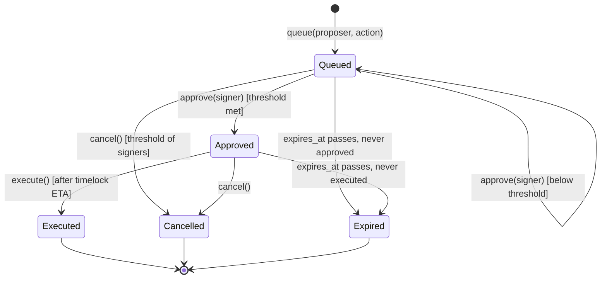

As a call sequence for a representative `SetParam` change (7 day timelock, Section 17.2):

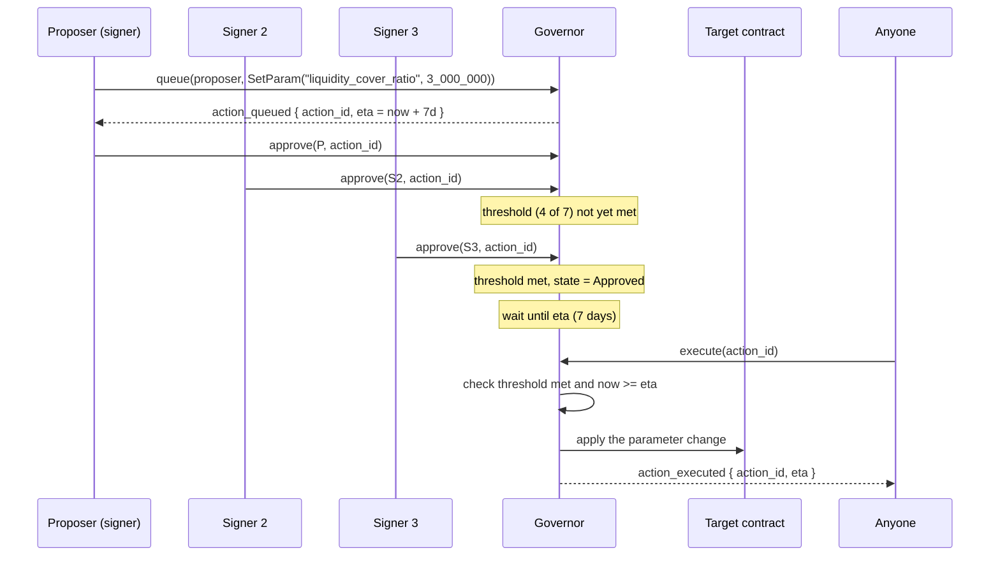

### 17.3 Upgrades

- Core contracts (`RiskOracle`, `EventRegistry`, `Staking`, `Treasury`, `MarketFactory`, `Governor`) expose `upgrade(wasm_hash)`, callable only by the governor, which calls `env.deployer().update_current_contract_wasm(hash)`. `Staking` and `Treasury` hold funds, so their upgrades carry the 14 day timelock like every other `Upgrade` and must preserve invariants I14 and I15.
- **`Series` contracts are not upgradeable.** `SetSeriesWasm` only affects series opened afterwards. A bug fix for live series is handled by pausing new cover and letting them run to expiry.
- Every upgrade must ship with a storage migration note and a test proving existing keys decode under the new types.
- After 12 months on mainnet, governance plans to remove `upgrade` from `EventRegistry` (deploying v2 alongside instead).

### 17.4 Parameter changes never apply retroactively

- `SeriesTerms`, including the pinned definition version per covered kind, are fixed at `open_series`.
- A new definition version applies only to series opened after it, and can only be registered once no live series pins the previous version (Section 8.8).
- An asset's `reference`, and so its FX rate source, never changes after `add_asset`.
- Formula changes affect scores from the next epoch; past scores keep their `formula_version`.
- The asset wide cover cap is checked only when buying; lowering it never cancels existing cover.
- Since v1.5 (Section 5.9, S1): a `sub_epoch_secs` change takes effect from the next hour boundary only. `SubEpochConfig(asset)` keeps both the current value and the pending `(sub_epoch_secs, effective_from_hour)`, so a sub-epoch already posted, or postable before that boundary, is never reinterpreted under a different length mid-hour.

## 18. Offchain services

Four services run outside the chain: the keeper computes signals, the reporter node probes anchors, the indexer turns events into queryable history, and the public API serves apps. All are open source; none is trusted for payouts, because everything they post is checked or disputable onchain.

### 18.1 Keeper

| Aspect | Design |
| --- | --- |
| Language | TypeScript (Node 20+), using the Stellar JS SDK for Horizon and Soroban RPC |
| Inputs | Trade history and order books (Horizon), ledger operations for issuer accounts, ledger asset stats for supply, SAC events (Soroban RPC `getEvents`), FX reference on the asset's rate basis via adapter. Not probe results: the endpoint status is never keeper posted |
| Schedule | Since v1.5 (Section 5.9): cron at each sub-epoch close plus a short margin, per asset, reading the asset's current `sub_epoch_secs` from `SubEpochConfig` (default every 5 minutes; 60 minutes reproduces the pre-v1.5 schedule exactly). After an outage, backfills every closed, non Final sub-epoch inside `sub_backfill_secs`, falling back to the existing hourly backfill path (`window_secs`, Section 5.2) beyond that. Independently, calls `Staking.settle_probes(asset, epoch)` and `RiskOracle.check_stale(asset)` for every registered asset, once per HOUR (unchanged: probes and staleness stay hourly, Section 5.9 S6), not once per sub-epoch: `finalize_endpoint` already calls `settle_probes` internally, but a service should not rely on `finalize_endpoint` happening for every asset every hour to guarantee `settle_probes` ran, since an epoch that never gets `settle_probes` called inside its window simply never settles (Section 7.5) |
| Output | `SignalSet` posted via `post_signals` with `endpoint = Unknown`, keyed by `(hour, sub)` since v1.5 (Section 5.9, S2); inputs bundle uploaded first, its SHA-256 placed in `inputs_hash`. Also calls `finalize_endpoint`, `settle_probes`, `check_stale`, `finalize` and `resolve_timeout` when due (hourly), and, since v1.5, triggers the hour-build once an hour's sub-epochs look settled, since these are all permissionless |
| Determinism | Recomputation tool (`sylox-recompute`) takes a bundle and must output byte identical `SignalSet`; the keeper uses the same library |
| Keys | Keeper signing key in an HSM or KMS; fee account separate from bond account |
| Failure | Retries within the sub-epoch (since v1.5) or epoch (pre-v1.5); alerts after 2 missed intervals |

Since v1.5: the keeper's posting cost at the default `sub_epoch_secs` (300s) is 288 posts per asset per day (Section 23), up from 24 per asset per day pre-v1.5; this is the "posting cost at the default" Section 23 itself states.

### 18.2 Reporter node

- Small container that runs the probe sequence (Section 7.1) on a schedule, signs `ProbeReport`s and submits them.
- Stores raw HTTP transcripts (headers, status, body hash, timings) per probe and uploads a bundle per epoch.
- Config: assets list from the oracle, region label, endpoints for RPC, key location.
- Must run from its declared region; reporters in the same cloud region as each other should be avoided.

### 18.3 Indexer

- Consumes contract events from Soroban RPC (or a Galexie style ledger export for backfill) into Postgres.
- Tables: `assets`, `signals`, `scores`, `definitions`, `events`, `bonds`, `stakes`, `treasury`, `series`, `positions`, `fills`, `claims`, `governance_actions`.
- Derived views: score history per asset, open cover per asset, premiums and fees per day, seller PnL, buyer exposure.
- Reorg free (Stellar has deterministic finality), so ingestion is append only by ledger.

### 18.4 Public API

REST plus WebSocket, read only, served from the indexer:

| Endpoint | Returns |
| --- | --- |
| `GET /v1/assets` | Covered assets with latest score, band, staleness |
| `GET /v1/assets/{asset}/signals?from=&to=` | Signal history |
| `GET /v1/assets/{asset}/score/history` | Score and band over time |
| `GET /v1/events?asset=&state=` | Credit events and their states |
| `GET /v1/series?asset=&state=` | Series with terms, totals, best quote |
| `GET /v1/series/{id}/quotes` | Order book |
| `GET /v1/positions/{address}` | Cover and seller positions for an address |
| `GET /v1/inputs/{hash}` | Inputs bundle for recomputation |
| `WS /v1/stream` | `band_changed`, `event_*`, `cover_bought`, `triggered` |

The API is a convenience. Integrators that need guarantees read contract state directly (Section 20).

## 19. TypeScript SDK reference

`@sylox/sdk` wraps the contract clients generated by `stellar contract bindings typescript`, adds fixed point helpers, simulation, archived entry restoration and error mapping. It is a client of the protocol; everything it does can be done with raw contract calls.

### 19.1 Setup

```ts
import { Sylox, Networks } from "@sylox/sdk";

const al = new Sylox({
  network: Networks.Testnet,          // rpcUrl, passphrase and contract ids preset
  signer: walletSigner,               // signTransaction / signAuthEntry adapter (e.g. Stellar Wallets Kit)
});
```

### 19.2 Reading risk

```ts
const assets = await al.oracle.assets();                 // Address[]
const s = await al.oracle.score(arsSac);                 // { score, band, stale, epoch, formulaVersion }
const sig = await al.oracle.latest(arsSac);              // SignalSet with numbers as bigint
al.fx.toNumber(sig.pegRatio);                            // 0.9934
const unsub = al.stream.onBandChanged(arsSac, e => alert(e.to));
```

### 19.3 Buying cover

```ts
const series = await al.markets.seriesFor(arsSac, { state: "Open" });
const s0 = series[0];
const q = await al.markets.premiumQuote(s0, al.fx.usdc("20000"), 600); // { fillable, premium }
const res = await al.markets.buyCover(s0, al.fx.usdc("20000"), { maxRateBps: 600 });
// res: { filled, premium, fee, txHash }
```

### 19.4 Selling cover

```ts
await al.markets.deposit(s0, al.fx.usdc("100000"));
await al.markets.quote(s0, { rateBps: 450, available: al.fx.usdc("100000") });
const pos = await al.markets.position(s0, myAddress);
await al.markets.withdraw(s0, "max");                    // computes withdrawable for current state
```

### 19.5 Claiming

```ts
await al.markets.trigger(s0);                            // no-op if already triggered
await al.markets.claim(s0, "all");
```

### 19.6 Events, staking and rewards

```ts
await al.events.proposeTier1(arsSac, "Depeg");           // uses the canonical Depeg definition
await al.events.challenge(eventId, evidenceHash);        // bond locked in Staking, escalates at once
const st = await al.events.status(arsSac, "Depeg");      // per (asset, kind): { kind: "None" | "InProgress" | "Declared", ... }
const gate = await al.events.coverGate(arsSac);          // "Clear" | "EventInProgress" | "RecentDepeg" | ...
await al.events.resolveTimeout(eventId);                 // after the ruling deadline
await al.staking.submitProbe({ asset, epoch, status: "Up", region: "af", evidenceHash });
await al.staking.claim();                                // bond refunds and winnings
await al.treasury.claimReward();                         // keeper or reporter rewards
```

### 19.7 Behaviour guarantees

- Every write is simulated first; the SDK throws `SyloxError` with the contract error name (Section 14) before asking the wallet to sign.
- If simulation reports archived entries, the SDK builds and submits a restore transaction first (with user consent callback).
- Amounts are `bigint` in base units everywhere; `al.fx` converts for display only.
- No private keys are handled by the SDK; signing is delegated to the provided signer.

## 20. Integration guides

Short, task oriented recipes for each kind of integrator. Each lists what to read, what to call, and what can go wrong.

### 20.1 Wallets: show issuer risk

1. For each issued asset in the user's balances, look up its SAC address (the wallet already knows code and issuer; derive the SAC id).
2. Call `RiskOracle.band(asset)` and `is_stale(asset)` via RPC simulation (free, no signing), or the public API for lists.
3. Show a badge: Normal (none or green), Watch, Warning, Distress, Event. Show "Data stale" when stale; never show a stale score as current.
4. Subscribe to `band_changed` and `event_declared` to notify users.
5. Link to the asset's signal page so users see why, not just a colour.

Pitfall: assets not covered by the oracle return `UnknownAsset`; show "Not rated", not "Safe".

### 20.2 Lending protocols: use bands in risk parameters

```rust
let oracle = RiskOracleClient::new(&env, &oracle_addr);
let band = oracle.band(&collateral_asset);
let stale = oracle.is_stale(&collateral_asset);
let factor_bps = match (band, stale) {
    (_, true) => 0,                       // treat stale as unsafe for new borrows
    (Band::Normal, _) => base_factor_bps,
    (Band::Watch, _) => base_factor_bps * 9 / 10,
    (Band::Warning, _) => base_factor_bps / 2,
    _ => 0,                               // Distress or Event: no new borrows
};
```

Read the band at borrow time inside your own contract; do not cache it across ledgers. Never liquidate on band changes alone; use them for new borrows and limits.

### 20.3 Buyers (treasuries, NGOs, fintechs)

- Pick the series whose expiry covers your exposure period; buy cover equal to what you would lose, not more (per buyer caps apply).
- Keep cover units in the same account that will claim. If you move them, the new holder claims.
- After an event is Declared, call `trigger` then `claim`. If you miss it, anyone can push your payout after the claim window.
- Read the definitions the series pins before buying (`terms().def_versions`, then `EventRegistry.definition(asset, kind, version)` for each kind); they are the contract, not the marketing text. For a fiat reference, check the rate source (official or market) the definition fixes.
- Expect `buy_cover` to refuse while any trailing failure signal is present (Section 9.4 step 2): you cannot buy cover on a failure that has already started.
- A failure that starts before expiry is covered even if it can only be proposed after expiry (Section 8.6); the series waits in Pending for one window length after expiry before it can expire.

### 20.4 Sellers (market makers, treasuries)

- Your maximum loss is `cover_written`, which is never more than your collateral.
- Premiums unlock only at Triggered or Expired, and collateral stays locked through the post expiry Pending period (Sections 8.6, 9.2).
- Monitor `band_changed`; you cannot exit written cover early except by transferring your whole position to another party who accepts it and holds no position in the series.
- Quote management: one quote per series; resize it as collateral changes.

### 20.5 Reporters

1. Get added by governance (provide organization, region, contact); the region you provide is fixed by `add_reporter` and used for every probe you ever submit, regardless of what your probe's own `region` field says (ADR-011, Section 7.3).
2. Stake `reporter_stake` USDC via `Staking.stake`.
3. Run the reporter node with your key in KMS.
4. Watch your fault count via `Staking.reporter(addr)`; investigate any disagreement with the majority.
5. Claim probe rewards from `Treasury.claim_reward`, accrued by `Staking.settle_probes` (Section 7.5), and bond refunds or winnings from `Staking.claim`.
6. File Tier 2 claims only with complete evidence bundles (probes, stuck SEP-24 transactions, anchor statements where available, Section 8.3); a lost challenge costs your bond.
7. If you are removed, your stake stays locked and slashable for `reporter_exit_delay_secs` after removal, not released immediately; your own voluntary `unstake_request` is held to the same floor (ADR-011).

### 20.6 Anchors

- Publish a complete stellar.toml with transfer servers so probes are accurate.
- Optional: opt in to authenticated probes by allowlisting the reporters' test accounts.
- Optional: cooperate on WithdrawalHalt claims by confirming or denying a halt with evidence; this is the strongest input to a Tier 2 ruling (Section 8.3).
- Optional: publish signed reserve attestations; they are shown alongside signals.
- Dispute path: contact the committee with evidence if you believe a signal or ruling is wrong.

## 21. Security: invariants, threats and testing

The protocol's safety is stated as invariants that must hold after every transaction; tests, fuzzing and the audit all target these invariants first.

### 21.1 Invariants

| Id | Invariant | Scope |
| --- | --- | --- |
| I1 | Total cover units ≤ sum of sellers' collateral | Series, always |
| I2 | For each seller, `cover_written ≤ collateral` | Series, always |
| I3 | USDC balance of a series ≥ expected balance (Section 10.3) | Series, always |
| I4 | Cover units can be minted only in Open state, only against a fill | Series |
| I5 | Payouts only in Triggered state, and only for an event that covers the series | Series |
| I6 | Premiums are not withdrawable before Triggered or Expired | Series |
| I7 | An event moves to Declared only via `finalize` after an unchallenged window, committee `rule` before the ruling deadline, or `resolve_timeout` of an escalated Tier 1 Depeg or IssuerFreeze event | EventRegistry |
| I8 | Declared is terminal for that (asset, kind, def\_version) | EventRegistry |
| I9 | Sum of open cover across series of an asset ≤ asset cap at the time of each purchase, checked and reserved in one `reserve_cover` call | MarketFactory |
| I10 | No role can transfer USDC out of a series except to a seller (withdraw), a holder (claim) or the `Treasury` (fee at purchase) | Series |
| I11 | Series terms, including pinned definition versions, never change after `open_series` | Series |
| I12 | A posted epoch's signals are immutable once Final, except by a resolved dispute and the one time write of `endpoint` from the `Staking` aggregate | RiskOracle |
| I13 | Every live series pins the current canonical definition version of each kind it covers | EventRegistry, MarketFactory |
| I14 | USDC balance of `Staking` = sum of keeper bonds, reporter stakes (including cooldown), locked bonds and claimable balances, exactly, apart from direct donations (S1, tightened from ≥ to = by ADR-012, PR #13; PR #7's original S1 also counted an unallocated local reward balance, now removed) | Staking, always |
| I15 | USDC balance of `Treasury` ≥ sum of bucket balances plus accrued, unclaimed rewards (= T1, Section 12.7, PR #13) | Treasury, always |
| T2 | `Treasury.accrue_reward` never accrues more than its bucket holds; it returns the amount actually accrued | Treasury, always |
| T3 | USDC leaves `Treasury` only through `claim_reward` (to the address it was accrued to) or `spend` (governor) | Treasury, always |
| T4 | `Treasury.allocate` moves balance between buckets without changing the total held across buckets | Treasury, always |
| I16 | `RiskOracle` and `EventRegistry` never hold or transfer USDC | RiskOracle, EventRegistry |
| I17 | A bond in `Staking` is Locked, Released or Forfeited, and moves at most once; `slash`, `release_bond` and `forfeit_bond` never pay out more than the amount actually deducted from the target's bond or stake (S2, S5, PR #7 review fix) | Staking, always |
| I18 | No `Staking` function moves a participant's stake or bond to any address other than that participant, a named dispute winner, or `Treasury`, and every amount reaching `Treasury` does so through a real `deposit` call, never a local credit (S3, PR #7; ADR-012, PR #13) | Staking, always |
| I19 | An address is registered as a keeper or a reporter in `Staking`, never both at once (S6, PR #7) | Staking, always |
| I20 | A keeper's bond cannot be withdrawn (`unstake` or `withdraw_keeper_bond`) while `open_dispute_count > 0` (ADR-011) | Staking, always |
| I21 | Changing `sub_epoch_secs` never changes an hour that is already built, and never changes hour numbering (Section 5.9, S1, S8) | RiskOracle, always |
| I22 | With `sub_epoch_secs = 3,600`, every pre-v1.5 test passes unchanged (Section 5.9, S8); the existing suite is this revision's own regression proof | RiskOracle, EventRegistry, Staking |
| I23 | A sub-epoch that fails its dispute process (resolved Overturned) never contributes to a built hour (Section 5.9, S4, S8) | RiskOracle, always |

### 21.2 Threat to control mapping

| Threat (PRD Section 10) | Controls in this design | Invariants or sections |
| --- | --- | --- |
| Trigger manipulation | Window, liquidity baseline before the window, asset cap from median liquidity, challenge window | 8.2, 11, I9 |
| One wick forcing a band change | `peg_ratio_p10` instead of a window minimum | 6.1, 11.3 |
| False keeper data | Bonded keepers, inputs hash, deterministic recompute, disputes, backfill of overturned epochs | 5.3, 5.4, I12 |
| False reporter claims | Stake, strict majority, slashing, Tier 2 bonds, endpoint only from the aggregate | 7.4, 7.5, 8.3 |
| Removal as an escape hatch (a keeper or reporter removed, or voluntarily unstaking, before accountability lands) | Removal deactivates immediately but never releases funds on the same call; exit delays derived from the accountability window each posting or probe needs; stake stays slashable until actually paid out; voluntary unstake cooldown floored at the same exit delay (ADR-011) | 7.3, 7.7, 12.3, I20 |
| Settling probes on a partial, TTL-expired set | Settlement allowed only inside a window during which every probe for the epoch is guaranteed to still exist; outside it, the epoch simply never settles (no funds moved, nothing to exploit) | 7.5 |
| Slash request exceeding the target's remaining balance | `slash` pays out only what it actually deducted (`min(requested, remaining)`), never the raw request, so a request past what exists cannot draw the difference from other participants' funds (PR #7 review fix S5) | 7.8, I14, I17 |
| Committee capture | Separate multisig, published reasons, escalation only | 8.4, 16 |
| Committee inaction | Ruling deadline, default outcome, `resolve_timeout` by anyone, misses recorded per committee | 8.9 |
| Contract bug drains a pool | Isolated series, non upgradeable series, invariants, audit; funds split across `Series`, `Staking` and `Treasury` | 3.1, 3.2, 17.3, I1 to I10, I14 to I16 |
| Buyer front running a failure | Cover gate: no cover while an event is in progress or a trailing failure signal is present; coverage keyed to failure window start | 8.6, 9.4 |
| Definition shopping | One canonical version per (asset, kind); proposals cannot pick a version; series pin current versions | 8.8, I13 |
| Governance attack | Timelocks, terms and definitions fixed per series, reference immutable, guardian cannot move funds | 16, 17, I11 |
| Storage expiry loses claims | TTL policy, restore support in SDK | 15.2 |

### 21.3 Testing strategy

| Layer | Tooling | What it covers |
| --- | --- | --- |
| Unit | `soroban-sdk` testutils, `Env::default()`, mocked auths | Every function, every error path |
| Property | `proptest` with random sequences of deposit, quote, buy, trigger, claim, withdraw; of stake, unstake, submit\_probe, settle\_probes, lock, release, forfeit, slash (including amounts that exceed the target's remaining balance, PR #7) and claim in `Staking`; of deposit, accrue\_reward, claim\_reward, allocate and spend in `Treasury` (PR #13) | I1 to I6, I10, I14, I15 (= T1), I17, I18, T2 to T4 after every step |
| Fuzz | `cargo-fuzz` on premium math and signal sanity checks | Overflow, rounding direction |
| Integration | Local quickstart network with all contracts, scripted scenarios | Full flows across contracts |
| Scenario | Replays of historical depeg periods from public data on other stablecoins, scaled to Stellar assets | Trigger behaviour, false positives |
| Adversarial | Scripted manipulation attempts on testnet AMMs and order books, each with a fixed spending limit | Section 11 assumptions |
| Recompute | Golden bundles: recompute tool must reproduce posted signals byte for byte | Keeper determinism |

Coverage target: 95% line coverage on `Series`, `EventRegistry`, `Staking` and `Treasury`, 100% of error codes exercised. Scenario tests must include the day 88 of 90 depeg (Section 8.6), a ruling deadline timeout for each default outcome (Section 8.9), a definition change with live series (Section 8.8), and a backfill after a keeper outage (Section 5.2).

Since v1.5 (Section 5.9): the implementation PR's own test list (full existing suite at `sub_epoch_secs = 3,600`; roll-up correctness against an offchain recomputation; the `min_sub_coverage_bps` threshold at and one below its boundary; a mid-hour interval change taking effect only at the next hour; a disputed sub-epoch outliving `Sub(asset)`'s own ring; the cover gate catching a depeg within one sub-epoch; a budget test for `post_signals` with a roll-up at the 5 minute floor, the worst case; rejection of any `sub_epoch_secs` outside the allowed values; a sub-epoch that is never posted, so the hour waits past the last posted sub-epoch's own `pending_until` — `is_final` and `effective_window` must report not-Final throughout, and the cover gate must read the hour's provisional roll-up, not a zeroed slot, for as long as it waits) targets I21 to I23 above, the same way the existing property tests target I1 through I20.

### 21.4 Audit and disclosure

- External security audit before mainnet, scoped to all seven contracts and the recompute library.
- SECURITY.md with a disclosure address and response targets (acknowledge within 48 hours).
- Bug bounty once mainnet collateral passes an agreed level.

### 21.5 Libraries

Check OpenZeppelin's Stellar contracts library (the Soroban port of OpenZeppelin Contracts) before hand rolling standard components, and record what it covers at the time each contract is built. Use an audited implementation wherever one fits; hand roll only what it does not cover, and note why.

| Need | Where in Sylox | What to check in the library |
| --- | --- | --- |
| SEP-41 fungible token | Cover units in `Series` (Section 9.1) | A fungible token implementing the SEP-41 interface, with allowance, burn and metadata extensions, that can be embedded in a contract with its own non token logic |
| Pausable | Guardian scopes (Section 16.2) | A pausable utility that supports several independent scopes and expiring pauses, or can be wrapped to do so |
| Upgradeable | `upgrade(wasm_hash)` on the six core contracts (Section 17.3) | An upgradeable utility, ideally with a migration hook, gated by an owner or role that the `Governor` can hold |
| Access control | Role checks (Section 16) | Ownable or role based access control usable with a contract address (the `Governor`) as owner |

What it covers today, as understood when this revision was written and not yet verified against the live repository: a SEP-41 fungible token with burnable and other extensions, a pausable utility, an upgradeable utility with a migration pattern, and ownable and role based access control. Pausable is understood to be a single switch, so the four guardian scopes and the automatic expiry of Section 16.2 would likely be a thin local layer on top. Verify all of this, and pin the exact version, before the `Series` token and the core contracts' pause and upgrade logic are written.

Record for each row: the library version checked, whether it covers the need, and any gap that forces a local implementation. The library's coverage and audit status change over time, so this check is done again at the start of each build phase rather than once.

## 22. Deployment, configuration and operations

Deployment is scripted end to end with the Stellar CLI and is the same on testnet and mainnet except for addresses and parameters. Operations focus on four things: feeds keep posting, events get finalized, storage stays alive, and anomalies get seen early.

### 22.1 Repository layout

```
sylox/
  contracts/
    types/            # shared #[contracttype]s
    risk-oracle/
    event-registry/
    staking/          # keeper bonds, reporter stakes and probes, bond escrow, slashing
    treasury/         # protocol fees, slashed funds, reward pools
    market-factory/
    series/
    governor/
    adapters/         # amm-*, fx-*, optimistic-oracle
  services/
    keeper/  reporter-node/  indexer/  api/
  packages/
    sdk/  recompute/
  deploy/
    testnet.toml  mainnet.toml  deploy.sh
  tests/
    integration/  scenarios/  property/
```

### 22.2 Deployment order

1. Build all contracts: `stellar contract build`, then optimize the Wasm.
2. Upload the `Series` Wasm and record its hash.
3. Deploy and initialize `Governor` with signers, threshold, timelocks and the committee address.
4. Deploy and initialize `Staking`, `Treasury`, `RiskOracle`, `EventRegistry` and `MarketFactory` (with the `Series` Wasm hash), wiring addresses together. Contract addresses derive from the deployer and a salt, so every address is computed before any deployment and the mutual references (`RiskOracle` and `Staking`, `EventRegistry` and `MarketFactory`, `Staking` and `Treasury`) are passed straight to each `initialize`.
5. Through governor actions: add keepers and reporters (on `Staking`), assets with their reference and issuer flags, and one canonical event definition per (asset, kind) in scope; set parameters from the network's config file; allocate initial `Treasury` funds to the reward pools if any.
6. Start keeper, reporter nodes, indexer and API; wait for at least `stale_after_epochs` clean epochs.
7. Through governor: open the first series.
8. Publish all contract ids and Wasm hashes in the docs and the repo `deployments/` file.

### 22.2a Build sequence

Deployment order (22.2) is the order contracts are *invoked* on a live network; it assumes every contract already exists. Build order is the order they get *written and tested*, and it is driven by the dependency graph in Section 3.5: a contract can only be implemented once the things it reads from compile. The build runs in three phases after the Phase 0 data pull (Section 1.7):

- **Phase A, data layer:** shared types, `RiskOracle` (built; ring buffer write cost measured, Section 5.8), `Staking`, `Treasury`, the adapters, the keeper and recompute library, the reporter node.
- **Phase B, first event scope and markets:** `EventRegistry` with canonical Depeg and IssuerFreeze definitions (Tier 1), challenges and the ruling deadline; `MarketFactory`; `Series`; `Governor`; indexer, API and SDK.
- **Phase C, later event scope:** WithdrawalHalt (Tier 2) with its evidence handling, Insolvency (Tier 3) with committee tooling, and MintWithoutBacking.

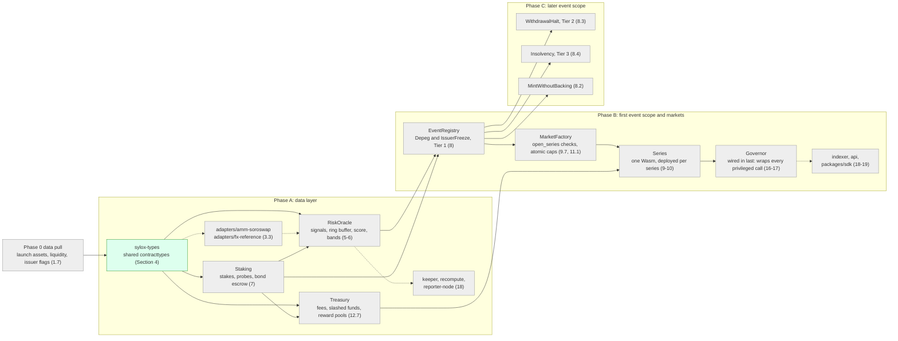

Green: implemented and tested as of this revision (the shared types crate). Grey: not yet implemented; every contract crate exists as a compiling stub (`lib.rs` with one `todo!()` function, no business logic). Within Phase A, `Staking` comes before the parts of `RiskOracle` that read the endpoint aggregate and send bond instructions, and `Treasury` before the reward paths of `Staking`. `Governor` has no functional dependency on the other core contracts but is ordered last in Phase B because every privileged call across them is written against its `require_auth()` pattern (Section 16), so its interface should be stable before those calls are finalized. Phase C adds checks, evidence handling and committee tooling to `EventRegistry`; it needs no type changes (Section 1.2).

### 22.3 Configuration

All per network settings live in `deploy/<network>.toml` (contract ids, USDC SAC, adapter addresses, parameters) and are applied through governor actions, never by editing contracts. Services read the same file plus secrets from KMS.

### 22.4 Monitoring and alerts

| Alert | Condition | Severity |
| --- | --- | --- |
| Feed stale | The monitor calls `check_stale(asset)` for every registered asset once per epoch; alert on its `asset_stale` event or a `true` return (ADR-009) | High |
| Settlement missed | The keeper service calls `Staking.settle_probes(asset, epoch)` for every registered asset once per epoch, inside that epoch's settlement window (Section 7.5); alert if a window closes with `settle_probes` never having succeeded for it, since that epoch then permanently never settles | High |
| Keeper disagreement | Two keepers' computed values differ beyond tolerance | High |
| Reporter split | No majority for an asset in an epoch | Medium |
| Band up move | Any asset moves to Warning or Distress | Medium, notify subscribers |
| Event proposed | Any `event_proposed` | High, page committee |
| Ruling deadline near | An Escalated event within 48 hours of its ruling deadline with no ruling | High, page committee |
| Ruling timed out | Any `ruling_timed_out` | High, notify governance (committee rotation grounds) |
| Unusual cover | Cover bought on an asset above 20% of its cap within 24 hours | Medium |
| Invariant check | Offchain check of I1 to I3 per series, I14 for `Staking`, and I15/T2 to T4 for `Treasury`, per hour fails | Critical, consider guardian pause |
| Reward pool low | A `Treasury` reward bucket below one week of expected accruals | Medium, propose `TreasuryAllocate` |
| TTL low | Any core entry within 30 days of expiry | Medium |

### 22.5 Runbooks

- **Event proposed:** confirm signals from raw bundles; notify committee; watch for challenges; call `finalize` on time. After a challenge, track the ruling deadline from `event_escalated`; if it passes, call `resolve_timeout`.
- **Keeper outage:** second keeper takes over automatically (any keeper may post); if all keepers are down past staleness, new cover stops by design; restore and backfill every closed, non Final epoch still inside `window_secs` (Section 5.2). Epochs older than the window stay missing and count toward `max_missing_epochs`.
- **Settlement missed:** if `Staking.settle_probes(asset, epoch)` was never called inside that epoch's settlement window (Section 7.5), that epoch's rewards and faults are gone for good; the epoch is not recoverable, so this is a monitoring and process fix (ensure the keeper service's own `settle_probes` schedule, Section 18.1, 22.4, is actually running for every asset), not an onchain remediation.
- **Definition change:** queue `RegisterDefinition`; stop opening series that pin the current version for that (asset, kind); `sync` live series as they expire; execute once none pins the old version (Section 8.8).
- **Suspected manipulation:** compare DEX activity with AMM cross checks; file a challenge with evidence; guardian may pause `NewCover` on the asset.
- **Contract bug:** guardian pauses affected scopes; existing series run to expiry; fix via governor upgrade for core contracts, new Wasm for future series.
- **TTL maintenance:** weekly job extends TTL on instances, asset configs, open event records and live series' positions.

## 23. Parameter reference

Every tunable value in one place, with its v1 default. All defaults are starting points to revisit with testnet data; changes go through the governor (Section 17). `epoch_secs` (3,600 seconds) and `RING_SLOTS` (240) are frozen for v1, not governance parameters, so they are not in this table: either value changing would require re-encoding every asset's existing packed `Ring(asset)` entry under a new layout version, which is a migration, not a parameter change `SetParam` should be able to trigger silently (Section 5.8). Reward parameters (`keeper_reward`, `reporter_reward_per_epoch`) are set so that 10 assets posting and probing at hourly epochs stays within a sustainable operating cost; this document states no dollar figures, since the sustainable level depends on funding sources and market conditions this spec does not fix. Since v1.5 (Section 5.9), `sub_epoch_secs` IS a governance parameter, unlike `epoch_secs`: it governs posting frequency underneath a fixed hour, never the hour's own length or the ring's own layout, so a change needs no migration.

| Parameter | Default | Unit | Used in |
| --- | --- | --- | --- |
| `window_secs` | 259,200 (72h) | seconds | Peg TWAP and `peg_ratio_p10` window; backfill limit for posting |
| `sub_epoch_secs` (v1.5) | 300 (5m) | seconds, per asset; one of {300, 600, 900, 1,200, 1,800, 3,600} | Section 5.9, S1; takes effect at the next hour boundary |
| `sub_backfill_secs` (v1.5) | 7,200 (2h) | seconds | Section 5.9, S2: backfill limit for a sub-epoch posting; beyond it, the keeper falls back to the hourly `window_secs` path |
| `min_sub_coverage_bps` (v1.5) | 7,500 | bps | Section 5.9, S4: an hour needs at least this fraction of its sub-epochs Final to count as present, rather than Empty |
| `feed_grace_secs` (v1.5) | 120 | seconds | Section 5.9, S5; `feat/markets` M1: how far behind the last closed sub-epoch `buy_cover`'s feed-freshness check tolerates, covering the keeper's own short posting margin after each close (Section 18.1) |
| `signal_dispute_secs` | 7,200 (2h) | seconds | Signal dispute window; unchanged, applies identically to a sub-epoch posting since v1.5 (Section 5.9, S2) |
| `signal_dispute_bond` | 1,000 | USDC | Signal disputes |
| `signal_dispute_ruling_secs` | 518,400 (6d) | seconds from the dispute | ADR-010: deadline for the committee to rule on a signal dispute before `resolve_signal_dispute_timeout` applies the default outcome. Lowered from 7 days (finding F1): the worst-case dispute timeline must resolve before the ring wraps around, and 7 days no longer fit once measured precisely against `RING_SLOTS * EPOCH_SECS` |
| `stale_after_epochs` | 3 | epochs | Staleness |
| `amm_tolerance_bps` | 300 | bps | AMM cross check |
| `keeper_bond` | 5,000 | USDC | Keepers |
| `keeper_slash` | 1,000 | USDC | Lost disputes |
| `keeper_max_faults` | 3 | count per 30 days | Suspension |
| `keeper_reward` | 0.05 | USDC per accepted epoch (hourly; or `keeper_reward * sub_epoch_secs / 3,600` per accepted sub-epoch since v1.5, Section 5.9 S6, so total pay per hour is unchanged) | `Staking.reward_keeper` accrues `keeper_reward * epochs` from `Treasury`'s `KeeperRewards` bucket, called from `RiskOracle`'s finality scan (ADR-012, issue #11 fix); lowered from 0.50 (v1.2) for sustainable cost at scale. Since v1.5, posting at the `sub_epoch_secs` default (300s) costs a keeper 288 posts per asset per day, up from 24 pre-v1.5 (Section 18.1) |
| `keeper_exit_delay_secs` | `signal_dispute_secs + epoch_secs` (3h at defaults) | seconds, derived | ADR-011: how long after `remove_keeper` before `withdraw_keeper_bond` may pay out, so every posting's own dispute window has had time to close; unaffected by v1.5, since it derives from `epoch_secs` and `signal_dispute_secs`, neither of which this revision changes (Section 5.9, S6) |
| `band_down_epochs` | 3 | epochs | Hysteresis |
| `d_max`, `r_max`, `c_max`, `k_max`, `s_max_bps` | 0.10, 0.10, 0.01, 20, 2,000 | ratio, ratio, ratio, count, bps | Score components |
| Weights P, E, R, I, L, S | 3,500, 2,000, 1,500, 1,500, 1,000, 500 | bps | Score |
| `probe_secs` | 900 | seconds | Reporters |
| `degraded_ms` | 5,000 | ms | Probe mapping |
| `probe_grace_secs` | 3,600 (1h) | seconds | Section 7.3: how long after an epoch closes a reporter may still submit a probe for it |
| `settle_window_secs` | 86,400 (24h) | seconds | Section 7.5: how long `settle_probes`'s window stays open after `probe_grace_secs` ends; an epoch nobody settles within it never settles |
| `probe_ttl_margin_secs` | 86,400 (1d) | seconds | Margin added on top of the settlement window's own close when extending a probe's storage TTL, so it is guaranteed to outlive the window it must be settlable within |
| `min_reporters` | 3 | count, `min_distinct_regions`+ regions | Aggregation |
| `min_distinct_regions` | 2 | count | Aggregation: names the existing "2 distinct regions" rule |
| `fault_majority_threshold` | 3 | count | Section 7.5: names the existing "a majority of 3 or more" rule |
| `max_submitters_per_epoch` | 32 | count | Cap on the per (asset, epoch) submitter index `aggregate`/`settle_probes` iterate; well above the 5 to 9 reporter target (7.6) |
| `reporter_stake` | 1,000 | USDC | Reporters |
| `reporter_max_faults` | 10 | count per 30 days | Slashing |
| `reporter_slash_bps` | 1,000 | bps | Slashing |
| `reporter_reward_per_epoch` | 0.1 | USDC per settled asset-epoch, split equally among matching reporters | `Staking.settle_probes` accrues each matching reporter's share from `Treasury`'s `ReporterRewards` bucket via `Treasury.accrue_reward` (ADR-012) |
| `unstake_cooldown_secs` | 604,800 (7d) | seconds | A keeper or reporter's own voluntary `unstake_request`; must be `>= keeper_exit_delay_secs` and `>= reporter_exit_delay_secs` (ADR-011) so a voluntary exit can never outrun a governor removal for the same stake |
| `reporter_exit_delay_secs` | `epoch_secs + probe_grace_secs + settle_window_secs` (26h at defaults) | seconds, derived | ADR-011: how long after `remove_reporter` before its stake leaves cooldown, so every epoch it could have probed can still settle and fault or slash it if warranted |
| `depeg_threshold` | 0.95 | ratio | Event definition |
| `depeg_window_secs` | 259,200 | seconds | Event definition |
| `max_missing_epochs` | 6 (of 72) | epochs | Event definition (Depeg) |
| `halt_window_secs` | 259,200 | seconds | Event definition |
| `challenge_secs` | 86,400 | seconds | Event definition |
| `ruling_deadline_secs` | 1,209,600 (14d) | seconds from escalation | Event definition |
| `cure_threshold` | 0.98 | ratio | Event definition |
| `claim_bond` | 2,000 | USDC | Tier 2 |
| `challenge_multiplier` | 1 | multiple | Challenges of every tier |
| `cooldown_secs` | 604,800 (7d) | seconds | After cure or reject |
| `liquidity_cover_ratio` | 0.25 | ratio | Asset cover cap |
| `max_series_per_asset` | 4 | count | Factory |
| `max_cover_per_buyer` | 10% of cap | ratio | Series |
| `min_deposit` | 100 | USDC | Series |
| `max_quotes` | 64 | count | Series |
| `sale_cutoff_secs` | 259,200 (3d) | seconds | Series |
| `claim_window_secs` | 2,592,000 (30d) | seconds | Series |
| `fee_bps` | 750 | bps of premium | Series |
| `max_pause_secs` | 1,209,600 (14d) | seconds | Guardian |
| `grace_secs` | 1,209,600 (14d) | seconds | Governor |

## 24. Glossary and open technical questions

### 24.1 Glossary

| Term | Meaning |
| --- | --- |
| Anchor | A business that issues tokens on Stellar backed by offchain money and runs deposit and withdrawal services |
| Band | Risk category from the score: Normal, Watch, Warning, Distress, Event |
| Bond | USDC posted to back a claim, challenge or dispute, held by `Staking`; forfeited if wrong, refunded on a ruling timeout |
| Canonical definition | The one current `EventDefinition` version for an (asset, kind); proposals always use it and new series must pin it |
| Challenge window | Time after a proposal during which anyone can contest it |
| Claim window | Time after which anyone can push a holder's payout to them |
| Committee | The multisig that rules on escalated events and Tier 3 events |
| Cover gate | The check that blocks new cover while an event is in progress or a trailing failure signal is present |
| Cover unit | 1 unit of protection, paying 1 USDC on a covered event |
| Credit event | A declared failure of an issuer under a fixed definition |
| Cure | A depeg proposal cancelled because the price recovered inside the challenge window |
| Epoch | One hour of signal history for one asset (Section 1.5) |
| Event definition | The exact rules for what counts as a credit event of one kind on one asset, versioned and stored by (asset, kind, version) |
| Hour build, built hour | The v1.5 step that rolls up an hour's settled sub-epochs into that hour's own epoch slot (Section 5.9, S4) |
| Failure window start | The time a credit event's failure began; it decides which series the event covers |
| Guardian | Multisig that can pause some actions, nothing more |
| Inputs bundle | The raw data a keeper used, published so anyone can recompute signals |
| Keeper | Bonded service that computes and posts signals |
| Official and market rate | Two exchange rates for one currency when they diverge (ARS is the standard example); each fiat reference fixes one |
| Reporter | Staked service that probes anchor endpoints |
| Ring buffer | The per asset entry of 240 epoch slots, each with a finality flag, that Tier 1 checks read |
| Ruling deadline | Time from escalation within which the committee must rule before the default outcome applies |
| SAC | Stellar Asset Contract: the Soroban interface to a classic Stellar asset |
| SEP-1, SEP-6, SEP-10, SEP-24, SEP-41 | Stellar standards for stellar.toml, transfers, authentication, interactive transfers and token interfaces |
| Series | One market for one asset and one term, pinning one definition version per covered kind |
| Staking | The contract holding every bond and stake |
| Sub-epoch | A `sub_epoch_secs` posting interval inside an hour; several roll up into their hour's own epoch slot once settled (Section 1.5, 5.9) |
| Treasury | The contract holding protocol fees, slashed funds and the reward pools |
| TTL | Time to live of a Soroban storage entry |

### 24.2 Open technical questions

- [ ] Which FX oracles on Stellar provide ARS and other local currency rates, on which basis (official, market or both), at what update frequency and with what methodology? (Phase 0 data pull, Section 1.7.)
- [ ] Can Soroban AMM adapters cover enough of the target assets to make the cross check meaningful?
- [x] Ring buffer write cost and the per entry and per transaction limits for a 240 slot entry: measured in the `RiskOracle` build (Section 5.8); fits with headroom, no paging needed.
- [ ] Should `min_liquidity` move from `AssetConfig` into the Depeg definition, so that an `UpdateAsset` cannot change the liquidity floor a live series is judged against?
- [ ] Insolvency has no measurement window, so under Section 8.6 it must be proposed by series expiry. Is a post expiry acceptance period needed for Tier 3 when it is built?
- [ ] What pending time makes a user submitted SEP-24 transaction count as stuck for WithdrawalHalt evidence, and should it be a definition parameter?
- [ ] Depeg windows longer than 72 hours need a larger ring buffer; is any asset expected to need one?
- [ ] An asset's `reference` is immutable after `add_asset`. If an issuer changes its redemption basis, what is the migration path (for example: disable the asset, let its series run off, then a governed reference change with new definition versions)?
- [ ] Is the Soroban Optimistic Oracle suitable as the Tier 2 dispute layer, or is committee escalation simpler for v1?
- [ ] Can signal disputes move from committee resolution to onchain verifiable recomputation in v2 (for example via proofs over ledger data)?
- [ ] Should `require_holding` be enforced at claim time as well as at purchase, and how to handle assets frozen for the buyer?
- [ ] How to source historical depeg data for scenario tests on Stellar issued assets specifically.
- [ ] Cost per epoch of `post_signals` for 10 assets, and whether batching postings per transaction is needed.
- [ ] Legal review of event definitions wording before they are registered onchain.
- [ ] Should `AssetConfig` gain a real `l_target` field for component L, or should the spec simply say `min_liquidity` doubles as `L_target` in v1 (Section 6.1)? `RiskOracle` uses `min_liquidity` today with no separate field.
- [ ] Does `Staking.reward_keeper` need a symmetric per-signal bond lock from the keeper (mirroring the disputer's `signal_dispute_bond`), or is slashing a keeper's general stake by address, with no per-signal bond, the intended v1 design? `RiskOracle` has no call that locks a keeper bond today; only `slash`, directly by address, touches a keeper's stake on a lost dispute. Unaffected by `reward_keeper` now having a real call site (ADR-012, issue #11 fix, `feat/treasury` PR #13): that fix is about when and how much to reward, not about adding any new bond lock, so this question remains exactly as open as it was.
- [ ] Should `signal_dispute_bond` and `keeper_slash` (Section 23) become per-asset or formula-level configurable parameters rather than contract constants, given that cover value likely scales with cover cap per asset?
- [ ] `add_asset` does not yet validate that a `Fiat` reference's `fx_adapter` is actually set, or that `amm_adapters` entries are well formed; is this validation meant to live in `add_asset` itself, or in a separate governance review step before an asset goes live?
- [ ] `peg_ratio_p10 <= peg_ratio` is enforced as a sanity bound on posted signals (Section 11.3) while this document's general statement elsewhere says a 10th percentile can sit above a volume weighted mean. Since `RiskOracle` now computes its own `peg_ratio_p10` onchain for scoring and treats the keeper posted field as audit only, should the posted field's bound be relaxed to match the general statement, or should the general statement be narrowed to describe only the onchain computation?
- [ ] `Staking.slash`'s auth checks only `RiskOracle` in the built contract (Section 12.3), not `RiskOracle` or `EventRegistry` as Section 7.8/12.3 specify: Soroban's `Address::require_auth()` traps on a mismatched caller with no non-panicking variant and no portable "who actually invoked this call" read, so there is no way to try one candidate's auth, catch a failure, and fall back to the next. `EventRegistry` is not built yet, so this has no real call site to test against today. When `EventRegistry` is built, how should `Staking.slash` distinguish its two legitimate callers: a `kind` argument (the `BondKey` variant pattern `lock_bond`/`release_bond`/`forfeit_bond` already use), or two separate functions?
- [ ] `RiskOracle.resolve_signal_dispute_timeout` (ADR-010) writes `CommitteeMisses(committee)` but exposes no public read for it, unlike `EventRegistry.committee_misses` (Section 12.2). Should `RiskOracle` gain a matching `committee_misses(committee) -> u32` read, and should the two contracts' miss counters for the same committee address ever be combined into one figure for a governance dashboard, or deliberately kept separate per contract?
- [ ] (v1.5) `feat/markets`'s exact ledger-count numbers for the M4 TTL policy (instance and persistent extension thresholds for `Series` and `MarketFactory`) are left to that design note; Section 5.9 S7 and Section 15.2 state the policy's shape (extend instance on every state-changing call, extend persistent on write and on hot-path reads) but not the numbers.
- [ ] (v1.5) Should `Sub(asset)`'s own write and instruction cost (a sub-epoch posting, and an hour build) be measured and stated in Section 15.3 the same way the hourly ring's costs already are, before or as part of the implementation PR? This revision states only the storage-size bound (Section 15.3), not a measured write cost, since no implementation exists yet to measure.