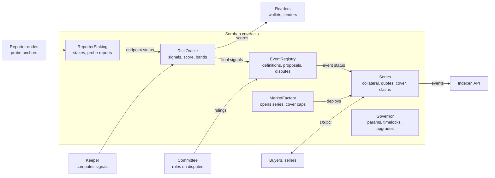
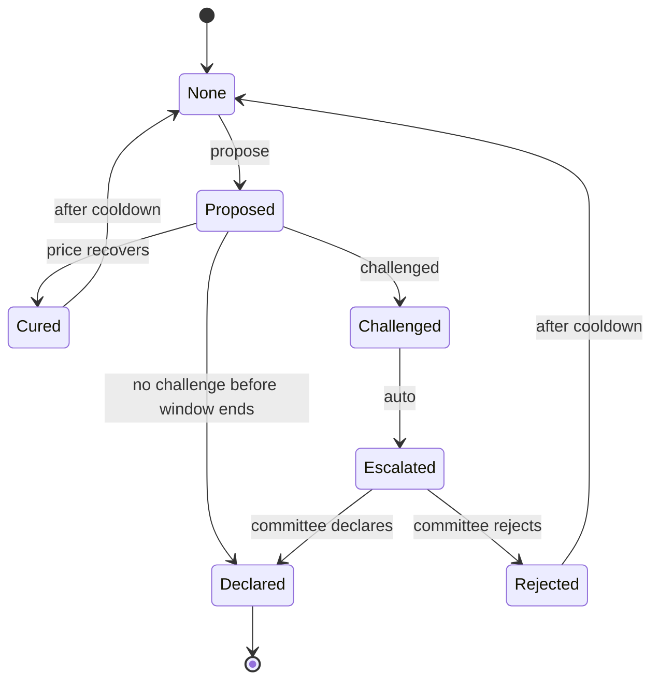
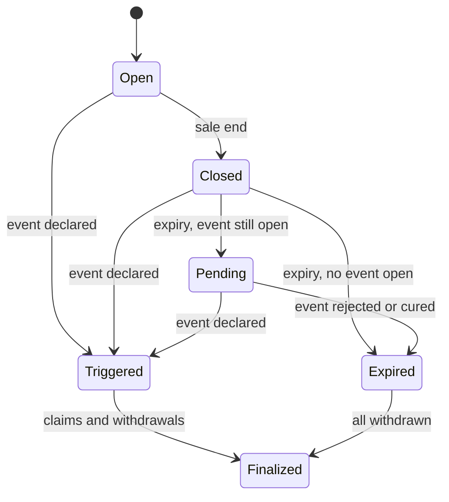

# Anchorline Protocol: Technical Documentation

Version: v1 draft, October 8, 2026 · Author: David Ejere

## 1. Overview and conventions

This document specifies how Anchorline is built: the Soroban contracts, their data, math, interfaces and events, the offchain services that feed them, and how to integrate, deploy and operate the system. It is the engineering companion to the Anchorline PRD and is written against a v1 design that has not yet been implemented, so every interface here is a draft to be validated in Phase 1.

### 1.1 Audience

| Reader | Read first |
| --- | --- |
| Contract engineers | Sections 4 to 17, 21 |
| Offchain and infra engineers | Sections 5, 7, 18, 22 |
| Wallet and lender integrators | Sections 6, 12, 13, 19, 20 |
| Auditors | Sections 10, 11, 15, 16, 21 |
| Reporters and committee members | Sections 7, 8, 20 |

### 1.2 Scope of v1

In scope: risk signals and score for issued assets on Stellar mainnet; credit event detection across three tiers; fully collateralized protection series settled in USDC; reporter staking and disputes; committee rulings; governance with timelock.

Out of scope for v1: recovery based payouts, cross margining, multiple settlement assets, a pricing model, onchain token governance, cross chain reference prices.

### 1.3 A design correction to the PRD

Soroban contracts cannot read classic Stellar DEX order books, classic liquidity pool reserves or most classic account state directly. So the PRD's "Tier 1: onchain" triggers are implemented here as **keeper posted, publicly recomputable** signals: a keeper computes them from public ledger data, posts the result with a hash of its inputs, and anyone can recompute and dispute within a window. Where a Soroban native source exists (for example a Soroban AMM pair's reserves, or Stellar Asset Contract balances), the contract reads it directly as a cross check. Section 5 details this.

### 1.4 Conventions

| Topic | Convention |
| --- | --- |
| Amounts | `i128`, in the token's smallest unit. USDC on Stellar uses 7 decimals |
| Prices and ratios | Fixed point `i128` with `SCALE = 10_000_000` (1e7). A peg ratio of 0.95 is `9_500_000` |
| Rates | Basis points `u32` (1 bps = 0.01%). Premium rates are annualised |
| Time | Ledger timestamps in seconds (`u64`) for windows; ledger sequence (`u32`) for TTL and ordering |
| Identifiers | `AssetId` = the Stellar Asset Contract address of the issued asset. `SeriesId`, `EventId`, `ClaimId` = `u64` counters per contract |
| Hashes | SHA-256, `BytesN<32>` |
| Rounding | Always in favour of the pool: round premiums up, payouts and withdrawals down |
| Naming | Contracts in PascalCase, functions in snake\_case, events as `("anchorline", "<contract>", "<event>")` topics |

### 1.5 Terms used throughout

- **Issued asset:** a token on Stellar issued by an anchor or stablecoin issuer, referenced by its SAC address.
- **Signal:** one measured input about an issued asset (peg deviation, liquidity, redemption flow, issuer actions, supply change, endpoint health).
- **Epoch:** one signal posting interval for one asset.
- **Credit event:** a declared failure of an issuer under a fixed definition.
- **Series:** one protection market for one asset, one event definition and one term.
- **Cover:** the USDC amount a buyer is paid if the event is declared.
- **Collateral:** USDC sellers lock to back cover.

A full glossary is in Section 24.

## 2. System architecture

Data moves top to bottom: reporters and the keeper feed the oracle, the oracle feeds the event registry, and the registry's status decides how each series settles. Only `Series` contracts hold buyer and seller money.



The Governor (dashed) governs every contract through timelocked actions. The indexer reads events from all contracts; the arrow shows it reading the series, the busiest source.

## 3. Contract inventory and deployment topology

Anchorline v1 is six Soroban contracts plus the Stellar Asset Contracts (SACs) of the assets it references. Three are core (oracle, registry, market factory), one is instantiated per series, and two are supporting (staking and governance).

### 3.1 Contracts

| Contract | Instances | Responsibility | Holds funds? |
| --- | --- | --- | --- |
| `RiskOracle` | 1 per network | Stores per asset signals per epoch, computes the score, exposes bands and staleness | No |
| `EventRegistry` | 1 per network | Event definitions, Tier 1 proposals, Tier 2 claims and disputes, Tier 3 rulings, final event status | Holds reporter and disputer bonds (USDC) |
| `ReporterStaking` | 1 per network | Reporter registration, stake, slashing, reward accrual | Holds reporter stake (USDC) |
| `MarketFactory` | 1 per network | Opens series, tracks the series index, enforces global caps, deploys `Series` contracts | No |
| `Series` | 1 per series | Collateral pool, quotes, cover tokens, share tokens, premiums, claims, withdrawals | Holds collateral and premiums (USDC) |
| `Governor` | 1 per network | Multisig owned parameter store, timelock queue, upgrade execution, pause switches | No |

### 3.2 Why one contract per series

- **Isolation:** a bug or accounting error in one series cannot touch another series' collateral.
- **Bounded state:** each series has a fixed lifetime, so its storage can expire cleanly after final settlement.
- **Simple invariants:** one pool, one asset, one event definition, one term.

The factory deploys `Series` from a single uploaded Wasm hash using `env.deployer()`, with a deterministic salt derived from `(asset, event_def_hash, term_start)`.

### 3.3 External dependencies

| Dependency | Used for | Access |
| --- | --- | --- |
| USDC SAC | Collateral, premiums, bonds, payouts | `token::Client` transfer and balance |
| Issued asset SACs | Reference asset identity; optional balance reads for insurable interest checks | `token::Client` balance |
| Soroban AMM pairs (where they exist for the asset) | Onchain spot price cross check | Cross contract `get_reserves` style call, adapter per AMM |
| Reference FX oracle | Fiat reference rate for non USD assets | Adapter contract wrapping the chosen oracle's interface |
| Soroban Optimistic Oracle (optional) | Tier 2 dispute escalation, if adopted after review | Adapter contract |

Every external read goes through an **adapter** with a fixed interface, so a dependency can be swapped by governance without changing core contracts.

### 3.4 Networks

| Network | Purpose | Data source |
| --- | --- | --- |
| Local (quickstart) | Unit and integration tests | Mocked adapters |
| Testnet | MVP, trials, dispute drills | Mainnet data mirrored by the keeper, posted to testnet contracts |
| Mainnet | Production | Mainnet data |

Testnet uses real mainnet signals so the feed is meaningful before launch; testnet USDC is used for collateral and payouts.

## 4. Core data model

All shared types live in a `anchorline-types` crate imported by every contract, so encodings never drift between contracts. Types are `#[contracttype]` unless noted.

### 4.1 Assets and signals

```rust
#[contracttype]
pub struct AssetConfig {
    pub asset: Address,            // SAC address of the issued asset
    pub issuer: Address,           // classic issuer account (G...)
    pub reference: Reference,      // what the asset should be worth
    pub home_domain: String,       // for SEP-1 / SEP-24 probing
    pub amm_adapters: Vec<Address>,// optional Soroban AMM price adapters
    pub min_liquidity: i128,       // in USDC units, below this depeg cannot trigger
    pub enabled: bool,
}

#[contracttype]
pub enum Reference {
    Usd,                           // 1 unit = 1 USD
    Fiat(Symbol),                  // ISO 4217 code, priced via FX adapter
    Asset(Address),                // pegged to another onchain asset
}

#[contracttype]
pub struct SignalSet {
    pub epoch: u64,
    pub posted_at: u64,            // ledger timestamp
    pub peg_ratio: i128,           // TWAP price / reference, SCALE 1e7
    pub peg_ratio_min: i128,       // lowest window value, SCALE 1e7
    pub liquidity_2pct: i128,      // depth within 2% of peg, USDC units
    pub redemption_net: i128,      // net burned minus issued this epoch, asset units
    pub supply: i128,              // total circulating supply, asset units
    pub supply_change_bps: i32,    // vs previous epoch
    pub issuer_actions: IssuerActions,
    pub endpoint: EndpointStatus,
    pub inputs_hash: BytesN<32>,   // hash of raw inputs, for recomputation
    pub poster: Address,
}

#[contracttype]
pub struct IssuerActions {
    pub clawbacks: u32,
    pub clawback_amount: i128,
    pub auth_revocations: u32,
    pub flag_changes: u32,
}

#[contracttype]
pub enum EndpointStatus { Unknown, Up, Degraded, Down }
```

### 4.2 Scores

```rust
#[contracttype]
pub struct RiskScore {
    pub epoch: u64,
    pub score: u32,                // 0..=100
    pub band: Band,
    pub formula_version: u32,
    pub stale: bool,
}

#[contracttype]
pub enum Band { Normal, Watch, Warning, Distress, Event }
```

### 4.3 Credit events

```rust
#[contracttype]
pub struct EventDefinition {
    pub kinds: Vec<EventKind>,     // which failures trigger
    pub depeg_threshold: i128,     // e.g. 9_500_000 = 0.95
    pub depeg_window_secs: u64,    // e.g. 259_200 = 72h
    pub freeze_pct_bps: u32,       // X in the PRD
    pub mint_spike_bps: u32,       // Y in the PRD
    pub halt_window_secs: u64,
    pub challenge_secs: u64,       // e.g. 86_400
    pub cure_threshold: i128,      // e.g. 9_800_000, only during challenge
}
// stored by hash: event_def_hash = sha256(xdr(EventDefinition))

#[contracttype]
pub enum EventKind { Depeg, IssuerFreeze, MintWithoutBacking, WithdrawalHalt, Insolvency }

#[contracttype]
pub enum EventState { None, Proposed, Challenged, Escalated, Declared, Rejected, Cured }

#[contracttype]
pub struct EventRecord {
    pub id: u64,
    pub asset: Address,
    pub kind: EventKind,
    pub tier: u32,                 // 1, 2 or 3
    pub state: EventState,
    pub proposed_at: u64,
    pub declared_at: Option<u64>,
    pub evidence_hash: BytesN<32>,
    pub proposer: Address,
    pub bond: i128,
}
```

### 4.4 Series

```rust
#[contracttype]
pub struct SeriesTerms {
    pub asset: Address,
    pub event_def_hash: BytesN<32>,
    pub settlement: Address,       // USDC SAC
    pub start: u64,
    pub expiry: u64,               // start + 30 or 90 days
    pub claim_window_secs: u64,    // e.g. 30 days
    pub cap: i128,                 // max total cover
    pub max_cover_per_buyer: i128,
    pub require_holding: bool,     // insurable interest check
    pub fee_bps: u32,              // protocol fee on premiums
}

#[contracttype]
pub enum SeriesState { Open, Closed, Triggered, Settling, Expired, Finalized }

#[contracttype]
pub struct Quote {
    pub seller: Address,
    pub rate_bps: u32,             // annualised premium rate
    pub available: i128,           // cover this seller still offers
}
```

## 5. Anchor Risk Oracle

The `RiskOracle` contract stores one `SignalSet` per asset per epoch, posted by bonded keepers, and derives the score and band onchain from those signals. Any posting can be disputed within a window by anyone who recomputes it from public data and gets a different result.

### 5.1 Where each signal comes from

| Signal | Computed from | How it is verified |
| --- | --- | --- |
| `peg_ratio`, `peg_ratio_min` | Trades on the classic DEX and classic AMM pools for the asset against USDC and XLM, over the window, volume weighted; divided by the reference rate | Recompute from Horizon or RPC trade history; onchain cross check against Soroban AMM adapters where present |
| `liquidity_2pct` | Classic order book offers and pool reserves within 2% of peg, valued in USDC | Recompute from a ledger snapshot at the epoch's closing ledger |
| `redemption_net`, `supply` | Payments to and from the issuer account and burns, from ledger operations and SAC events | Recompute from ledger history; `supply` cross checked against SAC data where available |
| `issuer_actions` | Clawback, set trustline flags and set options operations by the issuer | Recompute from issuer account operations |
| `endpoint` | Majority of reporter probes for this epoch (Section 7) | Reporter signatures stored in `ReporterStaking` |

### 5.2 Epochs

- Epoch length per asset: `epoch_secs` (default 3,600). Epoch `n` covers `[genesis + n * epoch_secs, genesis + (n + 1) * epoch_secs)`.
- One accepted `SignalSet` per asset per epoch. Later postings for the same epoch are rejected unless the first is overturned by a dispute.
- Windowed signals (peg TWAP) look back `window_secs` (default 72 hours) ending at the epoch close.

### 5.3 Posting flow

1. Keeper computes the `SignalSet` offchain and stores the raw inputs bundle (trades, offers, operations, probe results) at a content addressed location (IPFS or object storage).
2. Keeper calls `post_signals(asset, signal_set)`. The contract checks: keeper is bonded and active; epoch is current or the previous one; values are within sanity bounds (Section 11); `inputs_hash` is present.
3. If Soroban AMM adapters exist for the asset, the contract reads their spot price and rejects a posting whose `peg_ratio` deviates more than `amm_tolerance_bps` from it, unless the AMM's liquidity is below `min_liquidity`.
4. The posting enters `Pending` for `signal_dispute_secs` (default 2 hours), then becomes `Final`. Scores use `Pending` values immediately for display, but credit event checks only use `Final` values.

### 5.4 Disputing a posting

- Anyone calls `dispute_signals(asset, epoch, alt_hash)` with a bond of `signal_dispute_bond` USDC and a hash of their own inputs bundle.
- The dispute is decided by the committee multisig in v1 (a recomputation is deterministic, so the committee runs the open source recomputation tool on both bundles). In v2, move this to an onchain verifiable recomputation where feasible.
- Loser forfeits bond: 50% to the winner, 50% to the protocol treasury. A keeper that loses is slashed by `keeper_slash` and suspended after `keeper_max_faults`.

### 5.5 Staleness

- An asset is **stale** if no `SignalSet` has been accepted for `stale_after_epochs` (default 3) epochs.
- While stale: `RiskScore.stale = true`; `MarketFactory` blocks new series and `Series` blocks new cover on that asset; existing cover is unaffected.
- Staleness never triggers a credit event by itself.

### 5.6 Keepers

- v1: up to 5 permissioned keepers, each bonded (`keeper_bond`, default 5,000 USDC), added by governance.
- Any keeper may post for any asset; the first valid posting for an epoch wins and earns `keeper_reward` from the protocol fee pool.
- Reference keeper implementation is open source (Section 18), so third parties can run one.

## 6. Risk score

The score is a weighted sum of six component scores, each 0 to 100, computed onchain from the latest `SignalSet`. Formula version 1 is below; weights and targets are governance parameters, versioned so history stays comparable.

### 6.1 Components

Let `clamp(x) = min(max(x, 0), 1)`. All divisions are fixed point with `SCALE = 1e7`.

| Component | Symbol | Formula | Default parameters |
| --- | --- | --- | --- |
| Peg deviation | P | 100 × clamp(\|1 − peg\_ratio\_min\| / d\_max) | d\_max = 0.10 |
| Endpoint health | E | Up 0, Unknown 30, Degraded 50, Down 100 |  |
| Redemption pressure | R | 100 × clamp(redemption\_net\_24h / (supply × r\_max)) | r\_max = 0.10 |
| Issuer actions | I | 100 × clamp(clawback\_amount\_7d / (supply × c\_max) + auth\_revocations\_7d / k\_max) | c\_max = 0.01, k\_max = 20 |
| Liquidity | L | 100 × clamp(1 − liquidity\_2pct / L\_target) | L\_target per asset |
| Supply shock | S | 100 × clamp(\|supply\_change\_24h\_bps\| / s\_max\_bps) | s\_max\_bps = 2,000 |

### 6.2 Combined score

```math
\text{score} = \operatorname{round}\left(w_P P + w_E E + w_R R + w_I I + w_L L + w_S S\right)
```

Default weights (sum to 1): w\_P 0.35, w\_E 0.20, w\_R 0.15, w\_I 0.15, w\_L 0.10, w\_S 0.05. Stored as basis points that must sum to 10,000; `set_formula` rejects any other sum.

### 6.3 Bands and overrides

| Band | Score range | Override rules |
| --- | --- | --- |
| Normal | 0 to 24 |  |
| Watch | 25 to 49 |  |
| Warning | 50 to 74 | Forced to at least Warning if P = 100 or E = 100 |
| Distress | 75 to 100 | Forced to Distress if a credit event is Proposed or Challenged for this asset |
| Event | n/a | Set when a credit event is Declared; sticky until governance re-enables the asset |

### 6.4 Hysteresis

To stop bands flapping, an upward move (towards Distress) applies immediately, but a downward move requires the new band's range for `band_down_epochs` consecutive epochs (default 3). A `BandChanged` event is emitted on every change.

### 6.5 Implementation notes

- 24 hour and 7 day aggregates (`redemption_net_24h`, `clawback_amount_7d`) are computed onchain from a ring buffer of the last 168 hourly `SignalSet`s per asset (Section 15), not trusted from the keeper.
- All math in `i128`; intermediate products are bounded by sanity checks on inputs (Section 11), so overflow is unreachable for realistic supplies. Use checked arithmetic anyway and return `MathOverflow`.
- The score is advisory data. Only credit events (Section 8), never the score, release payouts.

## 7. Reporter network and endpoint probing

Endpoint health is the one signal that cannot be read from the ledger, so it comes from a set of staked reporters who each probe every anchor independently and sign what they saw. The contract accepts the majority result per epoch.

### 7.1 What a probe checks

For each asset's `home_domain`, a reporter runs this sequence every `probe_secs` (default 900):

1. Fetch `https://<home_domain>/.well-known/stellar.toml` (SEP-1). Record HTTP status and whether `TRANSFER_SERVER_SEP0024` or `TRANSFER_SERVER` is present.
2. Call the transfer server's `GET /info`. Record status and whether the asset's `withdraw.enabled` (and `deposit.enabled`) is true.
3. Optionally, for anchors that opt in, run an authenticated SEP-10 flow with a reporter test account and start (but not complete) an interactive withdrawal, recording whether the flow opens.
4. Record latency for each step.

### 7.2 Result mapping

| Observation | Status |
| --- | --- |
| stellar.toml and /info return 200, withdraw enabled | Up |
| Reachable but latency above `degraded_ms` (default 5,000) or withdraw enabled only for some methods | Degraded |
| /info unreachable, non 200, or withdraw disabled for the asset | Down |
| Reporter could not run the probe (its own network failure) | No report |

### 7.3 Signed reports

```rust
#[contracttype]
pub struct ProbeReport {
    pub asset: Address,
    pub epoch: u64,
    pub status: EndpointStatus,
    pub region: Symbol,            // e.g. "eu", "us", "af"
    pub evidence_hash: BytesN<32>, // raw HTTP transcripts bundle
}
```

Reporters submit `submit_probe(reporter, report)` with `reporter.require_auth()`. One report per reporter per asset per epoch.

### 7.4 Aggregation

- At least `min_reporters` (default 3) reports from at least 2 distinct regions are needed for a status other than Unknown.
- Status = the most severe status reported by a strict majority. With no majority, status is Degraded.
- The aggregate is written into the epoch's `SignalSet.endpoint` when the keeper posts, or by anyone calling `finalize_endpoint(asset, epoch)` after the epoch closes.

### 7.5 Incentives and slashing

- Stake: `reporter_stake` (default 1,000 USDC) in `ReporterStaking`.
- Reward: an equal share of `reporter_reward_pool` per epoch among reporters who agreed with the majority.
- Fault: a report that disagrees with the majority in an epoch where the majority had at least 3 reporters counts one fault. More than `reporter_max_faults` (default 10) faults in 30 days triggers a slash of `reporter_slash_bps` (default 1,000 = 10%) and suspension.
- Provably false evidence (an evidence bundle that contradicts the signed status) is slashed fully after a committee ruling.

### 7.6 Sybil resistance

v1 reporters are permissioned by governance (target 5 to 9, from different organizations and regions). Open registration with higher stakes is a v2 item.

## 8. Credit Event Registry

`EventRegistry` is the only contract that can move an asset into the Declared state, and Declared is the only state that releases payouts. Each event moves through a fixed state machine; every transition is permissionless to trigger, but bonded and time locked.



### 8.1 State transitions

| From | To | Trigger | Who |
| --- | --- | --- | --- |
| None | Proposed | `propose_tier1` passes checks, or `propose_tier2` with bond, or `propose_tier3` by committee | Anyone (T1, T2), committee (T3) |
| Proposed | Challenged | `challenge` with bond inside `challenge_secs` | Anyone |
| Proposed | Declared | `finalize` after `challenge_secs` with no challenge | Anyone |
| Proposed | Cured | Depeg only: `finalize` sees `peg_ratio` above `cure_threshold` for the whole challenge window | Anyone |
| Challenged | Escalated | `escalate` immediately (v1 always escalates to committee) | Anyone |
| Escalated | Declared or Rejected | `rule(event_id, outcome, reason_hash)` | Committee multisig |
| Cured, Rejected | None | Automatic; the asset can be proposed again after `cooldown_secs` |  |
| Declared | (terminal) | No reversal |  |

### 8.2 Tier 1 checks (keeper data, recomputable)

`propose_tier1(asset, kind)` reads `Final` signals from `RiskOracle` and checks:

- **Depeg:** every epoch in the last `depeg_window_secs` has `peg_ratio < depeg_threshold` and `liquidity_2pct >= min_liquidity`. Missing epochs count as failing the check, not passing it.
- **IssuerFreeze:** over the last 7 days, `clawback_amount / supply >= freeze_pct_bps` or `auth_revocations` above the threshold, and no governance flag marks the issuer's action as a declared compliance action.
- **MintWithoutBacking:** `supply_change_bps >= mint_spike_bps` within 24 hours and `redemption_net` shows no matching inflow. Proposed as Tier 1 but always escalated to the committee before Declared.

No bond is required for Tier 1 proposals, because the data is already final and bonded at the oracle layer.

### 8.3 Tier 2: reporter claims

- `propose_tier2(proposer, asset, kind, evidence_hash)` for **WithdrawalHalt**, with `claim_bond` (default 2,000 USDC).
- Auto support: if the oracle's aggregated endpoint status has been Down for every epoch in `halt_window_secs`, the proposal is marked `supported` and no challenge bond multiplier applies.
- Challengers post `challenge_bond = claim_bond × challenge_multiplier` (default 1).
- Bond outcomes: winner gets their bond back plus 50% of the loser's; 50% goes to the treasury.

### 8.4 Tier 3: committee

- Committee: an M of N multisig address (default 4 of 7) registered in `Governor`.
- Handles **Insolvency** directly through `propose_tier3`, and all escalated disputes through `rule`.
- Every ruling stores `reason_hash` pointing to a published written reason.
- Committee members must declare conflicts; a member with a conflict must not sign (enforced socially in v1, by an onchain recusal list in v2).

### 8.5 Effects of Declared

On Declared, the registry:

1. Sets `event_status(asset) = Declared { event_id, kind, declared_at }`.
2. Calls `RiskOracle.set_event_band(asset)`.
3. Emits `EventDeclared`.

Series contracts do not get pushed a message; they **pull** status via `event_status(asset)` when someone calls `trigger` or `claim` (Section 9), which keeps the registry independent of how many series exist.

### 8.6 Which series an event covers

An event covers a series if: the series' `asset` matches; the event `kind` is in the series' `EventDefinition.kinds`; and `proposed_at` falls inside `[series.start, series.expiry]`. Using `proposed_at` (not `declared_at`) means cover bought before a failure still pays if the ruling lands after expiry.

## 9. Protection Markets

Each `Series` contract is a self contained market: sellers deposit USDC and post quotes, buyers fill those quotes to receive fungible cover units (1 unit pays 1 USDC on a covered event), and every unit of cover is backed by one unit of the seller's locked collateral at all times.



### 9.1 Positions

- **Seller position** (non fungible, keyed by seller address): `collateral`, `cover_written`, `premium_earned`, `quote`. Invariant: `cover_written <= collateral`. Transferable with `transfer_position(from, to)`, which moves the whole position.
- **Cover units** (fungible within the series): the `Series` contract implements the SEP-41 token interface for cover units, so wallets can show and transfer them. Symbol `CVR-<asset code>-<expiry yyyymmdd>`, 7 decimals to match USDC.

### 9.2 Series states

| State | Meaning | Allowed actions |
| --- | --- | --- |
| Open | Before `sale_end` | Deposit, quote, buy, withdraw unencumbered collateral |
| Closed | `sale_end` to `expiry`; no new cover | Withdraw unencumbered collateral |
| Triggered | A covered event is Declared | Claims; sellers withdraw `collateral − cover_written` plus premiums |
| Pending | After `expiry`, a covering event is still Proposed, Challenged or Escalated | Nothing until it resolves |
| Expired | After `expiry`, no covering event | Sellers withdraw everything; cover units are worthless |
| Finalized | All seller balances withdrawn | Read only; storage may lapse |

`sale_end = expiry − sale_cutoff_secs` (default 3 days). Transitions are lazy: any state changing call first runs `sync_state()`, which reads the clock and `EventRegistry.event_status(asset)`.

### 9.3 Quotes and the order book

- `quote(seller, rate_bps, available)` sets or replaces the seller's single quote. `available <= collateral − cover_written`.
- Quotes are kept in a vector sorted by `rate_bps`, capped at `max_quotes` (default 64) per series. A new quote above the cap must beat the worst rate, which is evicted.
- `cancel_quote(seller)` sets `available = 0`.

### 9.4 Buying cover

`buy_cover(buyer, amount, max_rate_bps) -> (filled, premium_paid)`:

1. `buyer.require_auth()`; `sync_state()`; series must be Open.
2. Reject if the asset is stale, its band is Distress or Event, or any event is Proposed, Challenged or Escalated for the asset. This blocks buying cover on a failure already in progress.
3. Check caps: series total cover plus `amount` is at most `cap`; buyer's cover plus `amount` is at most `max_cover_per_buyer`; asset wide open cover across all series is at most the liquidity cap (Section 11).
4. If `require_holding`: buyer's issued asset balance (read from the asset's SAC) times the latest `peg_ratio` must be at least the buyer's resulting cover.
5. Walk quotes from cheapest; skip any with `rate_bps > max_rate_bps`; fill until `amount` or quotes run out. For each fill, compute the premium (Section 10), add `fill` to the seller's `cover_written` and the premium net of fee to `premium_earned`.
6. Transfer total premium from buyer to the series (USDC); transfer the fee part to the treasury; mint `filled` cover units to the buyer.
7. Emit `CoverBought`. Partial fills are allowed; the caller sees `filled < amount`.

### 9.5 Triggering and claiming

- `trigger()`: anyone; succeeds if the registry reports a Declared event covering this series (Section 8.6). Moves to Triggered and records `event_id`.
- `claim(holder, amount)`: burns `amount` cover units from `holder` (with `holder.require_auth()`) and transfers `amount` USDC to `holder`.
- `claim_for(holder)`: anyone may push a holder's full balance to them after `claim_window_secs`, so funds are never stuck because a holder is inactive.
- Payouts come from the pooled collateral. Because each seller's `cover_written` is at most their collateral, total collateral always covers total cover units (Section 21 invariant I1).

### 9.6 Seller withdrawals

| State | Seller may withdraw |
| --- | --- |
| Open, Closed | `collateral − cover_written`, minus the amount still offered in their quote (they must cancel or shrink it first) |
| Triggered | `collateral − cover_written + premium_earned` |
| Expired | `collateral + premium_earned` |
| Pending | Nothing |

Premiums are not withdrawable before Triggered or Expired, so a seller cannot take premiums and run before the outcome is known.

## 10. Settlement and accounting math

All money math is integer `i128` in USDC base units (7 decimals). Premiums round up and payouts round down, so rounding dust always stays with the pool.

### 10.1 Premium for one fill

For a fill of `c` cover units from a quote at `r` basis points, with `t` seconds remaining until expiry:

```math
\text{premium} = \left\lceil \frac{c \times r \times t}{10{,}000 \times 31{,}536{,}000} \right\rceil
```

31,536,000 is seconds in a 365 day year. Pricing on time remaining (not full term) means late buyers pay less. The ceiling uses `(numerator + denominator − 1) / denominator`.

### 10.2 Fee split

```math
\text{fee} = \left\lceil \frac{\text{premium} \times f}{10{,}000} \right\rceil, \qquad \text{seller credit} = \text{premium} - \text{fee}
```

`f` = `fee_bps` from the series terms (default 750 = 7.5%). The fee is sent to the treasury at purchase.

### 10.3 Series balance identity

At any moment, the USDC held by a series must equal:

```math
B = \sum_i \text{collateral}_i + \sum_i \text{premium\_earned}_i - \text{paid\_out} - \text{withdrawn}
```

where `collateral_i` is reduced as sellers withdraw. Implement by tracking `total_collateral`, `total_premium`, `total_paid` and `total_withdrawn`, and assert `token.balance(series) >= expected` in tests after every operation (a donation can only make the left side larger).

### 10.4 Payout

In Triggered, a holder of `u` cover units receives exactly `u` USDC. Seller `i`'s loss is exactly `cover_written_i`. There is no pro rata haircut in v1, because full collateralization guarantees:

```math
\sum_i \text{cover\_written}_i = \text{total cover units} \le \sum_i \text{collateral}_i
```

### 10.5 Worked example

| Step | Values |
| --- | --- |
| Seller A deposits | 100,000 USDC, quotes 400 bps for 100,000 |
| Seller B deposits | 50,000 USDC, quotes 300 bps for 50,000 |
| Buyer buys 80,000 cover, 90 days left (7,776,000 s), max 500 bps | Fills 50,000 from B at 300 bps, 30,000 from A at 400 bps |
| Premium from B fill | ceil(50,000 × 300 × 7,776,000 / 315,360,000,000) = 369.87 USDC |
| Premium from A fill | ceil(30,000 × 400 × 7,776,000 / 315,360,000,000) = 295.90 USDC |
| Total premium; fee at 7.5% | 665.77 USDC; fee ≈ 49.94 (computed per fill, rounded up) |
| No event, expiry | A withdraws 100,000 + about 273.7; B withdraws 50,000 + about 342.1 |
| Event declared | Buyer claims 80,000. A withdraws 70,000 + premium; B withdraws 0 + premium |

Figures are rounded for display; contracts work in base units.

## 11. Risk limits and manipulation defences

The limits below are enforced in contracts, not just recommended. Their shared goal: pushing an asset's market to fake a credit event must cost more than the cover it would pay out.

### 11.1 Asset wide cover cap

Open cover on an asset, summed over all live series, is capped by its measured liquidity:

```math
\text{open\_cover}(a) \le \min\left(\text{hard\_cap}(a),\; k \times \overline{\text{liquidity\_2pct}}(a)\right)
```

`k` = `liquidity_cover_ratio` (default 0.25). The liquidity term is the median of the last 168 hourly values, so a short burst of fake liquidity cannot raise the cap. `MarketFactory` keeps `open_cover(a)`; each `Series` calls `factory.reserve_cover(asset, amount)` before minting, and `release_cover` at Expired or Triggered.

### 11.2 Why this makes manipulation unprofitable

To hold the price below 0.95 for 72 hours, an attacker must keep absorbing the buying that arbitrage and holders bring, which costs at least the depth near peg, repeatedly. With cover capped at a quarter of that depth, the attacker's maximum payout is small relative to the capital at risk. The ratio is a governance parameter to tune with real data from the feed.

### 11.3 Sanity bounds on posted signals

`post_signals` rejects values outside these bounds (the posting is invalid, not disputed):

| Field | Bound |
| --- | --- |
| `peg_ratio`, `peg_ratio_min` | 0 to 2 × SCALE; `peg_ratio_min <= peg_ratio` |
| `liquidity_2pct`, `supply` | 0 to `i128::MAX / SCALE` |
| `supply_change_bps` | Matches `supply` vs previous epoch within 1 bps |
| Epoch | Current or previous only |
| AMM cross check | Within `amm_tolerance_bps` (default 300) of each adapter with enough liquidity |

### 11.4 Event side defences

- Depeg requires every epoch in the window to fail, and missing epochs count against triggering.
- Liquidity floor: an epoch with `liquidity_2pct < min_liquidity` cannot count toward a depeg.
- Challenge window and cure threshold (Section 8).
- No new cover while an event is in progress (Section 9.4).

### 11.5 Buyer and seller limits

| Limit | Default | Enforced in |
| --- | --- | --- |
| Max cover per buyer per series | 10% of series cap | `Series.buy_cover` |
| Max series per asset at once | 4 | `MarketFactory.open_series` |
| Minimum collateral deposit | 100 USDC | `Series.deposit` |
| Related seller block list | Issuer and declared affiliates | `Series.deposit`, list in `Governor` |
| Max quotes per series | 64 | `Series.quote` |

### 11.6 Known limits of these defences

- A buyer can split across many addresses to bypass per buyer caps; the asset wide cap still holds.
- `require_holding` can be gamed by borrowing the asset briefly; treat it as a legal signal, not a security control.
- An issuer that genuinely fails slowly may never trip a depeg; WithdrawalHalt and Insolvency events cover that case.

## 12. Contract API reference

Every public function per contract, with who may call it. "Auth" names the address whose `require_auth()` is checked. Read only functions need no auth and cost no state writes.

### 12.1 RiskOracle

```rust
fn initialize(env, governor: Address, registry: Address, staking: Address);
fn add_asset(env, cfg: AssetConfig);                       // auth: governor
fn update_asset(env, asset: Address, cfg: AssetConfig);    // auth: governor
fn disable_asset(env, asset: Address);                     // auth: governor
fn post_signals(env, keeper: Address, asset: Address, s: SignalSet); // auth: keeper
fn dispute_signals(env, disputer: Address, asset: Address, epoch: u64, alt_hash: BytesN<32>); // auth: disputer
fn resolve_signal_dispute(env, asset: Address, epoch: u64, keeper_wins: bool, reason: BytesN<32>); // auth: committee
fn finalize_endpoint(env, asset: Address, epoch: u64);     // anyone
fn set_event_band(env, asset: Address);                    // auth: registry contract
fn set_formula(env, version: u32, weights: Vec<u32>, params: Map<Symbol, i128>); // auth: governor

// reads
fn signals(env, asset: Address, epoch: u64) -> Option<SignalSet>;
fn latest(env, asset: Address) -> Option<SignalSet>;
fn score(env, asset: Address) -> RiskScore;
fn band(env, asset: Address) -> Band;
fn is_stale(env, asset: Address) -> bool;
fn median_liquidity(env, asset: Address) -> i128;
fn assets(env) -> Vec<Address>;
```

### 12.2 EventRegistry

```rust
fn initialize(env, governor: Address, oracle: Address, usdc: Address);
fn register_definition(env, def: EventDefinition) -> BytesN<32>; // auth: governor
fn propose_tier1(env, caller: Address, asset: Address, kind: EventKind) -> u64; // anyone
fn propose_tier2(env, proposer: Address, asset: Address, kind: EventKind, evidence: BytesN<32>) -> u64; // auth: proposer, posts bond
fn propose_tier3(env, asset: Address, kind: EventKind, evidence: BytesN<32>) -> u64; // auth: committee
fn challenge(env, challenger: Address, event_id: u64, evidence: BytesN<32>); // auth: challenger, posts bond
fn escalate(env, event_id: u64);                          // anyone
fn finalize(env, event_id: u64);                          // anyone, after challenge window
fn rule(env, event_id: u64, declare: bool, reason: BytesN<32>); // auth: committee
fn withdraw_bond(env, who: Address, event_id: u64) -> i128; // auth: who

// reads
fn definition(env, hash: BytesN<32>) -> Option<EventDefinition>;
fn event(env, event_id: u64) -> Option<EventRecord>;
fn event_status(env, asset: Address) -> AssetEventStatus; // None | InProgress(id) | Declared(id, kind, proposed_at, declared_at)
fn covers(env, event_id: u64, def_hash: BytesN<32>, start: u64, expiry: u64) -> bool;
```

### 12.3 ReporterStaking

```rust
fn add_reporter(env, reporter: Address, region: Symbol);  // auth: governor
fn remove_reporter(env, reporter: Address);               // auth: governor
fn stake(env, reporter: Address, amount: i128);           // auth: reporter
fn unstake_request(env, reporter: Address, amount: i128); // auth: reporter, starts cooldown
fn unstake(env, reporter: Address) -> i128;               // auth: reporter, after cooldown
fn submit_probe(env, reporter: Address, r: ProbeReport);  // auth: reporter
fn slash(env, reporter: Address, bps: u32, reason: BytesN<32>); // auth: committee or oracle
fn claim_rewards(env, reporter: Address) -> i128;         // auth: reporter

// reads
fn reporter(env, reporter: Address) -> Option<ReporterInfo>;
fn probes(env, asset: Address, epoch: u64) -> Vec<ProbeReport>;
fn aggregate(env, asset: Address, epoch: u64) -> EndpointStatus;
```

### 12.4 MarketFactory

```rust
fn initialize(env, governor: Address, oracle: Address, registry: Address, usdc: Address, series_wasm: BytesN<32>);
fn open_series(env, terms: SeriesTerms) -> Address;       // auth: governor in v1; permissionless in v2
fn reserve_cover(env, series: Address, amount: i128);     // auth: series contract
fn release_cover(env, series: Address, amount: i128);     // auth: series contract
fn set_series_wasm(env, hash: BytesN<32>);                // auth: governor (affects new series only)

// reads
fn series_for(env, asset: Address) -> Vec<Address>;
fn open_cover(env, asset: Address) -> i128;
fn cover_cap(env, asset: Address) -> i128;
```

### 12.5 Series

```rust
// seller side
fn deposit(env, seller: Address, amount: i128);           // auth: seller
fn quote(env, seller: Address, rate_bps: u32, available: i128); // auth: seller
fn cancel_quote(env, seller: Address);                    // auth: seller
fn withdraw(env, seller: Address, amount: i128) -> i128;  // auth: seller
fn transfer_position(env, from: Address, to: Address);    // auth: from

// buyer side
fn buy_cover(env, buyer: Address, amount: i128, max_rate_bps: u32) -> (i128, i128); // auth: buyer
fn claim(env, holder: Address, amount: i128) -> i128;     // auth: holder
fn claim_for(env, holder: Address) -> i128;               // anyone, after claim window

// lifecycle
fn trigger(env) -> u64;                                    // anyone
fn sync(env) -> SeriesState;                               // anyone

// SEP-41 cover token: allowance, approve, balance, transfer, transfer_from, burn, burn_from, decimals, name, symbol

// reads
fn terms(env) -> SeriesTerms;
fn state(env) -> SeriesState;
fn quotes(env) -> Vec<Quote>;
fn position(env, seller: Address) -> Option<SellerPosition>;
fn totals(env) -> SeriesTotals;
fn premium_quote(env, amount: i128, max_rate_bps: u32) -> (i128, i128); // (fillable, premium)
```

### 12.6 Governor

```rust
fn initialize(env, signers: Vec<Address>, threshold: u32, timelock_secs: u64, committee: Address);
fn queue(env, proposer: Address, action: Action) -> u64;  // auth: proposer (a signer)
fn approve(env, signer: Address, action_id: u64);         // auth: signer
fn execute(env, action_id: u64);                          // anyone, after threshold and timelock
fn cancel(env, action_id: u64);                           // auth: threshold of signers
fn pause(env, scope: PauseScope);                         // auth: guardian (no timelock)
fn unpause(env, scope: PauseScope);                       // via queue + timelock

// reads
fn param(env, key: Symbol) -> i128;
fn action(env, id: u64) -> Option<QueuedAction>;
fn committee(env) -> Address;
```

## 13. Events reference

Every state change emits a contract event. Topics are `("anchorline", <contract>, <event>, <primary key>)`; data is a single `#[contracttype]` struct. Indexers and the SDK subscribe through Soroban RPC `getEvents`, filtering on the first two topics.

| Contract | Event | Primary key topic | Data fields |
| --- | --- | --- | --- |
| RiskOracle | `signals_posted` | asset | epoch, keeper, inputs\_hash, pending\_until |
| RiskOracle | `signals_final` | asset | epoch |
| RiskOracle | `signals_disputed` | asset | epoch, disputer, alt\_hash |
| RiskOracle | `signals_resolved` | asset | epoch, keeper\_wins, reason |
| RiskOracle | `score_updated` | asset | epoch, score, formula\_version |
| RiskOracle | `band_changed` | asset | from, to, epoch |
| RiskOracle | `asset_stale` | asset | last\_epoch |
| EventRegistry | `event_proposed` | asset | event\_id, kind, tier, proposer, evidence |
| EventRegistry | `event_challenged` | asset | event\_id, challenger, evidence |
| EventRegistry | `event_escalated` | asset | event\_id |
| EventRegistry | `event_declared` | asset | event\_id, kind, proposed\_at, declared\_at |
| EventRegistry | `event_rejected` | asset | event\_id, reason |
| EventRegistry | `event_cured` | asset | event\_id |
| ReporterStaking | `probe_submitted` | asset | reporter, epoch, status, region |
| ReporterStaking | `reporter_slashed` | reporter | bps, amount, reason |
| MarketFactory | `series_opened` | asset | series, terms\_hash, start, expiry, cap |
| Series | `deposited` | seller | amount, collateral\_after |
| Series | `quoted` | seller | rate\_bps, available |
| Series | `cover_bought` | buyer | filled, premium, fee, fills (vector of seller, amount, rate) |
| Series | `triggered` | series | event\_id |
| Series | `claimed` | holder | amount |
| Series | `withdrawn` | seller | amount |
| Series | `state_changed` | series | from, to |
| Governor | `action_queued` / `action_executed` / `action_cancelled` | action\_id | action, eta |
| Governor | `paused` / `unpaused` | scope | by |

### 13.1 Indexer guidance

- Order by ledger sequence, then by event index within the ledger.
- `cover_bought.fills` gives per seller attribution without reading storage.
- Treat `signals_posted` values as provisional until `signals_final`.
- `band_changed` and `event_declared` are the two events wallets and lenders should alert on.

## 14. Error codes

Each contract defines a `#[contracterror]` enum with `u32` codes in its own range, so a code alone identifies the contract. The SDK maps codes to these names and messages.

| Code | Name | Contract | Meaning |
| --- | --- | --- | --- |
| 1 | `AlreadyInitialized` | all | `initialize` called twice |
| 2 | `NotInitialized` | all | Called before `initialize` |
| 3 | `Unauthorized` | all | Caller lacks the required role |
| 4 | `Paused` | all | Scope is paused by the guardian |
| 5 | `MathOverflow` | all | Checked arithmetic failed |
| 100 | `UnknownAsset` | RiskOracle | Asset not registered or disabled |
| 101 | `KeeperNotActive` | RiskOracle | Keeper not bonded or suspended |
| 102 | `WrongEpoch` | RiskOracle | Epoch not current or previous |
| 103 | `EpochAlreadyPosted` | RiskOracle | An accepted posting exists |
| 104 | `SanityBoundFailed` | RiskOracle | A field is outside Section 11.3 bounds |
| 105 | `AmmCrossCheckFailed` | RiskOracle | Peg ratio too far from Soroban AMM price |
| 106 | `DisputeWindowClosed` | RiskOracle | Too late to dispute |
| 107 | `WeightsInvalid` | RiskOracle | Formula weights do not sum to 10,000 |
| 200 | `UnknownDefinition` | EventRegistry | Definition hash not registered |
| 201 | `EventInProgress` | EventRegistry | Another event is open for this asset |
| 202 | `Tier1CheckFailed` | EventRegistry | Signals do not meet the definition |
| 203 | `InsufficientBond` | EventRegistry | Bond transfer failed or too small |
| 204 | `ChallengeWindowOpen` | EventRegistry | `finalize` called too early |
| 205 | `ChallengeWindowClosed` | EventRegistry | `challenge` called too late |
| 206 | `WrongState` | EventRegistry | Transition not allowed from current state |
| 207 | `CooldownActive` | EventRegistry | Asset in cooldown after cure or reject |
| 300 | `NotReporter` | ReporterStaking | Address not a registered reporter |
| 301 | `DuplicateProbe` | ReporterStaking | Already reported this asset and epoch |
| 302 | `StakeTooLow` | ReporterStaking | Below `reporter_stake` |
| 303 | `UnstakeCooldown` | ReporterStaking | Cooldown not over |
| 400 | `TooManySeries` | MarketFactory | Asset at max open series |
| 401 | `CoverCapExceeded` | MarketFactory | Asset wide cap reached |
| 402 | `InvalidTerms` | MarketFactory | Term, cap or dates invalid |
| 500 | `WrongSeriesState` | Series | Action not allowed in this state |
| 501 | `AssetStale` | Series | Oracle stale, no new cover |
| 502 | `AssetDistressed` | Series | Band Distress or Event, or event in progress |
| 503 | `BuyerCapExceeded` | Series | Over `max_cover_per_buyer` |
| 504 | `SeriesCapExceeded` | Series | Over series `cap` |
| 505 | `HoldingTooLow` | Series | Insurable interest check failed |
| 506 | `NoFill` | Series | No quote at or below `max_rate_bps` |
| 507 | `QuoteExceedsFree` | Series | Quote above unencumbered collateral |
| 508 | `QuoteBookFull` | Series | Rate does not beat the worst quote |
| 509 | `WithdrawTooLarge` | Series | Above withdrawable amount |
| 510 | `RelatedSeller` | Series | Seller is on the related seller list |
| 511 | `NotTriggered` | Series | Claim outside Triggered |
| 512 | `ClaimWindowOpen` | Series | `claim_for` called too early |
| 513 | `BelowMinDeposit` | Series | Deposit under minimum |
| 600 | `NotSigner` | Governor | Not a multisig signer |
| 601 | `TimelockActive` | Governor | Execute before ETA |
| 602 | `ThresholdNotMet` | Governor | Not enough approvals |
| 603 | `ActionExpired` | Governor | Grace period passed |

## 15. Storage layout and TTL strategy

Soroban storage has three classes with different lifetimes and costs: instance (lives with the contract), persistent (archived when its TTL runs out, restorable) and temporary (deleted when its TTL runs out). Anchorline puts anything that guards money in persistent storage and keeps its TTL extended by every touching call.

### 15.1 Keys per contract

| Contract | Key | Class | Value |
| --- | --- | --- | --- |
| RiskOracle | `Config` | instance | governor, registry, staking addresses, formula version |
| RiskOracle | `Asset(asset)` | persistent | `AssetConfig` |
| RiskOracle | `Signals(asset, epoch)` | persistent | `SignalSet` plus `Pending` or `Final` |
| RiskOracle | `Ring(asset)` | persistent | Ring buffer of the last 168 epochs' compact signals for 24h and 7d aggregates and the liquidity median |
| RiskOracle | `Score(asset)` | persistent | Latest `RiskScore`, band, hysteresis counter |
| RiskOracle | `Dispute(asset, epoch)` | persistent | Dispute record and bonds |
| EventRegistry | `Def(hash)` | persistent | `EventDefinition` |
| EventRegistry | `Event(id)` | persistent | `EventRecord` |
| EventRegistry | `Status(asset)` | persistent | Current `AssetEventStatus` |
| EventRegistry | `Bond(id, who)` | persistent | Bond amount and outcome |
| ReporterStaking | `Reporter(addr)` | persistent | Stake, region, faults, rewards |
| ReporterStaking | `Probe(asset, epoch, reporter)` | temporary | `ProbeReport`, kept 7 days |
| MarketFactory | `OpenCover(asset)` | persistent | Sum of open cover |
| MarketFactory | `SeriesList(asset)` | persistent | Live series addresses |
| Series | `Terms`, `State`, `Totals` | instance | Fixed terms and running totals |
| Series | `Position(seller)` | persistent | `SellerPosition` |
| Series | `Quotes` | instance | Sorted quote vector (capped at 64) |
| Series | `Balance(holder)`, `Allowance(from, spender)` | persistent, temporary | SEP-41 cover token state |
| Governor | `Params` | instance | Parameter map |
| Governor | `Action(id)` | persistent | Queued action |

### 15.2 TTL policy

| Data | Target lifetime | Extended by |
| --- | --- | --- |
| Contract instance and code | Indefinite | Every call; plus an ops job (Section 22) |
| Asset config, score, ring buffer | Indefinite while asset is enabled | Every `post_signals` |
| Individual `Signals(asset, epoch)` | 30 days | On write; history beyond that lives in the indexer and the inputs bundles |
| Event records and bonds | 1 year after resolution | Every touch; ops job |
| Series positions and cover balances | Until withdrawn or claimed, minimum 1 year after expiry | Every touch; anyone can call `extend(holder)` |
| Probe reports | 7 days | None (temporary) |

A claimant whose balance entry was archived can restore it with a standard restore footprint transaction before claiming. The SDK does this automatically when simulation reports an archived entry.

### 15.3 Size limits

- Ring buffer entries are compact (8 fields, about 120 bytes each); 168 entries stay well under the per entry size limit. Confirm limits against the current network configuration in Phase 1.
- The quote vector is capped at 64 entries to bound read and write cost of `buy_cover`.

## 16. Roles, authorization and access control

Every privileged call checks a role address with `require_auth()`; there are no hidden admin keys. The guardian can only pause, and no role can move user collateral.

| Role | Holder (v1) | Can | Cannot |
| --- | --- | --- | --- |
| Governor | Multisig contract, 4 of 7, 7 day timelock | Add assets, set parameters, register definitions, open series, upgrade contracts, add keepers and reporters | Change terms of an open series, move collateral, declare events |
| Committee | Separate multisig, 4 of 7 | Rule on escalated events, propose Tier 3 events, resolve signal disputes, slash for false evidence | Change parameters, touch collateral directly |
| Guardian | 2 of 3 multisig of core team | Pause new deposits, new cover and new series per scope | Unpause (needs governor), pause claims or withdrawals, move funds |
| Keeper | Bonded, permissioned addresses | Post signals | Change past postings, declare events |
| Reporter | Staked, permissioned addresses | Submit probes, propose Tier 2 events (with bond) | Decide disputes |
| Seller, buyer, holder | Anyone | Their own positions only | Others' positions |
| Contract to contract | Registry to Oracle (`set_event_band`); Series to Factory (`reserve_cover`, `release_cover`) | Only those calls | Anything else |

### 16.1 Contract to contract auth

- The oracle stores the registry's address at `initialize` and checks `registry.require_auth()` in `set_event_band`; in Soroban a contract authorizes its own direct calls, so this succeeds only when the registry is the caller.
- The factory records every series it deploys in a `Deployed(series)` set and checks membership plus `series.require_auth()` in `reserve_cover` and `release_cover`.

### 16.2 What pausing does

| Scope | Blocks | Never blocks |
| --- | --- | --- |
| `NewCover` | `buy_cover` on all series | Claims, withdrawals, triggers |
| `NewSeries` | `open_series` | Existing series |
| `Deposits` | `deposit`, `quote` | Withdrawals of unencumbered collateral |
| `Signals` | `post_signals` | Reads, event finalization based on already final data |

Pauses expire automatically after `max_pause_secs` (default 14 days) unless renewed by the governor, so a lost guardian key cannot freeze the protocol forever.

## 17. Governance, parameters and upgrades

All protocol changes go through the `Governor` queue: propose, collect approvals, wait out the timelock, execute. Nothing the governor does can alter a series that is already open.

### 17.1 Action types

```rust
#[contracttype]
pub enum Action {
    SetParam(Symbol, i128),
    AddAsset(AssetConfig),
    UpdateAsset(Address, AssetConfig),
    DisableAsset(Address),
    RegisterDefinition(EventDefinition),
    OpenSeries(SeriesTerms),
    AddKeeper(Address), RemoveKeeper(Address),
    AddReporter(Address, Symbol), RemoveReporter(Address),
    SetCommittee(Address),
    SetFormula(u32, Vec<u32>, Map<Symbol, i128>),
    SetSeriesWasm(BytesN<32>),
    Upgrade(Address, BytesN<32>),   // contract, new wasm hash
    Unpause(PauseScope),
    SetSigners(Vec<Address>, u32),
}
```

### 17.2 Timelocks by action

| Action | Timelock | Reason |
| --- | --- | --- |
| `OpenSeries`, `AddAsset`, `AddReporter`, `AddKeeper` | 2 days | Operational, low risk |
| `SetParam`, `SetFormula`, `RegisterDefinition` | 7 days | Changes risk behaviour for new series |
| `Upgrade`, `SetSeriesWasm`, `SetSigners`, `SetCommittee` | 14 days | Can change code or control |
| `Unpause` | 0 days | Restoring service should be fast |

Queued actions expire if not executed within `grace_secs` (default 14 days) after their ETA.

### 17.3 Upgrades

- Core contracts (`RiskOracle`, `EventRegistry`, `ReporterStaking`, `MarketFactory`, `Governor`) expose `upgrade(wasm_hash)`, callable only by the governor, which calls `env.deployer().update_current_contract_wasm(hash)`.
- **`Series` contracts are not upgradeable.** `SetSeriesWasm` only affects series opened afterwards. A bug fix for live series is handled by pausing new cover and letting them run to expiry.
- Every upgrade must ship with a storage migration note and a test proving existing keys decode under the new types.
- After 12 months on mainnet, governance plans to remove `upgrade` from `EventRegistry` (deploying v2 alongside instead).

### 17.4 Parameter changes never apply retroactively

- `SeriesTerms` and the `EventDefinition` hash are fixed at `open_series`.
- Formula changes affect scores from the next epoch; past scores keep their `formula_version`.
- The asset wide cover cap is checked only when buying; lowering it never cancels existing cover.

## 18. Offchain services

Four services run outside the chain: the keeper computes signals, the reporter node probes anchors, the indexer turns events into queryable history, and the public API serves apps. All are open source; none is trusted for payouts, because everything they post is checked or disputable onchain.

### 18.1 Keeper

| Aspect | Design |
| --- | --- |
| Language | TypeScript (Node 20+), using the Stellar JS SDK for Horizon and Soroban RPC |
| Inputs | Trade history and order books (Horizon), ledger operations for issuer accounts, SAC events (Soroban RPC `getEvents`), FX reference via adapter, probe aggregates |
| Schedule | Cron at each epoch close plus 60 seconds, per asset |
| Output | `SignalSet` posted via `post_signals`; inputs bundle uploaded first, its SHA-256 placed in `inputs_hash` |
| Determinism | Recomputation tool (`anchorline-recompute`) takes a bundle and must output byte identical `SignalSet`; the keeper uses the same library |
| Keys | Keeper signing key in an HSM or KMS; fee account separate from bond account |
| Failure | Retries within the epoch; alerts after 2 missed epochs |

### 18.2 Reporter node

- Small container that runs the probe sequence (Section 7.1) on a schedule, signs `ProbeReport`s and submits them.
- Stores raw HTTP transcripts (headers, status, body hash, timings) per probe and uploads a bundle per epoch.
- Config: assets list from the oracle, region label, endpoints for RPC, key location.
- Must run from its declared region; reporters in the same cloud region as each other should be avoided.

### 18.3 Indexer

- Consumes contract events from Soroban RPC (or a Galexie style ledger export for backfill) into Postgres.
- Tables: `assets`, `signals`, `scores`, `events`, `bonds`, `series`, `positions`, `fills`, `claims`, `governance_actions`.
- Derived views: score history per asset, open cover per asset, premiums and fees per day, seller PnL, buyer exposure.
- Reorg free (Stellar has deterministic finality), so ingestion is append only by ledger.

### 18.4 Public API

REST plus WebSocket, read only, served from the indexer:

| Endpoint | Returns |
| --- | --- |
| `GET /v1/assets` | Covered assets with latest score, band, staleness |
| `GET /v1/assets/{asset}/signals?from=&to=` | Signal history |
| `GET /v1/assets/{asset}/score/history` | Score and band over time |
| `GET /v1/events?asset=&state=` | Credit events and their states |
| `GET /v1/series?asset=&state=` | Series with terms, totals, best quote |
| `GET /v1/series/{id}/quotes` | Order book |
| `GET /v1/positions/{address}` | Cover and seller positions for an address |
| `GET /v1/inputs/{hash}` | Inputs bundle for recomputation |
| `WS /v1/stream` | `band_changed`, `event_*`, `cover_bought`, `triggered` |

The API is a convenience. Integrators that need guarantees read contract state directly (Section 20).

## 19. TypeScript SDK reference

`@anchorline/sdk` wraps the contract clients generated by `stellar contract bindings typescript`, adds fixed point helpers, simulation, archived entry restoration and error mapping. It is a client of the protocol; everything it does can be done with raw contract calls.

### 19.1 Setup

```ts
import { Anchorline, Networks } from "@anchorline/sdk";

const al = new Anchorline({
  network: Networks.Testnet,          // rpcUrl, passphrase and contract ids preset
  signer: walletSigner,               // signTransaction / signAuthEntry adapter (e.g. Stellar Wallets Kit)
});
```

### 19.2 Reading risk

```ts
const assets = await al.oracle.assets();                 // Address[]
const s = await al.oracle.score(usdNgnSac);              // { score, band, stale, epoch, formulaVersion }
const sig = await al.oracle.latest(usdNgnSac);           // SignalSet with numbers as bigint
al.fx.toNumber(sig.pegRatio);                            // 0.9934
const unsub = al.stream.onBandChanged(usdNgnSac, e => alert(e.to));
```

### 19.3 Buying cover

```ts
const series = await al.markets.seriesFor(usdNgnSac, { state: "Open" });
const s0 = series[0];
const q = await al.markets.premiumQuote(s0, al.fx.usdc("20000"), 600); // { fillable, premium }
const res = await al.markets.buyCover(s0, al.fx.usdc("20000"), { maxRateBps: 600 });
// res: { filled, premium, fee, txHash }
```

### 19.4 Selling cover

```ts
await al.markets.deposit(s0, al.fx.usdc("100000"));
await al.markets.quote(s0, { rateBps: 450, available: al.fx.usdc("100000") });
const pos = await al.markets.position(s0, myAddress);
await al.markets.withdraw(s0, "max");                    // computes withdrawable for current state
```

### 19.5 Claiming

```ts
await al.markets.trigger(s0);                            // no-op if already triggered
await al.markets.claim(s0, "all");
```

### 19.6 Events and reporters

```ts
await al.events.proposeTier1(usdNgnSac, "Depeg");
await al.events.challenge(eventId, evidenceHash);
const st = await al.events.status(usdNgnSac);            // { kind: "None" | "InProgress" | "Declared", ... }
await al.reporters.submitProbe({ asset, epoch, status: "Up", region: "af", evidenceHash });
```

### 19.7 Behaviour guarantees

- Every write is simulated first; the SDK throws `AnchorlineError` with the contract error name (Section 14) before asking the wallet to sign.
- If simulation reports archived entries, the SDK builds and submits a restore transaction first (with user consent callback).
- Amounts are `bigint` in base units everywhere; `al.fx` converts for display only.
- No private keys are handled by the SDK; signing is delegated to the provided signer.

## 20. Integration guides

Short, task oriented recipes for each kind of integrator. Each lists what to read, what to call, and what can go wrong.

### 20.1 Wallets: show issuer risk

1. For each issued asset in the user's balances, look up its SAC address (the wallet already knows code and issuer; derive the SAC id).
2. Call `RiskOracle.band(asset)` and `is_stale(asset)` via RPC simulation (free, no signing), or the public API for lists.
3. Show a badge: Normal (none or green), Watch, Warning, Distress, Event. Show "Data stale" when stale; never show a stale score as current.
4. Subscribe to `band_changed` and `event_declared` to notify users.
5. Link to the asset's signal page so users see why, not just a colour.

Pitfall: assets not covered by the oracle return `UnknownAsset`; show "Not rated", not "Safe".

### 20.2 Lending protocols: use bands in risk parameters

```rust
let oracle = RiskOracleClient::new(&env, &oracle_addr);
let band = oracle.band(&collateral_asset);
let stale = oracle.is_stale(&collateral_asset);
let factor_bps = match (band, stale) {
    (_, true) => 0,                       // treat stale as unsafe for new borrows
    (Band::Normal, _) => base_factor_bps,
    (Band::Watch, _) => base_factor_bps * 9 / 10,
    (Band::Warning, _) => base_factor_bps / 2,
    _ => 0,                               // Distress or Event: no new borrows
};
```

Read the band at borrow time inside your own contract; do not cache it across ledgers. Never liquidate on band changes alone; use them for new borrows and limits.

### 20.3 Buyers (treasuries, NGOs, fintechs)

- Pick the series whose expiry covers your exposure period; buy cover equal to what you would lose, not more (per buyer caps apply).
- Keep cover units in the same account that will claim. If you move them, the new holder claims.
- After an event is Declared, call `trigger` then `claim`. If you miss it, anyone can push your payout after the claim window.
- Read the event definition hash for the series before buying; it is the contract, not the marketing text.

### 20.4 Sellers (market makers, treasuries)

- Your maximum loss is `cover_written`, which is never more than your collateral.
- Premiums unlock only at Triggered or Expired.
- Monitor `band_changed`; you cannot exit written cover early except by transferring your position to another party who accepts it.
- Quote management: one quote per series; resize it as collateral changes.

### 20.5 Reporters

1. Get added by governance (provide organization, region, contact).
2. Stake `reporter_stake` USDC via `stake`.
3. Run the reporter node with your key in KMS, region label set honestly.
4. Watch your fault count via `reporter(addr)`; investigate any disagreement with the majority.
5. File Tier 2 claims only with complete evidence bundles; a lost challenge costs your bond.

### 20.6 Anchors

- Publish a complete stellar.toml with transfer servers so probes are accurate.
- Optional: opt in to authenticated probes by allowlisting the reporters' test accounts.
- Optional: publish signed reserve attestations; they are shown alongside signals.
- Dispute path: contact the committee with evidence if you believe a signal or ruling is wrong.

## 21. Security: invariants, threats and testing

The protocol's safety is stated as invariants that must hold after every transaction; tests, fuzzing and the audit all target these invariants first.

### 21.1 Invariants

| Id | Invariant | Scope |
| --- | --- | --- |
| I1 | Total cover units ≤ sum of sellers' collateral | Series, always |
| I2 | For each seller, `cover_written ≤ collateral` | Series, always |
| I3 | USDC balance of a series ≥ expected balance (Section 10.3) | Series, always |
| I4 | Cover units can be minted only in Open state, only against a fill | Series |
| I5 | Payouts only in Triggered state, and only for an event that covers the series | Series |
| I6 | Premiums are not withdrawable before Triggered or Expired | Series |
| I7 | An asset's event status moves to Declared only via `finalize` after an unchallenged window, or via committee `rule` | EventRegistry |
| I8 | Declared is terminal for that event | EventRegistry |
| I9 | Sum of open cover across series of an asset ≤ asset cap at the time of each purchase | MarketFactory |
| I10 | No role can transfer USDC out of a series except to a seller (withdraw), a holder (claim) or the treasury (fee at purchase) | Series |
| I11 | Series terms never change after `open_series` | Series |
| I12 | A posted epoch's signals are immutable once Final, except by a resolved dispute | RiskOracle |

### 21.2 Threat to control mapping

| Threat (PRD Section 10) | Controls in this design | Invariants or sections |
| --- | --- | --- |
| Trigger manipulation | Window, liquidity floor, asset cap from median liquidity, challenge window | 11, I9 |
| False keeper data | Bonded keepers, inputs hash, deterministic recompute, disputes | 5.3, 5.4, I12 |
| False reporter claims | Stake, majority, slashing, Tier 2 bonds | 7.5, 8.3 |
| Committee capture | Separate multisig, published reasons, escalation only | 8.4, 16 |
| Contract bug drains a pool | Isolated series, non upgradeable series, invariants, audit | 3.2, 17.3, I1 to I10 |
| Buyer front running a failure | No cover while event in progress or band Distress | 9.4 |
| Governance attack | Timelocks, terms fixed per series, guardian cannot move funds | 16, 17, I11 |
| Storage expiry loses claims | TTL policy, restore support in SDK | 15.2 |

### 21.3 Testing strategy

| Layer | Tooling | What it covers |
| --- | --- | --- |
| Unit | `soroban-sdk` testutils, `Env::default()`, mocked auths | Every function, every error path |
| Property | `proptest` with random sequences of deposit, quote, buy, trigger, claim, withdraw | I1 to I6, I10 after every step |
| Fuzz | `cargo-fuzz` on premium math and signal sanity checks | Overflow, rounding direction |
| Integration | Local quickstart network with all contracts, scripted scenarios | Full flows across contracts |
| Scenario | Replays of historical depeg periods from public data on other stablecoins, scaled to Stellar assets | Trigger behaviour, false positives |
| Adversarial | Scripted manipulation attempts on testnet AMMs and order books with capped budgets | Section 11 assumptions |
| Recompute | Golden bundles: recompute tool must reproduce posted signals byte for byte | Keeper determinism |

Coverage target: 95% line coverage on `Series` and `EventRegistry`, 100% of error codes exercised.

### 21.4 Audit and disclosure

- Audit through the SCF Audit Bank before mainnet, scoped to all six contracts and the recompute library.
- SECURITY.md with a disclosure address and response targets (acknowledge within 48 hours).
- Bug bounty once mainnet collateral passes an agreed level.

## 22. Deployment, configuration and operations

Deployment is scripted end to end with the Stellar CLI and is the same on testnet and mainnet except for addresses and parameters. Operations focus on four things: feeds keep posting, events get finalized, storage stays alive, and anomalies get seen early.

### 22.1 Repository layout

```
anchorline/
  contracts/
    types/            # shared #[contracttype]s
    risk-oracle/
    event-registry/
    reporter-staking/
    market-factory/
    series/
    governor/
    adapters/         # amm-*, fx-*, optimistic-oracle
  services/
    keeper/  reporter-node/  indexer/  api/
  packages/
    sdk/  recompute/
  deploy/
    testnet.toml  mainnet.toml  deploy.sh
  tests/
    integration/  scenarios/  property/
```

### 22.2 Deployment order

1. Build all contracts: `stellar contract build`, then optimize the Wasm.
2. Upload the `Series` Wasm and record its hash.
3. Deploy and initialize `Governor` with signers, threshold, timelocks and the committee address.
4. Deploy and initialize `ReporterStaking`, `RiskOracle`, `EventRegistry`, `MarketFactory` (with the `Series` Wasm hash), wiring addresses together.
5. Through governor actions: add keepers, reporters, assets and event definitions; set parameters from the network's config file.
6. Start keeper, reporter nodes, indexer and API; wait for at least `stale_after_epochs` clean epochs.
7. Through governor: open the first series.
8. Publish all contract ids and Wasm hashes in the docs and the repo `deployments/` file.

### 22.3 Configuration

All per network settings live in `deploy/<network>.toml` (contract ids, USDC SAC, adapter addresses, parameters) and are applied through governor actions, never by editing contracts. Services read the same file plus secrets from KMS.

### 22.4 Monitoring and alerts

| Alert | Condition | Severity |
| --- | --- | --- |
| Feed stale | Any asset missed 2 epochs | High |
| Keeper disagreement | Two keepers' computed values differ beyond tolerance | High |
| Reporter split | No majority for an asset in an epoch | Medium |
| Band up move | Any asset moves to Warning or Distress | Medium, notify subscribers |
| Event proposed | Any `event_proposed` | High, page committee |
| Unusual cover | Cover bought on an asset above 20% of its cap within 24 hours | Medium |
| Invariant check | Offchain check of I1 to I3 per series per hour fails | Critical, consider guardian pause |
| TTL low | Any core entry within 30 days of expiry | Medium |

### 22.5 Runbooks

- **Event proposed:** confirm signals from raw bundles; notify committee; watch for challenges; call `finalize` or `escalate` on time.
- **Keeper outage:** second keeper takes over automatically (any keeper may post); if all keepers are down past staleness, new cover stops by design; restore and backfill.
- **Suspected manipulation:** compare DEX activity with AMM cross checks; file a challenge with evidence; guardian may pause `NewCover` on the asset.
- **Contract bug:** guardian pauses affected scopes; existing series run to expiry; fix via governor upgrade for core contracts, new Wasm for future series.
- **TTL maintenance:** weekly job extends TTL on instances, asset configs, open event records and live series' positions.

## 23. Parameter reference

Every tunable value in one place, with its v1 default. All defaults are starting points to revisit with testnet data; changes go through the governor (Section 17).

| Parameter | Default | Unit | Used in |
| --- | --- | --- | --- |
| `epoch_secs` | 3,600 | seconds | Oracle epochs |
| `window_secs` | 259,200 (72h) | seconds | Peg TWAP window |
| `signal_dispute_secs` | 7,200 (2h) | seconds | Signal dispute window |
| `signal_dispute_bond` | 1,000 | USDC | Signal disputes |
| `stale_after_epochs` | 3 | epochs | Staleness |
| `amm_tolerance_bps` | 300 | bps | AMM cross check |
| `keeper_bond` | 5,000 | USDC | Keepers |
| `keeper_slash` | 1,000 | USDC | Lost disputes |
| `keeper_max_faults` | 3 | count per 30 days | Suspension |
| `keeper_reward` | 0.50 | USDC per accepted epoch | Fee pool |
| `band_down_epochs` | 3 | epochs | Hysteresis |
| `d_max`, `r_max`, `c_max`, `k_max`, `s_max_bps` | 0.10, 0.10, 0.01, 20, 2,000 | ratio, ratio, ratio, count, bps | Score components |
| Weights P, E, R, I, L, S | 3,500, 2,000, 1,500, 1,500, 1,000, 500 | bps | Score |
| `probe_secs` | 900 | seconds | Reporters |
| `degraded_ms` | 5,000 | ms | Probe mapping |
| `min_reporters` | 3 | count, 2+ regions | Aggregation |
| `reporter_stake` | 1,000 | USDC | Reporters |
| `reporter_max_faults` | 10 | count per 30 days | Slashing |
| `reporter_slash_bps` | 1,000 | bps | Slashing |
| `depeg_threshold` | 0.95 | ratio | Event definition |
| `depeg_window_secs` | 259,200 | seconds | Event definition |
| `halt_window_secs` | 259,200 | seconds | Event definition |
| `challenge_secs` | 86,400 | seconds | Event definition |
| `cure_threshold` | 0.98 | ratio | Event definition |
| `claim_bond` | 2,000 | USDC | Tier 2 |
| `challenge_multiplier` | 1 | multiple | Tier 2 |
| `cooldown_secs` | 604,800 (7d) | seconds | After cure or reject |
| `liquidity_cover_ratio` | 0.25 | ratio | Asset cover cap |
| `max_series_per_asset` | 4 | count | Factory |
| `max_cover_per_buyer` | 10% of cap | ratio | Series |
| `min_deposit` | 100 | USDC | Series |
| `max_quotes` | 64 | count | Series |
| `sale_cutoff_secs` | 259,200 (3d) | seconds | Series |
| `claim_window_secs` | 2,592,000 (30d) | seconds | Series |
| `fee_bps` | 750 | bps of premium | Series |
| `max_pause_secs` | 1,209,600 (14d) | seconds | Guardian |
| `grace_secs` | 1,209,600 (14d) | seconds | Governor |

## 24. Glossary and open technical questions

### 24.1 Glossary

| Term | Meaning |
| --- | --- |
| Anchor | A business that issues tokens on Stellar backed by offchain money and runs deposit and withdrawal services |
| Band | Risk category from the score: Normal, Watch, Warning, Distress, Event |
| Bond | USDC posted to back a claim, challenge or dispute; forfeited if wrong |
| Challenge window | Time after a proposal during which anyone can contest it |
| Claim window | Time after which anyone can push a holder's payout to them |
| Committee | The multisig that rules on escalated events and Tier 3 events |
| Cover unit | 1 unit of protection, paying 1 USDC on a covered event |
| Credit event | A declared failure of an issuer under a fixed definition |
| Cure | A depeg proposal cancelled because the price recovered inside the challenge window |
| Epoch | One signal interval for one asset |
| Event definition | The exact rules for what counts as a credit event, stored by hash |
| Guardian | Multisig that can pause some actions, nothing more |
| Inputs bundle | The raw data a keeper used, published so anyone can recompute signals |
| Keeper | Bonded service that computes and posts signals |
| Reporter | Staked service that probes anchor endpoints |
| SAC | Stellar Asset Contract: the Soroban interface to a classic Stellar asset |
| SEP-1, SEP-6, SEP-10, SEP-24, SEP-41 | Stellar standards for stellar.toml, transfers, authentication, interactive transfers and token interfaces |
| Series | One market for one asset, one event definition and one term |
| TTL | Time to live of a Soroban storage entry |

### 24.2 Open technical questions

- [ ] Which FX oracles on Stellar provide NGN and other local currency rates, at what update frequency and with what methodology?
- [ ] Can Soroban AMM adapters cover enough of the target assets to make the cross check meaningful?
- [ ] Exact ledger entry size and resource limits for the 168 entry ring buffer on the current network configuration.
- [ ] Is the Soroban Optimistic Oracle suitable as the Tier 2 dispute layer, or is committee escalation simpler for v1?
- [ ] Can signal disputes move from committee resolution to onchain verifiable recomputation in v2 (for example via proofs over ledger data)?
- [ ] Should `require_holding` be enforced at claim time as well as at purchase, and how to handle assets frozen for the buyer?
- [ ] How to source historical depeg data for scenario tests on Stellar issued assets specifically.
- [ ] Cost per epoch of `post_signals` for 10 assets, and whether batching postings per transaction is needed.
- [ ] Legal review of event definitions wording before they are registered onchain.